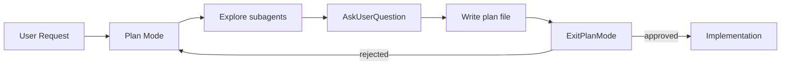
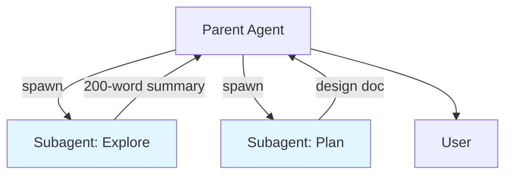

# Claude Code CLI

> **Domain:** Agentic AI, Developer Tooling
> **Key Concepts:** Claude Code, subagents, plan mode, CLAUDE.md, MCP, hooks, context management

**Claude Code** is Anthropic's official terminal-native coding agent. It pairs a frontier model (Opus / Sonnet / Haiku) with deep filesystem access, shell execution, and a rich extension surface — subagents, skills, hooks, MCP servers — so it can act as an autonomous engineering collaborator rather than just an autocomplete. This doc captures the workflow patterns that, in practice, separate a productive Claude Code session from a frustrating one.

---

## 1. What Is Claude Code?

Claude Code ships in four form factors that share the same harness and model backend:

| Form factor | Use case |
| :--- | :--- |
| **CLI** (`claude`) | Terminal-first development, scripts, CI |
| **Desktop app** (Mac / Windows) | Daily driver with native UI |
| **Web** (claude.ai/code) | Browser-based pairing, no install |
| **IDE extensions** (VS Code, JetBrains) | Inline diff review + editor integration |

It positions against tools like Cursor and Aider with three deliberate choices: **terminal-first** (the shell is the integration layer, not a sidebar), **Anthropic-only models** (no provider routing), and **deep filesystem + shell access** (the agent reads, writes, and runs without leaving the project).

---

## 2. Setup & Models

Install via npm:

```bash
npm install -g @anthropic-ai/claude-code
claude    # launches in the current directory; first run handles auth
```

Switch models with `/model`. Current lineup:

| Model | ID | Best for |
| :--- | :--- | :--- |
| **Opus 4.7** | `claude-opus-4-7` | Architecture, multi-file refactors, hard debugging |
| **Sonnet 4.6** | `claude-sonnet-4-6` | Everyday coding, balanced cost/quality |
| **Haiku 4.5** | `claude-haiku-4-5-20251001` | Fast lookups, bulk tool calls, low-latency loops |

**Fast mode** (`/fast`) keeps you on Opus but trades off some token-by-token latency for faster output — useful when you want top-tier reasoning without the wait. Available on Opus 4.6 and 4.7.

Rule of thumb: start a session on Sonnet; switch to Opus when the model starts spinning on a hard problem; drop to Haiku for "just grep this for me" stretches.

---

## 3. Project Memory: `CLAUDE.md`

Claude Code auto-loads `CLAUDE.md` files from the current directory and every parent up to your home. This is the single most leveraged file in the project — it sets the *baseline* context every conversation starts with.

**What belongs in `CLAUDE.md`:**
*   Build, test, lint, and dev-server commands
*   Project conventions the model can't infer from code (naming, branch policy, code style)
*   Architecture cheatsheet: where things live, what depends on what
*   Known gotchas, undocumented invariants, "do not touch X without Y"

**What does NOT belong:**
*   Transient state ("we're mid-refactor of auth") — that's what conversation context is for
*   Secrets, tokens, environment values
*   Tutorial-style explanation of obvious code

Three layers stack: `~/.claude/CLAUDE.md` (personal, all projects) → project `CLAUDE.md` (committed) → `CLAUDE.local.md` (project, gitignored). Use the `/init` skill to bootstrap a project file by having the model survey the repo. Keep it lean — every byte costs context on every turn.

---

## 4. Plan Mode

Plan mode is a read-only research + planning phase. The model can `Read`, `Grep`, `WebFetch`, and spawn `Explore` subagents — but cannot `Edit`, `Write`, or run non-readonly commands. The mandated output is a plan file at `~/.claude/plans/<slug>.md`, surfaced for explicit human approval via `ExitPlanMode`.



**Why use it:** for any change touching more than one file, plan mode buys you alignment *before* the model writes a single line. It costs five minutes; it saves an hour of "actually, can you redo this differently?"

**When to skip:** typo fixes, single-line tweaks, isolated bug fixes the user has already pinpointed. Forcing plan mode on trivial work is friction.

Trigger plan mode by passing `--plan` at launch or invoking it from the `/config` menu.

---

## 5. Subagents

Subagents are the most important productivity feature in modern Claude Code. A subagent is a *fresh* model conversation with its own context window, spawned by the parent agent for a delegated task. When it finishes, only its final summary returns — the raw search results, file reads, and intermediate reasoning never touch the parent's context.



### 5.1. Built-in Subagent Types

| Type | Purpose |
| :--- | :--- |
| **`Explore`** | Read-only search across the codebase — find files, grep symbols, answer "where is X." Cannot edit. |
| **`Plan`** | Architecture/design agent. Produces step-by-step plans, identifies critical files, weighs trade-offs. |
| **`general-purpose`** | Catch-all with full tool access. Use for open-ended multi-step research. |
| **`statusline-setup`** | Configures the user's status line. |
| **`claude-code-guide`** | Answers questions about Claude Code itself, the Agent SDK, and the Claude API. |

### 5.2. When to Delegate

*   **Open-ended research** with uncertain scope ("how is auth wired across this monorepo?")
*   **Parallel independent queries** — three `Explore` agents in one message finish in the time of one
*   **Protecting parent context** — when a task would dump a 5,000-line file into context, delegating reads keeps the parent lean

### 5.3. When NOT to Delegate

*   The target is already known — use `Read` directly
*   The parent already has the relevant context — a fresh subagent will re-derive it from scratch (cold-start cost)
*   The task is fast and cheap — the spawning overhead exceeds the benefit

Every spawn pays a setup cost. Use subagents like surgical instruments, not like a default.

### 5.4. Briefing a Subagent

A subagent sees *only* its prompt — none of the parent conversation. Brief it like a smart colleague who just walked into the room:

```text
Audit what's left before this branch can ship. Check:
- uncommitted changes
- commits ahead of main
- whether tests exist for the new feature
- whether the GrowthBook gate is wired up
- whether CI-relevant files changed
Report a punch list — done vs. missing. Under 200 words.
```

Good subagent prompts include: the goal, what's already known, the form the answer should take, and a length cap if relevant. Vague prompts produce shallow, generic work.

### 5.5. Parallel Spawning & Background

To run subagents in parallel, send multiple `Agent` tool calls in a single message. To run an agent in the background (returning control to the user immediately), pass `run_in_background: true` — useful for long-running research while you continue other work.

### 5.6. Custom Subagents

Project-specific subagent types live in `.claude/agents/<name>.md` with YAML frontmatter declaring `description`, `tools`, and `model`. The body is the system prompt. (Detailed authoring is out of scope here — see Anthropic's docs.)

---

## 6. Slash Commands & Skills

Built-in slash commands cover session management:

| Command | Effect |
| :--- | :--- |
| `/help` | List commands and skills |
| `/clear` | Reset conversation context |
| `/compact` | Summarize and compress prior turns |
| `/model` | Switch model mid-session |
| `/fast` | Toggle fast mode (Opus) |
| `/config` | Open settings UI |

**User-authored slash commands are skills.** Anything in `~/.claude/skills/<name>/SKILL.md` (personal) or `.claude/skills/<name>/SKILL.md` (project) becomes invocable as `/name`. See [Skills](./skills.md) for the full authoring model.

The `!` prefix runs a shell command in your session and pipes its output into the conversation: `! gcloud auth login` for interactive logins you don't want the agent driving.

---

## 7. Tools, Permissions & Settings

Settings cascade across three files:

| File | Scope |
| :--- | :--- |
| `~/.claude/settings.json` | Personal (all projects) |
| `<project>/.claude/settings.json` | Project (committed) |
| `<project>/.claude/settings.local.json` | Project (gitignored) |

Permissions control which tool calls auto-approve vs. prompt:

```json
{
  "permissions": {
    "allow": ["Bash(git status)", "Bash(npm test*)", "Read"],
    "deny": ["Bash(rm -rf*)", "Bash(git push --force*)"]
  }
}
```

The `fewer-permission-prompts` skill scans your transcripts and proposes a tightened allowlist — run it after a week of use to cut prompt fatigue in half.

**Never bypass safety as a shortcut.** If a pre-commit hook fails, fix the cause; don't reach for `--no-verify`. If you hit a permission prompt repeatedly, add the pattern to `allow` rather than running in dangerous mode.

---

## 8. Hooks

Hooks are shell commands the harness runs on lifecycle events. They are the **only** mechanism for "automatically do X" rules — the model itself cannot reliably enforce automation, since it might forget on the next turn.

Common events:

| Event | Fires when | Typical use |
| :--- | :--- | :--- |
| `PreToolUse` | Before a tool runs | Block dangerous commands, inject context |
| `PostToolUse` | After a tool returns | Auto-format edits, run a quick lint |
| `Stop` | At end of model turn | Notifications, summaries |
| `UserPromptSubmit` | When you hit enter | Inject standing context, gate the prompt |

Configure in `settings.json`:

```json
{
  "hooks": {
    "PostToolUse": [
      {
        "matcher": "Edit|Write",
        "hooks": [{"type": "command", "command": "prettier --write $CLAUDE_FILE_PATHS"}]
      }
    ]
  }
}
```

Hook output is treated as user input — failures surface as blocked tool calls the model must respond to.

---

## 9. MCP (Model Context Protocol) Servers

MCP is the standard for plugging external systems into Claude Code: databases, browsers, issue trackers, internal APIs. Servers expose tools that the model discovers and calls just like built-ins.

Register a server in `settings.json`:

```json
{
  "mcpServers": {
    "postgres": {
      "command": "npx",
      "args": ["-y", "@modelcontextprotocol/server-postgres", "postgres://localhost/mydb"]
    }
  }
}
```

Common servers worth knowing: `github` (issues, PRs, releases), `postgres` (read-only SQL), `playwright` (browser automation), `slack` (messaging), `filesystem` (scoped FS access for non-project paths). MCP is how you turn Claude Code into a project-shaped tool without forking the harness.

---

## 10. Context Management

The harness auto-compacts conversation history as you approach the model's context window, so a long session won't simply explode. You can also:

*   `/compact` — force summarization now
*   `/clear` — wipe and start fresh
*   Spawn a subagent — keep noisy work out of the parent context entirely

A useful persistence hierarchy when deciding where to put state:

| Need | Use |
| :--- | :--- |
| Survives current turn only | Conversation context |
| Survives current session, not next | Tasks, plan file |
| Survives across sessions | Memory (`~/.claude/.../memory/`) |
| Survives forever, shared with team | `CLAUDE.md`, skills, settings.json |

Subagents are the cleanest tool for context hygiene: delegate the noisy parts (large file reads, exploratory grepping) and only the conclusion comes back.

---

## 11. Background Tasks & Cron

Long-running work doesn't have to block the conversation:

*   **`run_in_background: true`** on `Bash` or `Agent` calls — returns immediately; you're notified on completion.
*   **`ScheduleWakeup`** — fire the agent again at a future time, with a prompt.
*   **`CronCreate`** — recurring jobs on a schedule. The `/loop` skill is sugar over this for periodic polling ("check the deploy every 5 minutes").

This beats sleep-polling loops, which burn tokens and block the model. If you find yourself wanting to "check back on" something, use `run_in_background` or `ScheduleWakeup`.

---

## 12. IDE Integration

The VS Code and JetBrains extensions add:

*   **Inline diff review** — see edits as proposed diffs in the editor, accept/reject per hunk
*   **Terminal pairing** — the IDE terminal stays in sync with Claude Code's working directory
*   **File-open coordination** — files the model opens surface in the editor automatically

Trade-off: the pure CLI is faster and scriptable; the IDE is friendlier for diff-heavy review and onboarding. Most heavy users keep both open and switch based on the task.

---

## 13. Workflow Best Practices

Distilled from recent collaboration patterns:

1.  **Use plan mode** for anything touching more than one file or with unclear scope.
2.  **Spawn `Explore` subagents** when scope is unknown or you'd need more than 3 sequential searches. Otherwise just `grep` or `find`.
3.  **Parallelize tool calls** when independent — multiple tool calls in one message instead of a serial chain.
4.  **Confirm before destructive or shared-state actions** — `git push`, `rm -rf`, force-pushes, sending messages. Approval for one such action doesn't generalize to all of them.
5.  **Keep `CLAUDE.md` lean.** Push depth into per-area docs and let the model load them on demand.
6.  **Verify UI / feature work by running the app.** Type checks and tests verify correctness, not behavior. If you can't run it, say so explicitly.
7.  **Don't bypass safety checks** (`--no-verify`, `--force`) as a shortcut to make an error go away — fix the root cause.
8.  **Memory is for cross-session facts**, not current-task scratch space. If it'll be stale next week, it doesn't belong in memory.

---

## 14. Comparison: Subagents vs. Skills vs. Tools vs. MCP

| | Tool | Skill | Subagent | MCP Server |
| :--- | :--- | :--- | :--- | :--- |
| **Unit** | Function call | Multi-step recipe | Fresh conversation | External tool source |
| **Context cost** | Per call | Description always loaded; body on use | Cold start each spawn | Tools discovered at startup |
| **State** | Stateless | Stateless | Own window | Owned by the server |
| **Best for** | Atomic actions | Repeatable workflows | Open-ended research, parallel work | External system integration |
| **Authoring effort** | None (built-in) | Low (write `SKILL.md`) | Medium (`agents/<name>.md`) | High (write a server) |

See [Skills](./skills.md) for the deeper skill-vs-tool-vs-subagent breakdown.

---

## 15. Conclusion

Claude Code's leverage doesn't come from any single feature — it comes from composing simple primitives under one model: **tools** for atomic capabilities, **skills** for repeatable recipes, **subagents** for context-isolated delegation, **hooks** for guaranteed automation, **MCP** for external systems. The recent direction of the product has been to shrink the built-in surface and lean harder on this customization layer.

The most productive sessions look the same regardless of project: a tight `CLAUDE.md`, plan mode for non-trivial work, `Explore` subagents to keep the parent context clean, hooks to enforce the rules the model would otherwise forget, and a few well-scoped project skills that capture the team's actual workflow. Get those right and Claude Code stops feeling like an autocomplete and starts feeling like a junior engineer who already knows the codebase.
