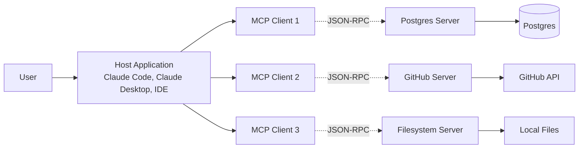
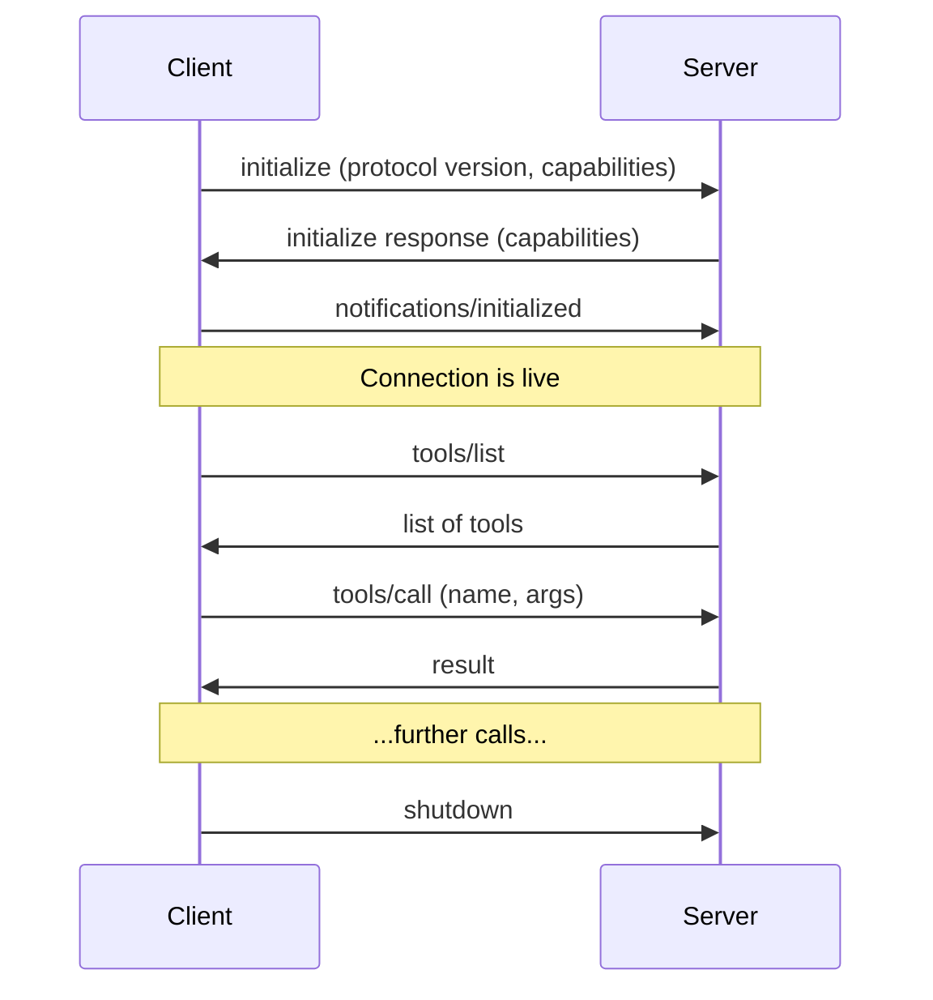

# Model Context Protocol (MCP)

> **Domain:** Agentic AI, Tooling, Protocols
> **Key Concepts:** Client/server architecture, tools, resources, prompts, sampling, stdio/HTTP transports, JSON-RPC

The **Model Context Protocol (MCP)** is an open standard, introduced by Anthropic in late 2024, for connecting AI assistants to the systems where data and capabilities actually live: databases, file systems, issue trackers, browsers, internal APIs. Before MCP, every AI client (Claude Desktop, Cursor, an IDE plugin) had to hand-roll a bespoke integration for every tool. MCP collapses that N×M problem into N+M: build an MCP **server** once for your system, and any MCP-compatible **client** can use it.

Think of MCP as **"USB-C for AI applications"** — a uniform port between models and the outside world.

---

## 1. Why MCP Exists

Before MCP, integrating an LLM with an external system meant one of three painful options:

1.  **Hand-roll tools per client.** Define a `get_github_issues` function in your Claude app, then redefine it for your Cursor plugin, then again for the internal chatbot.
2.  **Ship a giant prompt with API docs.** Hope the model figures out the right curl commands. Fragile, expensive in tokens, untrusted.
3.  **Use a closed plugin ecosystem.** Lock your integrations to one vendor's runtime.

MCP fixes this by standardizing the **wire protocol** between any AI client and any tool provider. Build a `postgres-mcp` server once; Claude Desktop, Claude Code, Zed, and Cursor all use it identically.

---

## 2. Architecture

MCP follows a strict **client/server** model over **JSON-RPC 2.0**.



| Role | Responsibility |
| :--- | :--- |
| **Host** | The AI application the user interacts with (Claude Code, Claude Desktop, an IDE). Owns the model. |
| **Client** | A connection manager inside the host. One client instance per server. Handles handshake, message routing, lifecycle. |
| **Server** | A separate process exposing tools/resources/prompts from one specific system (Postgres, GitHub, etc.). |

**Key property:** servers are *isolated processes*. They speak only to their client, never to the model directly. The host decides what to expose to the model and when.

---

## 3. Transports

MCP defines three transport mechanisms — the wire over which JSON-RPC messages flow:

| Transport | Use case | Server lifecycle |
| :--- | :--- | :--- |
| **stdio** | Local servers — launched by the host as a child process. Most common. | Host spawns/kills the process. |
| **Streamable HTTP** | Remote servers — accessible over the network. Replaced SSE in the 2025-03-26 spec. | Server runs independently; client connects via HTTP. |
| **SSE (legacy)** | Server-sent events. Deprecated; some older servers still use it. | Long-lived HTTP connection. |

For local dev — filesystem access, talking to a local database, driving a headless browser — **stdio is the default**. For team/cloud integrations (internal APIs, multi-user services), **HTTP** is the right call.

---

## 4. Core Primitives

MCP servers expose three primitive types. Each has different semantics for *who controls invocation*.

### 4.1. Tools (Model-Controlled)

Functions the model decides to call, like classic OpenAI/Anthropic function calling.

```json
{
  "name": "execute_sql",
  "description": "Run a read-only SQL query against the analytics database",
  "inputSchema": {
    "type": "object",
    "properties": {
      "query": {"type": "string", "description": "SQL SELECT statement"}
    },
    "required": ["query"]
  }
}
```

The host advertises available tools to the model; the model emits tool calls; the client routes them to the server; the server returns results.

### 4.2. Resources (Application-Controlled)

Read-only data the *application* (not the model) decides to expose: file contents, database schemas, API responses, log files. Identified by URIs like `file:///path/to/x` or `postgres://schema/users`.

Resources are how a server says "here's context the model might want" without committing to inject it on every turn. The host UI can let the user pin specific resources into context.

### 4.3. Prompts (User-Controlled)

Pre-defined prompt templates the *user* explicitly invokes — typically surfaced as slash commands or menu items in the host.

```json
{
  "name": "summarize_pr",
  "description": "Summarize a GitHub PR by number",
  "arguments": [{"name": "pr_number", "required": true}]
}
```

When the user picks the prompt, the server returns a fully-formed message sequence the host hands to the model.

### 4.4. Quick Reference

| Primitive | Who decides to use it | Analog |
| :--- | :--- | :--- |
| **Tool** | Model | Function call |
| **Resource** | Application / user | File attachment |
| **Prompt** | User | Slash command template |

---

## 5. Advanced Capabilities

### 5.1. Sampling (Server → Model)

Servers can ask the **client** to run a model completion on their behalf. This is "reverse tool calling" — a GitHub server might need an LLM to summarize a 5,000-line diff before returning a useful result.

The host always mediates: the user sees the sampling request, can edit the prompt, choose the model, and approve before the call runs. This prevents servers from secretly burning the user's tokens.

### 5.2. Roots

The client declares **roots** — filesystem boundaries the server is allowed to operate within. A filesystem MCP server given root `/home/me/projects/foo` cannot wander into `/etc/passwd`. Roots are how MCP enforces scope without trusting the server.

### 5.3. Notifications & Progress

Long-running operations send progress notifications back to the client. A migration tool can stream `42/100 rows processed` updates instead of blocking opaquely for minutes.

### 5.4. Logging

Servers emit structured logs to the client at standard levels (debug/info/warn/error). The host can surface these in its UI or write to a file — useful for debugging "why did the model just get a 500 error from my server?"

---

## 6. Protocol Lifecycle

A connection goes through a strict handshake:



Capability negotiation during `initialize` is how clients and servers discover what each other supports — a v1.0 client connecting to a v2.0 server can still work, falling back to the common subset.

---

## 7. Building a Server: Python Example

Official SDKs exist for **Python, TypeScript, Java, Kotlin, C#, Swift, and Rust**. Python is the quickest path:

```bash
pip install mcp
```

```python
from mcp.server.fastmcp import FastMCP

mcp = FastMCP("weather-server")

@mcp.tool()
def get_forecast(city: str, days: int = 3) -> str:
    """Return a short weather forecast for the given city."""
    # ...call your weather API here...
    return f"{city}: sunny for the next {days} days"

@mcp.resource("weather://stations")
def list_stations() -> str:
    """List all known weather stations."""
    return "KSFO, KJFK, KLAX, ..."

@mcp.prompt()
def vacation_planner(destination: str) -> str:
    """Generate a vacation-planning prompt template."""
    return f"Plan a 5-day trip to {destination}. Include weather considerations."

if __name__ == "__main__":
    mcp.run()  # defaults to stdio transport
```

That's a complete server — one tool, one resource, one prompt — in 20 lines. The decorators auto-generate JSON schemas from type hints and docstrings.

---

## 8. Building a Server: TypeScript Example

```bash
npm install @modelcontextprotocol/sdk zod
```

```typescript
import { McpServer } from "@modelcontextprotocol/sdk/server/mcp.js";
import { StdioServerTransport } from "@modelcontextprotocol/sdk/server/stdio.js";
import { z } from "zod";

const server = new McpServer({ name: "weather-server", version: "1.0.0" });

server.tool(
  "get_forecast",
  { city: z.string(), days: z.number().default(3) },
  async ({ city, days }) => ({
    content: [{ type: "text", text: `${city}: sunny for the next ${days} days` }]
  })
);

const transport = new StdioServerTransport();
await server.connect(transport);
```

---

## 9. Connecting to a Client

### 9.1. Claude Code

Register servers in `~/.claude/settings.json` (personal) or `<project>/.claude/settings.json` (project):

```json
{
  "mcpServers": {
    "postgres": {
      "command": "npx",
      "args": ["-y", "@modelcontextprotocol/server-postgres",
               "postgresql://localhost/mydb"]
    },
    "github": {
      "command": "npx",
      "args": ["-y", "@modelcontextprotocol/server-github"],
      "env": { "GITHUB_PERSONAL_ACCESS_TOKEN": "ghp_..." }
    },
    "my-internal-api": {
      "command": "python",
      "args": ["-m", "my_company.mcp_server"]
    }
  }
}
```

On launch, Claude Code spawns each server, runs the handshake, and exposes its tools to the model as `mcp__<server>__<tool>` calls.

### 9.2. Claude Desktop

Same shape, different file: `~/Library/Application Support/Claude/claude_desktop_config.json` on macOS, `%APPDATA%\Claude\claude_desktop_config.json` on Windows.

### 9.3. Other Hosts

Cursor, Zed, Continue, Cline, and most modern AI IDEs ship MCP support. The config schema is identical because the protocol is identical — only the file location varies.

---

## 10. Ecosystem: Servers Worth Knowing

A reference list of widely-used official and community servers:

| Server | Purpose |
| :--- | :--- |
| **filesystem** | Scoped read/write access to local directories outside the project root |
| **github** | Issues, PRs, commits, releases, code search |
| **gitlab** | Same, for GitLab |
| **postgres** | Read-only SQL queries against a Postgres database |
| **sqlite** | Read/write SQLite databases |
| **slack** | Read channels, post messages, search history |
| **google-drive** | Search and read Drive files |
| **memory** | Persistent knowledge graph across sessions |
| **playwright** | Browser automation — navigate, click, screenshot |
| **puppeteer** | Same, via Puppeteer |
| **brave-search** | Web search via Brave API |
| **fetch** | HTTP fetch with HTML→markdown conversion |
| **sentry** | Read errors and issues from Sentry |
| **linear** | Read/write Linear issues |
| **time** | Timezone-aware time and date utilities |

Anthropic's reference servers live at `github.com/modelcontextprotocol/servers`. Hundreds of community servers exist for niches (Notion, Airtable, AWS, Kubernetes, Stripe, etc.).

---

## 11. Authentication

MCP itself is transport-agnostic about auth — the protocol assumes the transport handles it.

*   **stdio servers** typically receive credentials via environment variables in the `env` block of the client config (see the GitHub example above). The host never sees the token after startup.
*   **HTTP servers** since the 2025-03-26 spec support **OAuth 2.1** with PKCE. The host launches an OAuth flow on first use; tokens are stored by the host and attached as bearer tokens on each request.
*   **Internal/trusted networks** sometimes skip auth entirely — fine for a localhost-only server, dangerous if exposed.

The host is the security boundary: it decides whether to forward a server's request to the user (sampling), whether to allow a tool call, and whether to expose a resource.

---

## 12. Security Model

MCP servers are powerful — many can read your filesystem, run SQL, or send Slack messages. Treat them like browser extensions, not like npm packages.

**Principles:**

1.  **Servers run in their own process.** A misbehaving server can crash without taking down the host.
2.  **The host mediates everything.** Tool calls, resource reads, and sampling requests all pass through host UI before reaching the user or model.
3.  **Roots constrain filesystem access.** Never grant a server a broader root than it needs.
4.  **User approval for sensitive actions.** Most hosts prompt before destructive tool calls (delete, send, push). Configure your allowlists accordingly.

**Risks to watch for:**

*   **Prompt injection via tool output.** A malicious GitHub issue body could contain instructions the model interprets as commands. Treat all server output as untrusted user input.
*   **Token exfiltration.** A compromised server with API keys can do anything those keys can. Scope tokens narrowly; rotate.
*   **Confused deputy.** A server with broad permissions invoked on behalf of a less-privileged user can perform actions the user couldn't directly.

---

## 13. Debugging

Common debugging workflow:

1.  **Check the server started.** Most hosts log spawn failures. Run the server command manually in a terminal — does it print errors?
2.  **Use the MCP Inspector.** Anthropic ships an interactive debugger:
    ```bash
    npx @modelcontextprotocol/inspector npx -y @modelcontextprotocol/server-postgres postgres://...
    ```
    Opens a UI to call tools, list resources, and watch the JSON-RPC wire traffic.
3.  **Look at server logs.** Use the `logging` capability to surface server-side state.
4.  **Verify schemas.** Tool input schemas must be valid JSON Schema. A subtle typo breaks discovery silently.

---

## 14. Best Practices

**Server design:**

*   **One server per logical system.** Don't build a monolith that does GitHub *and* Slack *and* Postgres — separate servers compose better and fail independently.
*   **Tool names should be verbs.** `create_issue`, not `issue_creator`. Descriptions should read like the docstring of a function the model is calling.
*   **Tools < 20 per server.** Beyond that, the model struggles to pick the right one. Group with prefixes (`db_query`, `db_insert`) and consider splitting.
*   **Validate inputs at the server.** Don't trust the model to send well-formed args.
*   **Make errors actionable.** Return error messages the model can recover from: `"table 'users' not found, did you mean 'user_accounts'?"`

**Client/usage:**

*   **Don't install every server you see.** Each server is more context loaded on every turn (tool descriptions accumulate).
*   **Prefer official servers** over forks unless you've audited them.
*   **Pin versions** in your config — `npx -y @modelcontextprotocol/server-github@1.2.3` — to avoid surprise updates.
*   **Use project-scoped configs** for team-shared servers; personal-scoped for your private setup.

---

## 15. MCP vs. Other Mechanisms

How MCP relates to the other extension points in modern AI clients:

| Mechanism | Lives in | Strengths | Weaknesses |
| :--- | :--- | :--- | :--- |
| **Built-in tool** | Host binary | Zero config, optimal latency | Only what the vendor ships |
| **Skill** | Markdown file | No code, easy to author and share | Can't reach external systems |
| **Subagent** | Markdown + tools | Context isolation, parallel work | Cold-start cost |
| **MCP server** | Separate process | External systems, language-agnostic, reusable across hosts | More moving parts, security surface |
| **Plugin** | Vendor-specific bundle | Rich UI integration | Locked to one host |

The rule of thumb: **internal workflows → skills; external systems → MCP.** They compose freely — a skill can instruct the model to use MCP tools from a specific server.

See [Skills](./skills.md) and [Claude Code CLI](./cli.md) for the related layers.

---

## 16. The Road Ahead

MCP has moved fast since the November 2024 launch:

*   **2024-11**: Initial release with stdio and SSE transports.
*   **2025-03**: Streamable HTTP replaces SSE; OAuth 2.1 standardized; sampling matured.
*   **2025+**: Broad client support (Cursor, Zed, Continue, Cline, JetBrains IDEs, OpenAI's Agents SDK), the **MCP Registry** for server discovery, **elicitation** (servers can interactively ask the user for input mid-tool-call), and increasingly **enterprise auth** patterns (SSO, audit logs).

The protocol is governed openly via the spec repo at `github.com/modelcontextprotocol/specification`. Anthropic shepherds it but no longer owns it unilaterally — Microsoft, Google, OpenAI, and others now ship MCP-compatible clients and servers.

---

## 17. Conclusion

MCP turns "AI integration" from a bespoke engineering project into a config file. Build a server once; every compliant host can use it. The architectural discipline — client/server isolation, capability negotiation, host-mediated security — is what makes that reuse safe.

For most engineers, the practical takeaway is: **before writing a custom tool inside your AI app, check if an MCP server already does the job.** The ecosystem has crossed the threshold where the answer is usually yes. When it isn't, writing a small server in Python takes an afternoon and pays back across every AI tool you use.

## Where this connects

- [Claude Code CLI](cli.md) — a primary MCP client
- [Tool use](tool_use.md) — MCP standardizes how tools are exposed to models
- [Agent frameworks](agent_frameworks.md), [Multi-agent systems](multi_agent_systems.md) — consumers of MCP servers
- [RAG](rag.md) — MCP resources as a retrieval source
- [LLM security](llm_security.md) — trust boundaries when connecting servers
