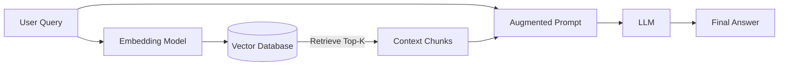

# Retrieval Augmented Generation (RAG)

> **Domain:** Generative AI, Information Retrieval
> **Key Concepts:** Vector Search, Chunking, Re-ranking, Hybrid Search

**Retrieval Augmented Generation (RAG)** is an architectural pattern that enhances the capabilities of Large Language Models (LLMs) by retrieving relevant data from external knowledge bases and injecting it into the context window before generation. This grounds the LLM in specific, up-to-date, or proprietary information, mitigating hallucinations and expanding the model's knowledge cutoff.

---

## 1. The Core Architecture

RAG decouples **knowledge** from **reasoning**. The LLM provides the reasoning engine, while an external retrieval system provides the knowledge.



### 1.1. The "Naive" RAG Pipeline
1.  **Ingestion:** Documents are split into chunks, embedded into vectors, and stored in a vector database.
2.  **Retrieval:** The user query is embedded. The system performs a K-Nearest Neighbor (KNN) search to find the most similar chunks.
3.  **Generation:** Retrieved text is pasted into the system prompt. The LLM answers the query based *only* on that context.

---

## 2. Advanced RAG Patterns

Naive RAG often fails in production due to low precision (retrieving irrelevant chunks) or low recall (missing the answer).

### 2.1. Advanced Chunking Strategies
*   **Fixed-Size Overlap:** The baseline. Split by 512 tokens with 50-token overlap. Good for general prose.
*   **Semantic Chunking:** Splits text based on semantic breakpoints (e.g., when the embedding similarity between two sentences drops significantly). Keeps coherent ideas together.
*   **Recursive Retrieval / Parent-Child:**
    *   *Concept:* Search against small chunks (summaries) for precision, but retrieve the larger parent document for context.
    *   *Benefit:* Matches granular queries without losing the surrounding context needed for synthesis.

### 2.2. Query Transformation
User queries are often vague. We rewrite them before retrieval.
*   **HyDE (Hypothetical Document Embeddings):** Ask the LLM to hallucinate a *fake* answer to the query. Embed the fake answer and search against that. This bridges the semantic gap between a question and an answer document.
*   **Multi-Query:** Break a complex question ("Compare X and Y") into sub-questions ("What is X?", "What is Y?"), retrieve for both, and synthesize.

### 2.3. Hybrid Search
Vector search (Semantic) is bad at exact keyword matching (e.g., product SKUs, specific acronyms).
*   **Architecture:** Combine **Dense Retrieval** (Vectors) + **Sparse Retrieval** (BM25/Keyword).
*   **Reciprocal Rank Fusion (RRF):** A standard algorithm to merge the ranked lists from both retrievers.
    *   `Score = 1 / (k + rank_vector) + 1 / (k + rank_keyword)`

### 2.4. Re-Ranking (The "Precision" Layer)
Retrieving the top 100 chunks is fast (Bi-Encoder). Determining which 5 are actually relevant is the job of a **Cross-Encoder**.
*   **Bi-Encoder (Vector DB):** Fast, compares Query Vector <-> Doc Vector.
*   **Cross-Encoder (Re-ranker):** Slower, but more accurate. Takes `[Query, Document]` pairs as a single input and outputs a relevance score (0-1).
*   **Flow:** Retrieve Top-50 via Vector Search -> Re-rank Top-50 via Cross-Encoder -> Pass Top-5 to LLM.

---

## 3. Evaluation: The RAG Triad

How do you know if your RAG system is working? You evaluate three distinct links:

1.  **Context Relevance:** Is the retrieved context actually relevant to the query? (Measures Retrieval Quality)
2.  **Groundedness (Faithfulness):** Is the answer derived *only* from the retrieved context? (Measures Hallucination)
3.  **Answer Relevance:** Does the answer actually address the user's query? (Measures Utility)

**Tools:** RAGAS (RAG Assessment), TruLens.

---

## 4. Implementation Example (Python/LangChain)

```python
from langchain.vectorstores import Chroma
from langchain.embeddings import OpenAIEmbeddings
from langchain.retrievers import ContextualCompressionRetriever
from langchain.retrievers.document_compressors import CohereRerank

# 1. Base Retriever (Vector Search)
base_retriever = Chroma(
    embedding_function=OpenAIEmbeddings(),
    persist_directory="./db"
).as_retriever(search_kwargs={"k": 20})

# 2. Re-ranker (Cross Encoder)
compressor = CohereRerank(top_n=5)

# 3. Advanced Pipeline
compression_retriever = ContextualCompressionRetriever(
    base_compressor=compressor,
    base_retriever=base_retriever
)

# 4. Usage
docs = compression_retriever.get_relevant_documents("How does the flux capacitor work?")
```

---

## 5. Challenges and Solutions

| Challenge | Solution |
| :--- | :--- |
| **"Lost in the Middle"** | LLMs pay more attention to the beginning and end of the context. **Reorder** chunks so the most relevant ones are at the edges (Top-1 at start, Top-2 at end). |
| **Outdated Data** | Implement a **Time-Weighted** vector store where older documents decay in similarity score. |
| **Structured Data** | Don't just embed text. Use **Text-to-SQL** for databases and combine the result with vector search results. |

## 6. Conclusion

RAG is moving from "POC" to "Production" by adding complexity to the retrieval side. The future is **Agentic RAG**, where an agent autonomously decides *what* to retrieve, *how* to filter it, and *when* to stop searching.
