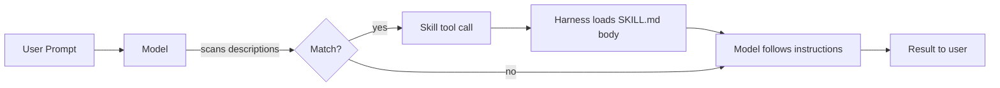

# Skills

> **Domain:** Agentic AI, Tooling, Claude Code
> **Key Concepts:** Skill packaging, SKILL.md, progressive disclosure, model-invocable capabilities

**Skills** are self-contained, model-discoverable capability packages that extend an LLM with domain expertise, workflows, or task-specific instructions. Unlike a raw **tool** (a single function the model calls) or a full **agent** (an autonomous loop), a skill is a *recipe* — a bundle of natural-language instructions plus optional scripts and references that the model loads on demand. Anthropic's Claude Code, Claude Apps, and the Claude API all support skills via a unified `Skill` invocation tool.

---

## 1. What Are Skills?

A skill answers a single question: *"When the user wants to do X, how should I do it?"*

*   **Tool:** A function call (`read_file`, `bash`). Atomic, stateless, one shot.
*   **Skill:** A procedure (`code-review`, `verify`, `run`). Multi-step instructions the model follows, often *using* tools.
*   **Agent (subagent):** A spawned conversation with its own context window and tool set. Heavier than a skill.

Skills shine when the same workflow recurs — committing code, reviewing a PR, launching the app, scaffolding a new project — and you want the model to follow a *consistent, expert* procedure each time.

---

## 2. Anatomy of a Skill

A skill is just a directory containing a `SKILL.md` file plus optional resources:

```
my-skill/
├── SKILL.md           # required: frontmatter + instructions
├── scripts/           # optional: helper scripts the skill executes
│   └── lint.sh
├── references/        # optional: deep-dive docs loaded only when needed
│   └── style_guide.md
└── assets/            # optional: templates, fixtures, images
    └── template.tsx
```

The `SKILL.md` opens with YAML frontmatter:

```markdown
---
name: code-review
description: Review the current diff for correctness bugs at the given effort
  level. Pass --comment to post findings as inline PR comments.
allowed-tools: [Bash, Read, Grep]
---

# Code Review

When invoked, do the following:
1. Run `git diff main...HEAD` to see the pending changes.
2. For each modified file, look for ...
```

The **`description` field is the trigger** — it is what the model reads when deciding whether to invoke the skill. Write it like a prompt, not a label: be specific about *when* the skill applies and *when it does not*.

---

## 3. Progressive Disclosure

Skills are designed to keep context windows lean. The harness loads them in three tiers:

1.  **Always loaded:** Just the `name` + `description` of each available skill — a few hundred tokens total, regardless of how many skills exist.
2.  **Loaded on invocation:** The full `SKILL.md` body, only when the model actually calls `Skill(name="...")`.
3.  **Loaded on demand:** Files under `references/`, `scripts/`, and `assets/` — read only if the skill instructions tell the model to open them.

This means a project can ship dozens of skills without bloating every conversation. The cost is paid only when a skill is used.

---

## 4. Invocation Flow



Skills can be triggered two ways:

*   **Automatic matching:** The model reads the descriptions of available skills and invokes one when the user's intent matches. Good descriptions are the entire reason this works.
*   **Explicit `/skill-name`:** The user types a slash command. The harness rewrites this into a `Skill` tool call. Useful for skills the user *always* wants to drive manually (e.g. `/init`, `/grill-me`).

---

## 5. Authoring a Skill

A minimal worked example — a `commit-helper` skill:

```markdown
---
name: commit-helper
description: Draft and create a git commit for the current staged changes,
  following the repository's existing commit-message style. Use when the user
  says "commit this", "make a commit", or asks for a commit message.
allowed-tools: [Bash]
---

# Commit Helper

1. Run `git status` and `git diff --staged` to see what is about to be committed.
2. Run `git log -5 --pretty=format:'%s'` to learn the project's commit style.
3. Draft a 1–2 sentence message focused on the *why*, not the *what*.
4. Show the message to the user and wait for approval before running
   `git commit -m "..."`.
```

**Good vs. bad descriptions:**

| Bad | Good |
| :--- | :--- |
| `"Helps with commits."` | `"Draft and create a git commit for staged changes. Use when the user says 'commit this' or asks for a commit message."` |
| `"For tests."` | `"Run the project's test suite and report failures. TRIGGER when user asks to run tests, verify a fix, or check CI status. SKIP for unit-test authoring."` |

The model never sees the body of `SKILL.md` until it has already decided to invoke — so all the discovery signal lives in the description.

---

## 6. Distribution

| Location | Scope |
| :--- | :--- |
| `~/.claude/skills/<name>/` | Personal — available in every project for this user |
| `<project>/.claude/skills/<name>/` | Project — checked in to the repo, available to anyone working in it |
| Plugin-bundled skills | Distributed via Claude Code plugins; invoked as `plugin-name:skill-name` to avoid collisions |

Project skills are the most powerful pattern: a repo can ship its own `run`, `deploy`, `verify`, or `release` skill that encodes the actual conventions of *that* codebase, so anyone (or any Claude session) entering the project gets the same expert behavior for free.

---

## 7. Skills vs. Tools vs. Subagents

| | Tool | Skill | Subagent |
| :--- | :--- | :--- | :--- |
| **Unit** | Single function call | Multi-step instructions | Full conversation |
| **State** | Stateless | Stateless (instructions only) | Own context window |
| **Invocation** | Model decides per call | Model matches description → loads body | Parent agent spawns it |
| **Cost** | Minimal | Description always loaded; body on use | Heavy — new context, new model run |
| **Best for** | Atomic capabilities (read file, run command) | Repeatable workflows with clear triggers | Independent research, parallel work, isolation |

A useful rule: *if you find yourself writing the same multi-step instruction to Claude more than twice, it should be a skill.*

---

## 8. Best Practices

*   **Keep `SKILL.md` short.** Aim for under 100 lines. Push detail into `references/*.md` and load it only when needed.
*   **Write the description as a trigger, not a summary.** Include "TRIGGER when X / SKIP when Y" phrasing for skills with narrow applicability.
*   **Don't invoke the same skill twice in one turn.** Once loaded, its instructions are in context — reread them rather than recalling.
*   **Never invent skill names.** Only invoke skills that the harness has explicitly listed as available.
*   **Pin tool requirements.** If the skill needs `Bash` or `WebFetch`, declare it in `allowed-tools` so the harness can warn early.
*   **Test the description.** Read it back yourself: would *you* know exactly when to call this skill? If not, neither will the model.

---

## 9. Conclusion

Skills are the durable unit of reusable agent behavior. Tools give a model new abilities; skills give it new *habits*. The most valuable skills in practice — `code-review`, `verify`, `run`, `init`, `claude-api`, `grill-me` — are not exotic; they are the boring, repeatable workflows of real engineering, captured once and reused everywhere. Treat the `description` field as a prompt, keep the body lean, and let progressive disclosure handle the rest.
