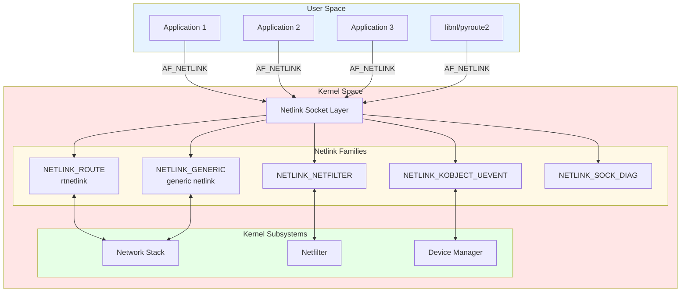
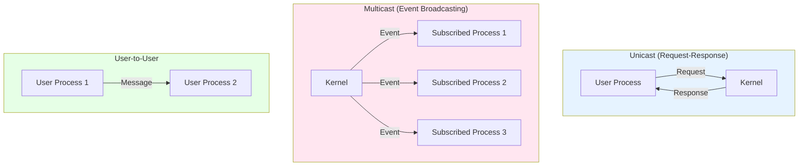
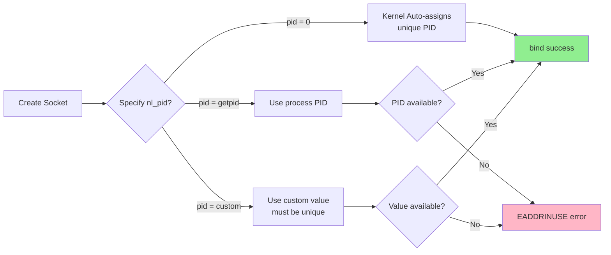
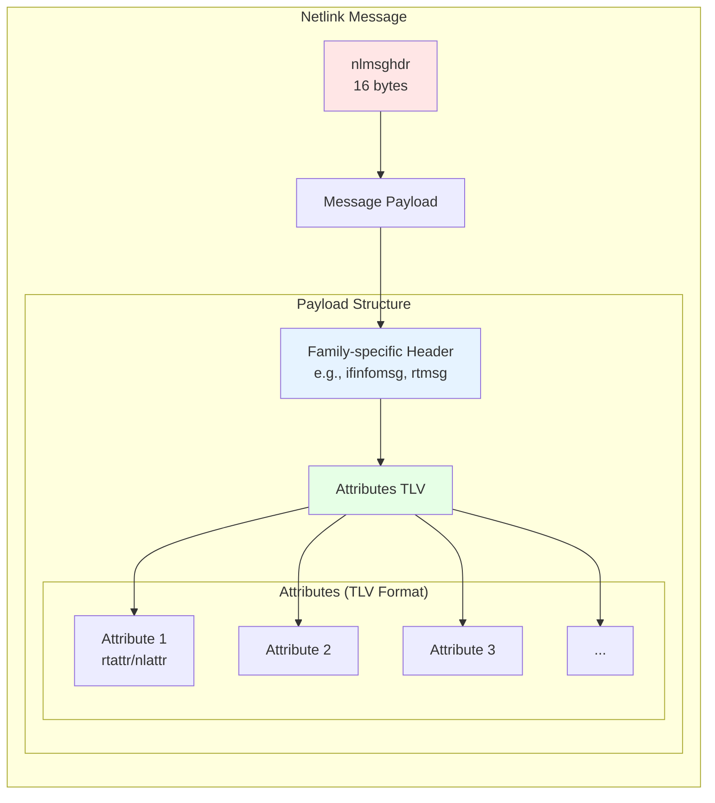
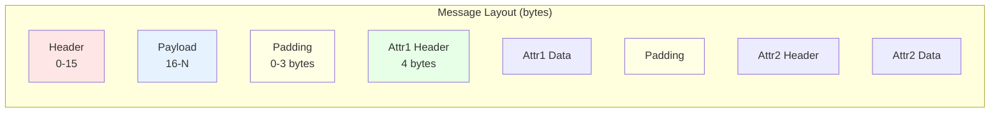
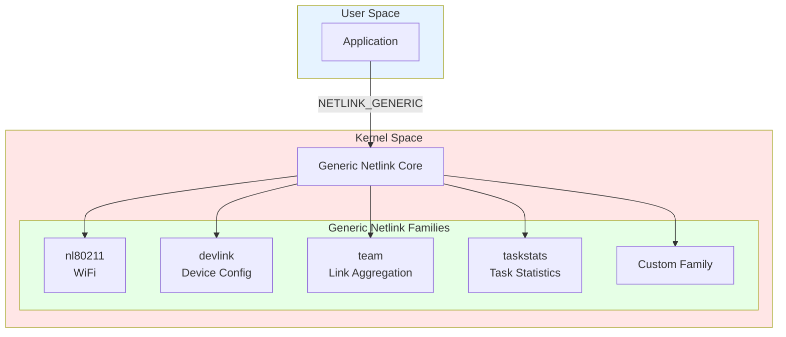

# Netlink

## Introduction

Netlink is a Linux kernel interface used for communication between the kernel and user-space processes, as well as between different user-space processes. It provides a flexible, extensible mechanism for transferring information and is the modern replacement for older interfaces like ioctl, /proc, and sysfs for many kernel subsystems.

### What is Netlink?

Netlink is a socket-based Inter-Process Communication (IPC) mechanism that uses a special address family (`AF_NETLINK`). Unlike traditional sockets that communicate over networks, Netlink sockets facilitate communication between user-space and kernel-space, or even between different user-space processes.

**Key Characteristics**:
- **Bidirectional**: Both kernel and user-space can initiate communication
- **Asynchronous**: Supports event-driven programming model
- **Multicast**: Kernel can broadcast messages to multiple user-space processes
- **Extensible**: Easy to add new message types and protocols
- **Socket-based**: Uses familiar socket API (socket, bind, send, recv)

### Why Use Netlink?

Netlink offers several advantages over traditional kernel-userspace communication methods:

| Method | Advantages | Disadvantages |
|--------|-----------|---------------|
| **ioctl** | Simple, direct | Limited data transfer, not extensible, version compatibility issues |
| **/proc** | Human-readable | Text parsing overhead, not suitable for complex data, one-way |
| **/sys** | Organized, one-value-per-file | Inefficient for bulk operations, read-only limitations |
| **Netlink** | Flexible, extensible, bidirectional, multicast support | More complex API, steeper learning curve |

**Advantages of Netlink**:
1. **Structured Messages**: Well-defined binary format with TLV (Type-Length-Value) attributes
2. **Extensibility**: Easy to add new attributes without breaking compatibility
3. **Asynchronous Notifications**: Kernel can push events to user-space
4. **Multicast Support**: One-to-many communication
5. **Standard Socket API**: Familiar programming interface
6. **Better Performance**: No text parsing, efficient binary protocol
7. **Bidirectional**: Both sides can initiate communication

### Common Use Cases

Netlink is used extensively throughout the Linux kernel for:

- **Network Configuration**: `rtnetlink` for routing, interfaces, addresses (used by `ip` command)
- **Wireless Configuration**: `nl80211` for WiFi management
- **Netfilter/iptables**: Firewall rule management
- **SELinux**: Security policy communication
- **Audit System**: Kernel audit events
- **udev Events**: Device hotplug notifications
- **Task Statistics**: Per-process statistics (taskstats)
- **Connector**: Generic kernel-to-user notifications
- **Socket Diagnostics**: Detailed socket information

### Netlink Architecture Overview



### History and Evolution

- **Linux 2.0 (1996)**: Initial netlink implementation for routing
- **Linux 2.2 (1999)**: Expanded to support multiple protocols
- **Linux 2.4 (2001)**: Generic netlink introduced
- **Linux 2.6 (2003)**: Major expansion, nl80211 for wireless
- **Linux 3.x (2011+)**: Continued expansion, netlink used for most kernel-user communication
- **Modern Linux**: Primary interface for network configuration, replacing ioctl

## Core Concepts

### Netlink Socket Family

Netlink uses the `AF_NETLINK` address family. Creating a netlink socket is similar to creating any other socket:

```c
int sock = socket(AF_NETLINK, SOCK_RAW, NETLINK_ROUTE);
```

**Socket Type**:
- `SOCK_RAW`: Used for netlink (not UDP/TCP)
- `SOCK_DGRAM`: Also supported, functionally equivalent to SOCK_RAW for netlink

**Protocol Parameter**: Specifies the netlink family/protocol:
- `NETLINK_ROUTE` - Routing and interface configuration
- `NETLINK_GENERIC` - Generic netlink
- `NETLINK_NETFILTER` - Netfilter subsystem
- Many others (see complete list below)

### Netlink Protocols/Families

The Linux kernel supports numerous netlink families:

| Protocol | Value | Purpose |
|----------|-------|---------|
| `NETLINK_ROUTE` | 0 | Routing and link configuration (rtnetlink) |
| `NETLINK_UNUSED` | 1 | Unused (legacy) |
| `NETLINK_USERSOCK` | 2 | Reserved for user-mode socket protocols |
| `NETLINK_FIREWALL` | 3 | Unused (legacy firewall) |
| `NETLINK_SOCK_DIAG` | 4 | Socket diagnostics |
| `NETLINK_NFLOG` | 5 | Netfilter logging |
| `NETLINK_XFRM` | 6 | IPsec |
| `NETLINK_SELINUX` | 7 | SELinux events |
| `NETLINK_ISCSI` | 8 | iSCSI |
| `NETLINK_AUDIT` | 9 | Kernel audit |
| `NETLINK_FIB_LOOKUP` | 10 | FIB lookup |
| `NETLINK_CONNECTOR` | 11 | Kernel connector |
| `NETLINK_NETFILTER` | 12 | Netfilter subsystem |
| `NETLINK_IP6_FW` | 13 | Unused (legacy IPv6 firewall) |
| `NETLINK_DNRTMSG` | 14 | DECnet routing |
| `NETLINK_KOBJECT_UEVENT` | 15 | Kernel object events (udev) |
| `NETLINK_GENERIC` | 16 | Generic netlink |
| `NETLINK_SCSITRANSPORT` | 18 | SCSI transport |
| `NETLINK_ECRYPTFS` | 19 | eCryptfs |
| `NETLINK_RDMA` | 20 | RDMA |
| `NETLINK_CRYPTO` | 21 | Crypto layer |

### Communication Model

Netlink supports several communication patterns:



**Communication Patterns**:

1. **Unicast (Request-Response)**:
   - User-space sends request to kernel
   - Kernel responds with data
   - Example: Getting interface information

2. **Multicast (Event Broadcasting)**:
   - Kernel broadcasts events to multiple listeners
   - User-space processes subscribe to multicast groups
   - Example: Link state changes, route updates

3. **User-to-User**:
   - Communication between user-space processes
   - Less common, but supported
   - Example: Custom IPC using netlink

### Netlink Addressing

Netlink uses a unique addressing scheme:

```c
struct sockaddr_nl {
    sa_family_t     nl_family;  /* AF_NETLINK */
    unsigned short  nl_pad;     /* Zero */
    __u32           nl_pid;     /* Port ID (process ID or 0) */
    __u32           nl_groups;  /* Multicast groups mask */
};
```

**Port ID (nl_pid)**:
- **User-space**: Typically the process PID, but can be any unique value
- **Kernel**: Always 0
- **Autobind**: Use 0 to let kernel assign a unique port ID
- **Custom**: Can specify any value, but must be unique

**Multicast Groups (nl_groups)**:
- Bitmask of multicast groups to join
- Each bit represents a group (0-31)
- Used for receiving broadcast notifications
- Different for each netlink family

### Port ID Assignment



### Multicast Groups

Multicast groups allow kernel to broadcast events to multiple user-space listeners:

```c
// Example: Join RTMGRP_LINK group to receive link state changes
struct sockaddr_nl sa = {
    .nl_family = AF_NETLINK,
    .nl_groups = RTMGRP_LINK | RTMGRP_IPV4_ROUTE
};
bind(sock, (struct sockaddr *)&sa, sizeof(sa));
```

**Common rtnetlink Multicast Groups**:
- `RTMGRP_LINK` - Link state changes
- `RTMGRP_NOTIFY` - General notifications
- `RTMGRP_NEIGH` - Neighbor table updates
- `RTMGRP_TC` - Traffic control
- `RTMGRP_IPV4_IFADDR` - IPv4 address changes
- `RTMGRP_IPV4_ROUTE` - IPv4 routing changes
- `RTMGRP_IPV6_IFADDR` - IPv6 address changes
- `RTMGRP_IPV6_ROUTE` - IPv6 routing changes

## Message Format

### Netlink Message Header

Every netlink message starts with a `struct nlmsghdr`:

```c
struct nlmsghdr {
    __u32 nlmsg_len;    /* Length of message including header */
    __u16 nlmsg_type;   /* Message type (protocol specific) */
    __u16 nlmsg_flags;  /* Additional flags */
    __u32 nlmsg_seq;    /* Sequence number */
    __u32 nlmsg_pid;    /* Sender port ID */
};
```

**Field Details**:

1. **nlmsg_len**: Total message length in bytes, including header
2. **nlmsg_type**: Message type/command (specific to each netlink family)
3. **nlmsg_flags**: Control flags (request, multi-part, etc.)
4. **nlmsg_seq**: Sequence number for matching requests/responses
5. **nlmsg_pid**: Sender's port ID (0 for kernel, process ID for user-space)

### Message Types

**Standard Message Types** (common across all netlink families):

```c
#define NLMSG_NOOP      0x1     /* Nothing, ignore */
#define NLMSG_ERROR     0x2     /* Error message */
#define NLMSG_DONE      0x3     /* End of multi-part message */
#define NLMSG_OVERRUN   0x4     /* Data lost */
```

**Family-Specific Types**: Each netlink family defines its own message types (>= 16)

For rtnetlink (NETLINK_ROUTE):
```c
RTM_NEWLINK     // Create/update link
RTM_DELLINK     // Delete link
RTM_GETLINK     // Get link info
RTM_NEWADDR     // Add address
RTM_DELADDR     // Delete address
RTM_GETADDR     // Get address
RTM_NEWROUTE    // Add route
RTM_DELROUTE    // Delete route
RTM_GETROUTE    // Get route
// ... many more
```

### Message Flags

```c
/* Request flags */
#define NLM_F_REQUEST   0x01    /* Request message */
#define NLM_F_MULTI     0x02    /* Multi-part message */
#define NLM_F_ACK       0x04    /* Request acknowledgment */
#define NLM_F_ECHO      0x08    /* Echo request */

/* Modifiers for GET requests */
#define NLM_F_ROOT      0x100   /* Return complete table */
#define NLM_F_MATCH     0x200   /* Return all matching */
#define NLM_F_ATOMIC    0x400   /* Atomic operation */
#define NLM_F_DUMP      (NLM_F_ROOT | NLM_F_MATCH)

/* Modifiers for NEW requests */
#define NLM_F_REPLACE   0x100   /* Replace existing */
#define NLM_F_EXCL      0x200   /* Don't replace if exists */
#define NLM_F_CREATE    0x400   /* Create if doesn't exist */
#define NLM_F_APPEND    0x800   /* Add to end of list */
```

**Common Flag Combinations**:
- `NLM_F_REQUEST | NLM_F_DUMP`: Get all entries
- `NLM_F_REQUEST | NLM_F_ACK`: Request with acknowledgment
- `NLM_F_REQUEST | NLM_F_CREATE | NLM_F_EXCL`: Create only if doesn't exist
- `NLM_F_REQUEST | NLM_F_REPLACE`: Replace existing entry

### Message Structure



### Netlink Attributes (TLV Format)

Netlink uses Type-Length-Value (TLV) encoding for flexible, extensible message payloads:

```c
/* Old-style attributes */
struct rtattr {
    unsigned short  rta_len;    /* Length including header */
    unsigned short  rta_type;   /* Attribute type */
    /* Attribute data follows */
};

/* New-style attributes */
struct nlattr {
    __u16           nla_len;    /* Length including header */
    __u16           nla_type;   /* Attribute type */
    /* Attribute data follows */
};
```

**Attribute Alignment**: All attributes must be aligned to 4-byte boundaries.

**Macros for Attribute Manipulation**:

```c
/* Attribute length macros */
#define RTA_ALIGNTO     4
#define RTA_ALIGN(len)  (((len)+RTA_ALIGNTO-1) & ~(RTA_ALIGNTO-1))
#define RTA_LENGTH(len) (RTA_ALIGN(sizeof(struct rtattr)) + (len))
#define RTA_SPACE(len)  RTA_ALIGN(RTA_LENGTH(len))

/* Attribute data access */
#define RTA_DATA(rta)   ((void*)(((char*)(rta)) + RTA_LENGTH(0)))
#define RTA_PAYLOAD(rta) ((int)((rta)->rta_len) - RTA_LENGTH(0))

/* Attribute iteration */
#define RTA_OK(rta,len) \
    ((len) >= (int)sizeof(struct rtattr) && \
     (rta)->rta_len >= sizeof(struct rtattr) && \
     (rta)->rta_len <= (len))
#define RTA_NEXT(rta,attrlen) \
    ((attrlen) -= RTA_ALIGN((rta)->rta_len), \
     (struct rtattr*)(((char*)(rta)) + RTA_ALIGN((rta)->rta_len)))
```

### Nested Attributes

Attributes can contain other attributes (nesting):

```c
/* Creating nested attribute */
struct rtattr *nest = (struct rtattr *)buffer;
nest->rta_type = IFLA_LINKINFO;
nest->rta_len = RTA_LENGTH(0);

/* Add child attributes */
add_attribute(buffer, IFLA_INFO_KIND, "vlan", 4);
add_attribute(buffer, IFLA_INFO_DATA, &data, sizeof(data));

/* Update nest length */
nest->rta_len = (char *)current_pos - (char *)nest;
```

### Message Alignment and Padding



**Alignment Rules**:
1. Messages are aligned to 4-byte boundaries (NLMSG_ALIGNTO)
2. Attributes are aligned to 4-byte boundaries (RTA_ALIGNTO/NLA_ALIGNTO)
3. Padding bytes should be zeroed
4. Length fields include the header and data, but not padding

## rtnetlink (NETLINK_ROUTE)

rtnetlink is the most commonly used netlink family, providing network configuration capabilities used by tools like `ip`, `ifconfig`, and `route`.

### Capabilities

rtnetlink can manage:
- Network interfaces (create, delete, configure)
- IP addresses (add, remove, query)
- Routing tables (add/delete routes)
- Neighbor tables (ARP/NDP)
- Traffic control (qdisc, classes, filters)
- Network namespaces
- Tunnels and virtual interfaces

### Message Types

```c
/* Link messages */
RTM_NEWLINK     /* Create/modify link */
RTM_DELLINK     /* Delete link */
RTM_GETLINK     /* Get link info */
RTM_SETLINK     /* Set link attributes */

/* Address messages */
RTM_NEWADDR     /* Add address */
RTM_DELADDR     /* Delete address */
RTM_GETADDR     /* Get address */

/* Route messages */
RTM_NEWROUTE    /* Add route */
RTM_DELROUTE    /* Delete route */
RTM_GETROUTE    /* Get route */

/* Neighbor messages */
RTM_NEWNEIGH    /* Add neighbor */
RTM_DELNEIGH    /* Delete neighbor */
RTM_GETNEIGH    /* Get neighbor */

/* Rule messages */
RTM_NEWRULE     /* Add routing rule */
RTM_DELRULE     /* Delete routing rule */
RTM_GETRULE     /* Get routing rule */

/* Qdisc messages */
RTM_NEWQDISC    /* Add qdisc */
RTM_DELQDISC    /* Delete qdisc */
RTM_GETQDISC    /* Get qdisc */

/* Traffic class messages */
RTM_NEWTCLASS   /* Add traffic class */
RTM_DELTCLASS   /* Delete traffic class */
RTM_GETTCLASS   /* Get traffic class */

/* Filter messages */
RTM_NEWTFILTER  /* Add filter */
RTM_DELTFILTER  /* Delete filter */
RTM_GETTFILTER  /* Get filter */
```

### Link Management

**Interface Information Message (`ifinfomsg`)**:

```c
struct ifinfomsg {
    unsigned char   ifi_family;     /* AF_UNSPEC */
    unsigned char   __ifi_pad;
    unsigned short  ifi_type;       /* Device type (ARPHRD_*) */
    int             ifi_index;      /* Interface index */
    unsigned int    ifi_flags;      /* Device flags (IFF_*) */
    unsigned int    ifi_change;     /* Change mask */
};
```

**Link Attributes**:

```c
enum {
    IFLA_UNSPEC,
    IFLA_ADDRESS,           /* Hardware address */
    IFLA_BROADCAST,         /* Broadcast address */
    IFLA_IFNAME,            /* Interface name */
    IFLA_MTU,               /* MTU */
    IFLA_LINK,              /* Link index */
    IFLA_QDISC,             /* Queueing discipline */
    IFLA_STATS,             /* Interface statistics */
    IFLA_MASTER,            /* Master device index */
    IFLA_OPERSTATE,         /* Operating state */
    IFLA_LINKMODE,          /* Link mode */
    IFLA_LINKINFO,          /* Link type info (nested) */
    IFLA_TXQLEN,            /* Transmit queue length */
    IFLA_MAP,               /* Device mapping */
    IFLA_WEIGHT,            /* Weight */
    // ... many more
};
```

### Example: Getting Link Information

```c
#include <linux/netlink.h>
#include <linux/rtnetlink.h>
#include <sys/socket.h>
#include <unistd.h>
#include <stdio.h>
#include <string.h>

int main() {
    int sock;
    struct {
        struct nlmsghdr nlh;
        struct ifinfomsg ifi;
    } req;
    char buf[8192];
    struct iovec iov;
    struct msghdr msg;

    /* Create netlink socket */
    sock = socket(AF_NETLINK, SOCK_RAW, NETLINK_ROUTE);
    if (sock < 0) {
        perror("socket");
        return 1;
    }

    /* Prepare request message */
    memset(&req, 0, sizeof(req));
    req.nlh.nlmsg_len = NLMSG_LENGTH(sizeof(struct ifinfomsg));
    req.nlh.nlmsg_type = RTM_GETLINK;
    req.nlh.nlmsg_flags = NLM_F_REQUEST | NLM_F_DUMP;
    req.nlh.nlmsg_seq = 1;
    req.nlh.nlmsg_pid = getpid();

    req.ifi.ifi_family = AF_UNSPEC;

    /* Send request */
    iov.iov_base = &req;
    iov.iov_len = req.nlh.nlmsg_len;
    memset(&msg, 0, sizeof(msg));
    msg.msg_iov = &iov;
    msg.msg_iovlen = 1;

    if (sendmsg(sock, &msg, 0) < 0) {
        perror("sendmsg");
        close(sock);
        return 1;
    }

    /* Receive response */
    while (1) {
        struct nlmsghdr *nlh;
        int len;

        iov.iov_base = buf;
        iov.iov_len = sizeof(buf);
        len = recvmsg(sock, &msg, 0);

        if (len < 0) {
            perror("recvmsg");
            break;
        }

        for (nlh = (struct nlmsghdr *)buf;
             NLMSG_OK(nlh, len);
             nlh = NLMSG_NEXT(nlh, len)) {

            if (nlh->nlmsg_type == NLMSG_DONE) {
                goto done;
            }

            if (nlh->nlmsg_type == NLMSG_ERROR) {
                fprintf(stderr, "Error in netlink response\n");
                goto done;
            }

            if (nlh->nlmsg_type == RTM_NEWLINK) {
                struct ifinfomsg *ifi = NLMSG_DATA(nlh);
                struct rtattr *rta = IFLA_RTA(ifi);
                int rtalen = IFLA_PAYLOAD(nlh);

                printf("Interface %d: ", ifi->ifi_index);

                /* Parse attributes */
                while (RTA_OK(rta, rtalen)) {
                    if (rta->rta_type == IFLA_IFNAME) {
                        printf("%s ", (char *)RTA_DATA(rta));
                    } else if (rta->rta_type == IFLA_MTU) {
                        printf("MTU=%u ", *(unsigned int *)RTA_DATA(rta));
                    } else if (rta->rta_type == IFLA_OPERSTATE) {
                        unsigned char state = *(unsigned char *)RTA_DATA(rta);
                        printf("State=%s ",
                               state == 6 ? "UP" :
                               state == 2 ? "DOWN" : "UNKNOWN");
                    }
                    rta = RTA_NEXT(rta, rtalen);
                }
                printf("\n");
            }
        }
    }

done:
    close(sock);
    return 0;
}
```

### Example: Setting Link UP/DOWN

```c
#include <linux/netlink.h>
#include <linux/rtnetlink.h>
#include <net/if.h>
#include <sys/socket.h>
#include <string.h>
#include <stdio.h>
#include <unistd.h>

int set_link_state(const char *ifname, int up) {
    int sock;
    struct {
        struct nlmsghdr nlh;
        struct ifinfomsg ifi;
        char attrbuf[512];
    } req;
    struct rtattr *rta;
    int ifindex;

    /* Get interface index */
    ifindex = if_nametoindex(ifname);
    if (ifindex == 0) {
        perror("if_nametoindex");
        return -1;
    }

    /* Create socket */
    sock = socket(AF_NETLINK, SOCK_RAW, NETLINK_ROUTE);
    if (sock < 0) {
        perror("socket");
        return -1;
    }

    /* Prepare request */
    memset(&req, 0, sizeof(req));
    req.nlh.nlmsg_len = NLMSG_LENGTH(sizeof(struct ifinfomsg));
    req.nlh.nlmsg_type = RTM_NEWLINK;
    req.nlh.nlmsg_flags = NLM_F_REQUEST | NLM_F_ACK;
    req.nlh.nlmsg_seq = 1;
    req.nlh.nlmsg_pid = getpid();

    req.ifi.ifi_family = AF_UNSPEC;
    req.ifi.ifi_index = ifindex;
    req.ifi.ifi_flags = up ? IFF_UP : 0;
    req.ifi.ifi_change = IFF_UP;

    /* Send request */
    if (send(sock, &req, req.nlh.nlmsg_len, 0) < 0) {
        perror("send");
        close(sock);
        return -1;
    }

    /* Wait for acknowledgment */
    char buf[4096];
    int len = recv(sock, buf, sizeof(buf), 0);

    struct nlmsghdr *nlh = (struct nlmsghdr *)buf;
    if (nlh->nlmsg_type == NLMSG_ERROR) {
        struct nlmsgerr *err = (struct nlmsgerr *)NLMSG_DATA(nlh);
        if (err->error != 0) {
            fprintf(stderr, "Netlink error: %d\n", err->error);
            close(sock);
            return -1;
        }
    }

    close(sock);
    return 0;
}

int main(int argc, char *argv[]) {
    if (argc != 3) {
        fprintf(stderr, "Usage: %s <interface> <up|down>\n", argv[0]);
        return 1;
    }

    int up = strcmp(argv[2], "up") == 0;

    if (set_link_state(argv[1], up) == 0) {
        printf("Successfully set %s %s\n", argv[1], up ? "UP" : "DOWN");
        return 0;
    }

    return 1;
}
```

### Address Management

**Address Information Message (`ifaddrmsg`)**:

```c
struct ifaddrmsg {
    __u8    ifa_family;     /* Address family (AF_INET/AF_INET6) */
    __u8    ifa_prefixlen;  /* Prefix length */
    __u8    ifa_flags;      /* Address flags (IFA_F_*) */
    __u8    ifa_scope;      /* Address scope (RT_SCOPE_*) */
    __u32   ifa_index;      /* Interface index */
};
```

**Address Attributes**:

```c
enum {
    IFA_UNSPEC,
    IFA_ADDRESS,        /* Address itself */
    IFA_LOCAL,          /* Local address */
    IFA_LABEL,          /* Interface name */
    IFA_BROADCAST,      /* Broadcast address */
    IFA_ANYCAST,        /* Anycast address */
    IFA_CACHEINFO,      /* Address cache info */
    IFA_MULTICAST,      /* Multicast address */
    IFA_FLAGS,          /* Extended flags */
    // ...
};
```

### Example: Adding an IP Address

```c
#include <linux/netlink.h>
#include <linux/rtnetlink.h>
#include <net/if.h>
#include <arpa/inet.h>
#include <sys/socket.h>
#include <string.h>
#include <stdio.h>
#include <unistd.h>

int add_ipv4_address(const char *ifname, const char *ip, int prefixlen) {
    int sock;
    struct {
        struct nlmsghdr nlh;
        struct ifaddrmsg ifa;
        char attrbuf[512];
    } req;
    struct rtattr *rta;
    int ifindex;
    struct in_addr addr;

    /* Get interface index */
    ifindex = if_nametoindex(ifname);
    if (ifindex == 0) {
        perror("if_nametoindex");
        return -1;
    }

    /* Parse IP address */
    if (inet_pton(AF_INET, ip, &addr) != 1) {
        fprintf(stderr, "Invalid IP address\n");
        return -1;
    }

    /* Create socket */
    sock = socket(AF_NETLINK, SOCK_RAW, NETLINK_ROUTE);
    if (sock < 0) {
        perror("socket");
        return -1;
    }

    /* Prepare request */
    memset(&req, 0, sizeof(req));
    req.nlh.nlmsg_len = NLMSG_LENGTH(sizeof(struct ifaddrmsg));
    req.nlh.nlmsg_type = RTM_NEWADDR;
    req.nlh.nlmsg_flags = NLM_F_REQUEST | NLM_F_CREATE | NLM_F_EXCL | NLM_F_ACK;
    req.nlh.nlmsg_seq = 1;
    req.nlh.nlmsg_pid = getpid();

    req.ifa.ifa_family = AF_INET;
    req.ifa.ifa_prefixlen = prefixlen;
    req.ifa.ifa_flags = IFA_F_PERMANENT;
    req.ifa.ifa_scope = RT_SCOPE_UNIVERSE;
    req.ifa.ifa_index = ifindex;

    /* Add IFA_LOCAL attribute */
    rta = (struct rtattr *)(((char *)&req) + NLMSG_ALIGN(req.nlh.nlmsg_len));
    rta->rta_type = IFA_LOCAL;
    rta->rta_len = RTA_LENGTH(sizeof(addr));
    memcpy(RTA_DATA(rta), &addr, sizeof(addr));
    req.nlh.nlmsg_len = NLMSG_ALIGN(req.nlh.nlmsg_len) + RTA_LENGTH(sizeof(addr));

    /* Add IFA_ADDRESS attribute */
    rta = (struct rtattr *)(((char *)&req) + NLMSG_ALIGN(req.nlh.nlmsg_len));
    rta->rta_type = IFA_ADDRESS;
    rta->rta_len = RTA_LENGTH(sizeof(addr));
    memcpy(RTA_DATA(rta), &addr, sizeof(addr));
    req.nlh.nlmsg_len = NLMSG_ALIGN(req.nlh.nlmsg_len) + RTA_LENGTH(sizeof(addr));

    /* Send request */
    if (send(sock, &req, req.nlh.nlmsg_len, 0) < 0) {
        perror("send");
        close(sock);
        return -1;
    }

    /* Check acknowledgment */
    char buf[4096];
    int len = recv(sock, buf, sizeof(buf), 0);
    struct nlmsghdr *nlh = (struct nlmsghdr *)buf;

    if (nlh->nlmsg_type == NLMSG_ERROR) {
        struct nlmsgerr *err = (struct nlmsgerr *)NLMSG_DATA(nlh);
        if (err->error != 0) {
            fprintf(stderr, "Failed to add address: %s\n", strerror(-err->error));
            close(sock);
            return -1;
        }
    }

    close(sock);
    return 0;
}

int main(int argc, char *argv[]) {
    if (argc != 4) {
        fprintf(stderr, "Usage: %s <interface> <ip> <prefixlen>\n", argv[0]);
        fprintf(stderr, "Example: %s eth0 192.168.1.100 24\n", argv[0]);
        return 1;
    }

    int prefixlen = atoi(argv[3]);

    if (add_ipv4_address(argv[1], argv[2], prefixlen) == 0) {
        printf("Successfully added %s/%d to %s\n", argv[2], prefixlen, argv[1]);
        return 0;
    }

    return 1;
}
```

### Route Management

**Route Message (`rtmsg`)**:

```c
struct rtmsg {
    unsigned char   rtm_family;     /* Address family (AF_INET/AF_INET6) */
    unsigned char   rtm_dst_len;    /* Destination prefix length */
    unsigned char   rtm_src_len;    /* Source prefix length */
    unsigned char   rtm_tos;        /* Type of service */
    unsigned char   rtm_table;      /* Routing table ID */
    unsigned char   rtm_protocol;   /* Routing protocol */
    unsigned char   rtm_scope;      /* Route scope */
    unsigned char   rtm_type;       /* Route type */
    unsigned int    rtm_flags;      /* Route flags */
};
```

**Route Attributes**:

```c
enum {
    RTA_UNSPEC,
    RTA_DST,            /* Destination address */
    RTA_SRC,            /* Source address */
    RTA_IIF,            /* Input interface */
    RTA_OIF,            /* Output interface */
    RTA_GATEWAY,        /* Gateway address */
    RTA_PRIORITY,       /* Route priority/metric */
    RTA_PREFSRC,        /* Preferred source address */
    RTA_METRICS,        /* Route metrics */
    RTA_MULTIPATH,      /* Multipath route */
    RTA_FLOW,           /* Flow classification */
    RTA_CACHEINFO,      /* Cache information */
    RTA_TABLE,          /* Routing table ID (extended) */
    // ... more
};
```

### Example: Adding a Route

```c
#include <linux/netlink.h>
#include <linux/rtnetlink.h>
#include <net/if.h>
#include <arpa/inet.h>
#include <sys/socket.h>
#include <string.h>
#include <stdio.h>
#include <unistd.h>

int add_route(const char *dest, int prefixlen, const char *gateway, const char *ifname) {
    int sock;
    struct {
        struct nlmsghdr nlh;
        struct rtmsg rtm;
        char attrbuf[512];
    } req;
    struct rtattr *rta;
    struct in_addr dst_addr, gw_addr;
    int ifindex;

    /* Parse addresses */
    if (inet_pton(AF_INET, dest, &dst_addr) != 1) {
        fprintf(stderr, "Invalid destination address\n");
        return -1;
    }

    if (gateway && inet_pton(AF_INET, gateway, &gw_addr) != 1) {
        fprintf(stderr, "Invalid gateway address\n");
        return -1;
    }

    /* Get interface index if specified */
    if (ifname) {
        ifindex = if_nametoindex(ifname);
        if (ifindex == 0) {
            perror("if_nametoindex");
            return -1;
        }
    }

    /* Create socket */
    sock = socket(AF_NETLINK, SOCK_RAW, NETLINK_ROUTE);
    if (sock < 0) {
        perror("socket");
        return -1;
    }

    /* Prepare request */
    memset(&req, 0, sizeof(req));
    req.nlh.nlmsg_len = NLMSG_LENGTH(sizeof(struct rtmsg));
    req.nlh.nlmsg_type = RTM_NEWROUTE;
    req.nlh.nlmsg_flags = NLM_F_REQUEST | NLM_F_CREATE | NLM_F_EXCL | NLM_F_ACK;
    req.nlh.nlmsg_seq = 1;
    req.nlh.nlmsg_pid = getpid();

    req.rtm.rtm_family = AF_INET;
    req.rtm.rtm_dst_len = prefixlen;
    req.rtm.rtm_table = RT_TABLE_MAIN;
    req.rtm.rtm_protocol = RTPROT_BOOT;
    req.rtm.rtm_scope = RT_SCOPE_UNIVERSE;
    req.rtm.rtm_type = RTN_UNICAST;

    /* Add RTA_DST attribute */
    rta = (struct rtattr *)(((char *)&req) + NLMSG_ALIGN(req.nlh.nlmsg_len));
    rta->rta_type = RTA_DST;
    rta->rta_len = RTA_LENGTH(sizeof(dst_addr));
    memcpy(RTA_DATA(rta), &dst_addr, sizeof(dst_addr));
    req.nlh.nlmsg_len = NLMSG_ALIGN(req.nlh.nlmsg_len) + RTA_LENGTH(sizeof(dst_addr));

    /* Add RTA_GATEWAY attribute if specified */
    if (gateway) {
        rta = (struct rtattr *)(((char *)&req) + NLMSG_ALIGN(req.nlh.nlmsg_len));
        rta->rta_type = RTA_GATEWAY;
        rta->rta_len = RTA_LENGTH(sizeof(gw_addr));
        memcpy(RTA_DATA(rta), &gw_addr, sizeof(gw_addr));
        req.nlh.nlmsg_len = NLMSG_ALIGN(req.nlh.nlmsg_len) + RTA_LENGTH(sizeof(gw_addr));
    }

    /* Add RTA_OIF attribute if specified */
    if (ifname) {
        rta = (struct rtattr *)(((char *)&req) + NLMSG_ALIGN(req.nlh.nlmsg_len));
        rta->rta_type = RTA_OIF;
        rta->rta_len = RTA_LENGTH(sizeof(ifindex));
        memcpy(RTA_DATA(rta), &ifindex, sizeof(ifindex));
        req.nlh.nlmsg_len = NLMSG_ALIGN(req.nlh.nlmsg_len) + RTA_LENGTH(sizeof(ifindex));
    }

    /* Send request */
    if (send(sock, &req, req.nlh.nlmsg_len, 0) < 0) {
        perror("send");
        close(sock);
        return -1;
    }

    /* Check acknowledgment */
    char buf[4096];
    int len = recv(sock, buf, sizeof(buf), 0);
    struct nlmsghdr *nlh = (struct nlmsghdr *)buf;

    if (nlh->nlmsg_type == NLMSG_ERROR) {
        struct nlmsgerr *err = (struct nlmsgerr *)NLMSG_DATA(nlh);
        if (err->error != 0) {
            fprintf(stderr, "Failed to add route: %s\n", strerror(-err->error));
            close(sock);
            return -1;
        }
    }

    close(sock);
    return 0;
}

int main(int argc, char *argv[]) {
    if (argc < 3) {
        fprintf(stderr, "Usage: %s <dest> <prefixlen> [gateway] [interface]\n", argv[0]);
        fprintf(stderr, "Example: %s 192.168.2.0 24 192.168.1.1 eth0\n", argv[0]);
        return 1;
    }

    const char *dest = argv[1];
    int prefixlen = atoi(argv[2]);
    const char *gateway = argc > 3 ? argv[3] : NULL;
    const char *ifname = argc > 4 ? argv[4] : NULL;

    if (add_route(dest, prefixlen, gateway, ifname) == 0) {
        printf("Successfully added route\n");
        return 0;
    }

    return 1;
}
```

### Monitoring Link Changes

```c
#include <linux/netlink.h>
#include <linux/rtnetlink.h>
#include <sys/socket.h>
#include <unistd.h>
#include <stdio.h>
#include <string.h>

void monitor_link_changes() {
    int sock;
    struct sockaddr_nl sa;
    char buf[8192];

    /* Create socket */
    sock = socket(AF_NETLINK, SOCK_RAW, NETLINK_ROUTE);
    if (sock < 0) {
        perror("socket");
        return;
    }

    /* Bind to multicast groups */
    memset(&sa, 0, sizeof(sa));
    sa.nl_family = AF_NETLINK;
    sa.nl_groups = RTMGRP_LINK | RTMGRP_IPV4_IFADDR | RTMGRP_IPV4_ROUTE;

    if (bind(sock, (struct sockaddr *)&sa, sizeof(sa)) < 0) {
        perror("bind");
        close(sock);
        return;
    }

    printf("Monitoring network changes...\n");

    /* Receive and process events */
    while (1) {
        struct nlmsghdr *nlh;
        int len = recv(sock, buf, sizeof(buf), 0);

        if (len < 0) {
            perror("recv");
            break;
        }

        for (nlh = (struct nlmsghdr *)buf;
             NLMSG_OK(nlh, len);
             nlh = NLMSG_NEXT(nlh, len)) {

            if (nlh->nlmsg_type == RTM_NEWLINK || nlh->nlmsg_type == RTM_DELLINK) {
                struct ifinfomsg *ifi = NLMSG_DATA(nlh);
                const char *action = nlh->nlmsg_type == RTM_NEWLINK ? "NEW/UPDATE" : "DELETE";

                printf("LINK %s: index=%d flags=0x%x\n",
                       action, ifi->ifi_index, ifi->ifi_flags);

                /* Parse attributes */
                struct rtattr *rta = IFLA_RTA(ifi);
                int rtalen = IFLA_PAYLOAD(nlh);

                while (RTA_OK(rta, rtalen)) {
                    if (rta->rta_type == IFLA_IFNAME) {
                        printf("  Interface: %s\n", (char *)RTA_DATA(rta));
                    }
                    rta = RTA_NEXT(rta, rtalen);
                }
            } else if (nlh->nlmsg_type == RTM_NEWADDR || nlh->nlmsg_type == RTM_DELADDR) {
                struct ifaddrmsg *ifa = NLMSG_DATA(nlh);
                const char *action = nlh->nlmsg_type == RTM_NEWADDR ? "NEW" : "DELETE";

                printf("ADDR %s: family=%d index=%d\n",
                       action, ifa->ifa_family, ifa->ifa_index);
            } else if (nlh->nlmsg_type == RTM_NEWROUTE || nlh->nlmsg_type == RTM_DELROUTE) {
                struct rtmsg *rtm = NLMSG_DATA(nlh);
                const char *action = nlh->nlmsg_type == RTM_NEWROUTE ? "NEW" : "DELETE";

                printf("ROUTE %s: family=%d dst_len=%d\n",
                       action, rtm->rtm_family, rtm->rtm_dst_len);
            }
        }
    }

    close(sock);
}

int main() {
    monitor_link_changes();
    return 0;
}
```

## Generic Netlink

Generic Netlink (`NETLINK_GENERIC`) is a meta-protocol that allows kernel modules to create custom netlink families without needing a dedicated netlink protocol number. It's the recommended way to add new netlink-based interfaces.

### Why Generic Netlink?

**Traditional Approach Problems**:
- Limited number of netlink protocol numbers (0-31)
- Each subsystem needs a dedicated protocol number
- Protocol numbers are a scarce resource

**Generic Netlink Solution**:
- Multiplexes multiple "families" over a single protocol (`NETLINK_GENERIC`)
- Dynamic family registration
- Automatic command and attribute validation
- Easier to add new interfaces

### Architecture



### Generic Netlink Message Structure

```c
struct genlmsghdr {
    __u8    cmd;        /* Command */
    __u8    version;    /* Version */
    __u16   reserved;   /* Reserved */
};
```

The complete message structure:
```
+-------------------+
| nlmsghdr          |  <- Standard netlink header
+-------------------+
| genlmsghdr        |  <- Generic netlink header
+-------------------+
| Family Attributes |  <- Family-specific data (TLV)
+-------------------+
```

### Family Resolution

Before using a generic netlink family, you must resolve its family ID:

```c
#include <linux/genetlink.h>

#define GENL_CTRL_NAME "nlctrl"     /* Controller family name */
#define GENL_CTRL_VERSION 2

/* Get family ID by name */
int get_family_id(int sock, const char *family_name) {
    struct {
        struct nlmsghdr nlh;
        struct genlmsghdr gnlh;
        char attrbuf[512];
    } req;
    struct rtattr *rta;
    int family_id = -1;

    /* Prepare request to controller */
    memset(&req, 0, sizeof(req));
    req.nlh.nlmsg_len = NLMSG_LENGTH(GENL_HDRLEN);
    req.nlh.nlmsg_type = GENL_ID_CTRL;  /* Controller family ID is always 0x10 */
    req.nlh.nlmsg_flags = NLM_F_REQUEST;
    req.nlh.nlmsg_seq = 1;
    req.nlh.nlmsg_pid = getpid();

    req.gnlh.cmd = CTRL_CMD_GETFAMILY;
    req.gnlh.version = GENL_CTRL_VERSION;

    /* Add family name attribute */
    rta = (struct rtattr *)(((char *)&req) + NLMSG_ALIGN(req.nlh.nlmsg_len));
    rta->rta_type = CTRL_ATTR_FAMILY_NAME;
    rta->rta_len = RTA_LENGTH(strlen(family_name) + 1);
    strcpy(RTA_DATA(rta), family_name);
    req.nlh.nlmsg_len = NLMSG_ALIGN(req.nlh.nlmsg_len) + RTA_ALIGN(rta->rta_len);

    /* Send request */
    if (send(sock, &req, req.nlh.nlmsg_len, 0) < 0) {
        return -1;
    }

    /* Receive response and parse family ID */
    char buf[4096];
    int len = recv(sock, buf, sizeof(buf), 0);

    struct nlmsghdr *nlh = (struct nlmsghdr *)buf;
    if (NLMSG_OK(nlh, len) && nlh->nlmsg_type != NLMSG_ERROR) {
        struct genlmsghdr *gnlh = (struct genlmsghdr *)NLMSG_DATA(nlh);
        rta = (struct rtattr *)((char *)gnlh + GENL_HDRLEN);
        int rtalen = nlh->nlmsg_len - NLMSG_LENGTH(GENL_HDRLEN);

        while (RTA_OK(rta, rtalen)) {
            if (rta->rta_type == CTRL_ATTR_FAMILY_ID) {
                family_id = *(__u16 *)RTA_DATA(rta);
                break;
            }
            rta = RTA_NEXT(rta, rtalen);
        }
    }

    return family_id;
}
```

### Example: nl80211 (WiFi Configuration)

nl80211 is one of the most commonly used generic netlink families for WiFi configuration.

**Listing WiFi Interfaces**:

```c
#include <linux/netlink.h>
#include <linux/genetlink.h>
#include <linux/nl80211.h>
#include <sys/socket.h>
#include <unistd.h>
#include <stdio.h>
#include <string.h>

int list_wifi_interfaces() {
    int sock;
    struct {
        struct nlmsghdr nlh;
        struct genlmsghdr gnlh;
    } req;
    int nl80211_id;

    /* Create socket */
    sock = socket(AF_NETLINK, SOCK_RAW, NETLINK_GENERIC);
    if (sock < 0) {
        perror("socket");
        return -1;
    }

    /* Get nl80211 family ID */
    nl80211_id = get_family_id(sock, "nl80211");
    if (nl80211_id < 0) {
        fprintf(stderr, "Failed to get nl80211 family ID\n");
        close(sock);
        return -1;
    }

    /* Prepare request */
    memset(&req, 0, sizeof(req));
    req.nlh.nlmsg_len = NLMSG_LENGTH(GENL_HDRLEN);
    req.nlh.nlmsg_type = nl80211_id;
    req.nlh.nlmsg_flags = NLM_F_REQUEST | NLM_F_DUMP;
    req.nlh.nlmsg_seq = 1;
    req.nlh.nlmsg_pid = getpid();

    req.gnlh.cmd = NL80211_CMD_GET_INTERFACE;
    req.gnlh.version = 1;

    /* Send request */
    if (send(sock, &req, req.nlh.nlmsg_len, 0) < 0) {
        perror("send");
        close(sock);
        return -1;
    }

    /* Receive and process response */
    char buf[8192];
    while (1) {
        struct nlmsghdr *nlh;
        int len = recv(sock, buf, sizeof(buf), 0);

        if (len < 0) {
            perror("recv");
            break;
        }

        for (nlh = (struct nlmsghdr *)buf;
             NLMSG_OK(nlh, len);
             nlh = NLMSG_NEXT(nlh, len)) {

            if (nlh->nlmsg_type == NLMSG_DONE) {
                goto done;
            }

            if (nlh->nlmsg_type == NLMSG_ERROR) {
                fprintf(stderr, "Error in response\n");
                goto done;
            }

            struct genlmsghdr *gnlh = (struct genlmsghdr *)NLMSG_DATA(nlh);
            struct rtattr *rta = (struct rtattr *)((char *)gnlh + GENL_HDRLEN);
            int rtalen = nlh->nlmsg_len - NLMSG_LENGTH(GENL_HDRLEN);

            printf("WiFi Interface:\n");

            while (RTA_OK(rta, rtalen)) {
                if (rta->rta_type == NL80211_ATTR_IFNAME) {
                    printf("  Name: %s\n", (char *)RTA_DATA(rta));
                } else if (rta->rta_type == NL80211_ATTR_IFINDEX) {
                    printf("  Index: %u\n", *(__u32 *)RTA_DATA(rta));
                } else if (rta->rta_type == NL80211_ATTR_WIPHY) {
                    printf("  PHY: %u\n", *(__u32 *)RTA_DATA(rta));
                }
                rta = RTA_NEXT(rta, rtalen);
            }
            printf("\n");
        }
    }

done:
    close(sock);
    return 0;
}
```

## Python Examples with pyroute2

Working with netlink in C can be verbose. Python's `pyroute2` library provides a much simpler interface.

### Installation

```bash
pip install pyroute2
```

### Example: Listing Network Interfaces

```python
from pyroute2 import IPRoute

# Create IPRoute object
ip = IPRoute()

# Get all links
links = ip.get_links()

for link in links:
    # Extract attributes
    attrs = dict(link['attrs'])

    print(f"Interface: {attrs.get('IFLA_IFNAME', 'unknown')}")
    print(f"  Index: {link['index']}")
    print(f"  State: {'UP' if link['flags'] & 1 else 'DOWN'}")
    print(f"  MTU: {attrs.get('IFLA_MTU', 'N/A')}")

    if 'IFLA_ADDRESS' in attrs:
        mac = ':'.join(f'{b:02x}' for b in attrs['IFLA_ADDRESS'])
        print(f"  MAC: {mac}")
    print()

# Close connection
ip.close()
```

### Example: Adding an IP Address

```python
from pyroute2 import IPRoute

ip = IPRoute()

# Get interface index
idx = ip.link_lookup(ifname='eth0')[0]

# Add IP address
ip.addr('add', index=idx, address='192.168.1.100', prefixlen=24)

# Verify
addrs = ip.get_addr(index=idx)
for addr in addrs:
    attrs = dict(addr['attrs'])
    if 'IFA_ADDRESS' in attrs:
        print(f"Address: {attrs['IFA_ADDRESS']}/{addr['prefixlen']}")

ip.close()
```

### Example: Managing Routes

```python
from pyroute2 import IPRoute

ip = IPRoute()

# Add a route
ip.route('add', dst='192.168.2.0/24', gateway='192.168.1.1')

# List routes
routes = ip.get_routes(family=2)  # AF_INET

for route in routes:
    attrs = dict(route['attrs'])
    dst = attrs.get('RTA_DST', 'default')
    gateway = attrs.get('RTA_GATEWAY', 'direct')

    print(f"Route: {dst}/{route.get('dst_len', 0)} via {gateway}")

# Delete a route
ip.route('del', dst='192.168.2.0/24', gateway='192.168.1.1')

ip.close()
```

### Example: Monitoring Network Events

```python
from pyroute2 import IPRoute

ip = IPRoute()

# Bind to multicast groups
ip.bind()

print("Monitoring network events... (Ctrl+C to stop)")

try:
    for message in ip.get():
        event = message.get('event')

        if event == 'RTM_NEWLINK':
            attrs = dict(message['attrs'])
            ifname = attrs.get('IFLA_IFNAME', 'unknown')
            print(f"Link added/changed: {ifname}")

        elif event == 'RTM_DELLINK':
            attrs = dict(message['attrs'])
            ifname = attrs.get('IFLA_IFNAME', 'unknown')
            print(f"Link deleted: {ifname}")

        elif event == 'RTM_NEWADDR':
            attrs = dict(message['attrs'])
            addr = attrs.get('IFA_ADDRESS', 'N/A')
            print(f"Address added: {addr}")

        elif event == 'RTM_DELADDR':
            attrs = dict(message['attrs'])
            addr = attrs.get('IFA_ADDRESS', 'N/A')
            print(f"Address deleted: {addr}")

except KeyboardInterrupt:
    print("\nStopped monitoring")

ip.close()
```

### Example: Creating a VLAN Interface

```python
from pyroute2 import IPRoute

ip = IPRoute()

try:
    # Get parent interface index
    parent_idx = ip.link_lookup(ifname='eth0')[0]

    # Create VLAN interface
    ip.link('add',
            ifname='eth0.100',
            kind='vlan',
            link=parent_idx,
            vlan_id=100)

    # Get new interface index
    vlan_idx = ip.link_lookup(ifname='eth0.100')[0]

    # Bring interface up
    ip.link('set', index=vlan_idx, state='up')

    # Add IP address
    ip.addr('add', index=vlan_idx, address='10.0.100.1', prefixlen=24)

    print("VLAN interface eth0.100 created successfully")

except Exception as e:
    print(f"Error: {e}")

ip.close()
```

## Netlink Libraries

### libnl (C Library)

libnl is the standard C library for netlink programming, providing high-level abstractions.

**Installation**:
```bash
# Ubuntu/Debian
sudo apt-get install libnl-3-dev libnl-route-3-dev libnl-genl-3-dev

# Fedora/RHEL
sudo dnf install libnl3-devel
```

**Example**:
```c
#include <netlink/netlink.h>
#include <netlink/route/link.h>

int main() {
    struct nl_sock *sock;
    struct nl_cache *link_cache;
    struct rtnl_link *link;

    /* Allocate socket */
    sock = nl_socket_alloc();
    if (!sock) {
        return -1;
    }

    /* Connect to route netlink */
    nl_connect(sock, NETLINK_ROUTE);

    /* Allocate link cache */
    rtnl_link_alloc_cache(sock, AF_UNSPEC, &link_cache);

    /* Iterate through links */
    link = (struct rtnl_link *)nl_cache_get_first(link_cache);
    while (link) {
        printf("Interface: %s\n", rtnl_link_get_name(link));
        printf("  Index: %d\n", rtnl_link_get_ifindex(link));
        printf("  MTU: %u\n", rtnl_link_get_mtu(link));

        link = (struct rtnl_link *)nl_cache_get_next((struct nl_object *)link);
    }

    /* Cleanup */
    nl_cache_free(link_cache);
    nl_socket_free(sock);

    return 0;
}
```

**Compilation**:
```bash
gcc -o example example.c $(pkg-config --cflags --libs libnl-3.0 libnl-route-3.0)
```

### pyroute2 (Python)

We've already seen several examples above. pyroute2 is the most popular Python library for netlink.

**Features**:
- IPRoute: Network interface and routing management
- IPDB: Transactional interface for network configuration
- Generic netlink support
- Network namespace support
- Async/await support

### Other Libraries

**Rust**:
- `netlink-rs`: Rust bindings for netlink
- `rtnetlink`: High-level rtnetlink API

**Go**:
- `vishvananda/netlink`: Popular Go netlink library
- `mdlayher/netlink`: Low-level netlink library

## Tools Using Netlink

### iproute2

The `ip` command is the primary tool for network configuration on Linux, using rtnetlink.

**Common Commands**:
```bash
# Link management
ip link show
ip link set eth0 up
ip link set eth0 down
ip link set eth0 mtu 9000

# Address management
ip addr show
ip addr add 192.168.1.100/24 dev eth0
ip addr del 192.168.1.100/24 dev eth0

# Route management
ip route show
ip route add 192.168.2.0/24 via 192.168.1.1
ip route del 192.168.2.0/24

# Neighbor (ARP) management
ip neigh show
ip neigh add 192.168.1.1 lladdr 00:11:22:33:44:55 dev eth0
```

### iw

WiFi configuration tool using nl80211:

```bash
# List WiFi devices
iw dev

# Scan for networks
iw dev wlan0 scan

# Connect to network
iw dev wlan0 connect "SSID"

# Get interface info
iw dev wlan0 info

# Set channel
iw dev wlan0 set channel 6
```

### ss (Socket Statistics)

Uses `NETLINK_SOCK_DIAG` for socket information:

```bash
# Show all TCP sockets
ss -t

# Show listening sockets
ss -l

# Show detailed information
ss -e

# Show socket memory usage
ss -m

# Filter by state
ss state established
```

### ethtool

Some operations use netlink (newer versions):

```bash
# Show interface statistics
ethtool -S eth0

# Show driver info
ethtool -i eth0

# Set speed/duplex
ethtool -s eth0 speed 1000 duplex full
```

## Advanced Topics

### Netlink Error Handling

Netlink errors are returned via `NLMSG_ERROR` messages:

```c
struct nlmsgerr {
    int error;                  /* Negative errno or 0 for ack */
    struct nlmsghdr msg;        /* Original request header */
};
```

**Handling Errors**:
```c
if (nlh->nlmsg_type == NLMSG_ERROR) {
    struct nlmsgerr *err = (struct nlmsgerr *)NLMSG_DATA(nlh);

    if (err->error == 0) {
        /* Success acknowledgment */
        printf("Success\n");
    } else {
        /* Error occurred */
        fprintf(stderr, "Netlink error: %s\n", strerror(-err->error));
    }
}
```

### Extended Acknowledgments

Modern kernels support extended acknowledgments with error messages:

```c
/* Request extended ack */
int val = 1;
setsockopt(sock, SOL_NETLINK, NETLINK_EXT_ACK, &val, sizeof(val));
```

When enabled, error messages can include:
- Human-readable error strings
- Attribute that caused the error
- Error offset in message

### Multi-part Messages

Large responses are sent as multi-part messages:

```c
/* Request with DUMP flag */
req.nlh.nlmsg_flags = NLM_F_REQUEST | NLM_F_DUMP;

/* Receive loop */
while (1) {
    len = recv(sock, buf, sizeof(buf), 0);

    for (nlh = (struct nlmsghdr *)buf;
         NLMSG_OK(nlh, len);
         nlh = NLMSG_NEXT(nlh, len)) {

        if (nlh->nlmsg_type == NLMSG_DONE) {
            goto done;  /* End of multi-part */
        }

        /* Process message */
        process_message(nlh);
    }
}
```

### Netlink Socket Options

```c
/* Set receive buffer size */
int bufsize = 32768;
setsockopt(sock, SOL_SOCKET, SO_RCVBUF, &bufsize, sizeof(bufsize));

/* Enable broadcast */
int val = 1;
setsockopt(sock, SOL_NETLINK, NETLINK_BROADCAST_ERROR, &val, sizeof(val));

/* Enable listening to all namespaces */
setsockopt(sock, SOL_NETLINK, NETLINK_LISTEN_ALL_NSID, &val, sizeof(val));

/* Disable auto-ack */
val = 0;
setsockopt(sock, SOL_NETLINK, NETLINK_NO_ENOBUFS, &val, sizeof(val));
```

### Network Namespaces

Netlink operates within network namespaces:

```c
/* Open namespace file descriptor */
int nsfd = open("/var/run/netns/myns", O_RDONLY);

/* Switch to namespace */
setns(nsfd, CLONE_NEWNET);

/* Now netlink operations affect the new namespace */
int sock = socket(AF_NETLINK, SOCK_RAW, NETLINK_ROUTE);
/* ... */
```

**Python Example**:
```python
from pyroute2 import NetNS

# Open namespace
ns = NetNS('myns')

# List interfaces in namespace
links = ns.get_links()

# Close namespace
ns.close()
```

### Performance Considerations

**Batching Requests**:
```c
/* Send multiple requests in one syscall */
struct iovec iov[10];
for (int i = 0; i < 10; i++) {
    /* Prepare each message */
    iov[i].iov_base = &requests[i];
    iov[i].iov_len = requests[i].nlh.nlmsg_len;
}

struct msghdr msg = {
    .msg_iov = iov,
    .msg_iovlen = 10,
};
sendmsg(sock, &msg, 0);
```

**Buffer Size**:
- Use large buffers (32KB+) for DUMP operations
- Set SO_RCVBUF to avoid message drops
- Monitor ENOBUFS errors

**Message Size**:
- Keep messages under page size (4KB) when possible
- Use NLM_F_MULTI for large data transfers

### Security Considerations

**Capabilities Required**:
- Most netlink operations require `CAP_NET_ADMIN`
- Read-only operations (GET) typically allowed for all users
- Modify operations (NEW/DEL/SET) require privileges

**Checking Permissions**:
```c
#include <sys/capability.h>

int check_net_admin() {
    cap_t caps = cap_get_proc();
    cap_flag_value_t value;

    cap_get_flag(caps, CAP_NET_ADMIN, CAP_EFFECTIVE, &value);
    cap_free(caps);

    return value == CAP_SET;
}
```

**Port ID Validation**:
- Always validate sender's port ID
- Kernel messages always have nl_pid = 0
- User messages should match their PID

## Debugging Netlink

### Using strace

```bash
# Trace netlink syscalls
strace -e sendto,recvfrom,bind,socket ip link show

# Show data in hex
strace -e trace=sendto,recvfrom -x ip addr show

# Follow forks
strace -f -e trace=network ip link show
```

### Using nlmon

Create a netlink monitor interface:

```bash
# Load module
modprobe nlmon

# Create interface
ip link add nlmon0 type nlmon
ip link set nlmon0 up

# Capture with tcpdump
tcpdump -i nlmon0 -w netlink.pcap

# Or with Wireshark
wireshark -i nlmon0
```

### Wireshark Dissectors

Wireshark can dissect netlink messages:
- rtnetlink messages
- Generic netlink messages
- nl80211 (WiFi) messages

### Manual Parsing

```bash
# Dump netlink messages in hex
ip -d link show | od -A x -t x1z -v

# Use hexdump for better formatting
ip link show 2>&1 | hexdump -C
```

## Common Pitfalls

### 1. Incorrect Message Alignment

**Wrong**:
```c
req.nlh.nlmsg_len = sizeof(struct nlmsghdr) + sizeof(struct ifinfomsg);
```

**Correct**:
```c
req.nlh.nlmsg_len = NLMSG_LENGTH(sizeof(struct ifinfomsg));
```

### 2. Not Checking NLMSG_ERROR

Always check for error responses:
```c
if (nlh->nlmsg_type == NLMSG_ERROR) {
    struct nlmsgerr *err = NLMSG_DATA(nlh);
    if (err->error != 0) {
        /* Handle error */
    }
}
```

### 3. Buffer Too Small

Use adequately sized buffers for DUMP operations:
```c
char buf[32768];  /* 32KB is recommended */
```

### 4. Not Handling Multi-part Messages

Always loop until NLMSG_DONE:
```c
while (1) {
    for (nlh = ...; NLMSG_OK(nlh, len); nlh = NLMSG_NEXT(nlh, len)) {
        if (nlh->nlmsg_type == NLMSG_DONE) goto done;
        /* ... */
    }
}
```

### 5. Incorrect Attribute Parsing

Always use macros for attribute manipulation:
```c
/* Wrong */
rta = (struct rtattr *)((char *)ifi + sizeof(*ifi));

/* Correct */
rta = IFLA_RTA(ifi);
```

## Summary

Netlink is a powerful and flexible IPC mechanism that has become the standard for kernel-userspace communication in Linux. Key takeaways:

**Advantages**:
- Bidirectional, asynchronous communication
- Multicast support for event notifications
- Extensible TLV format
- Type-safe and efficient binary protocol

**Common Use Cases**:
- Network configuration (rtnetlink)
- WiFi management (nl80211)
- Firewall rules (netfilter)
- Device events (kobject_uevent)
- Custom kernel modules (generic netlink)

**Best Practices**:
- Use libraries (libnl, pyroute2) for simpler code
- Always check for errors via NLMSG_ERROR
- Use proper alignment macros
- Handle multi-part messages correctly
- Set appropriate buffer sizes

**Resources**:
- Kernel Documentation: `Documentation/userspace-api/netlink/`
- libnl: https://www.infradead.org/~tgr/libnl/
- pyroute2: https://docs.pyroute2.org/
- iproute2 source code: https://git.kernel.org/pub/scm/network/iproute2/iproute2.git

Netlink continues to evolve, with new families and features being added regularly. Understanding netlink is essential for anyone working with Linux networking, device management, or kernel-userspace communication.