# EAP (Extensible Authentication Protocol)

## Overview

**EAP (Extensible Authentication Protocol)** is an authentication framework, not a specific authentication mechanism. Defined in RFC 3748, EAP provides a flexible framework that supports multiple authentication methods, allowing networks to choose the most appropriate authentication mechanism for their security requirements.

### Purpose and History

- **Created**: Originally designed for PPP (Point-to-Point Protocol) authentication
- **Evolution**: Extended to support 802.1X port-based network access control
- **Primary Use**: WiFi WPA2/WPA3-Enterprise authentication (see [security.md](security.md))
- **Flexibility**: Allows new authentication methods without changing the underlying framework

### Why EAP Exists

Traditional authentication protocols were rigid and method-specific. EAP solves this by:

1. **Method Independence**: Separates authentication framework from specific methods
2. **Extensibility**: New methods can be added without protocol changes
3. **Transport Independence**: Works over various link layers (LAN, PPP, etc.)
4. **Centralized Authentication**: Enables RADIUS/AAA server integration

### Key Use Cases

- **WiFi Enterprise Networks**: WPA2/WPA3-Enterprise with 802.1X
- **Network Access Control**: Port-based authentication (802.1X)
- **VPN Authentication**: Some VPN solutions use EAP
- **Cellular Networks**: EAP-SIM and EAP-AKA for mobile authentication

---

## EAP Framework Architecture

EAP operates in a three-party model:

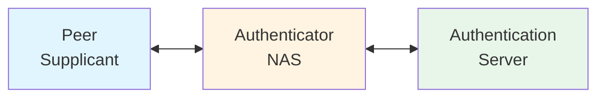

### Three-Party Model

1. **Peer (Supplicant)**
   - Device requesting network access (laptop, phone, IoT device)
   - Runs EAP supplicant software (e.g., wpa_supplicant)
   - Responds to authentication challenges

2. **Authenticator (NAS - Network Access Server)**
   - Network device controlling access (WiFi AP, switch, VPN gateway)
   - Passes EAP messages between peer and server
   - Enforces port-based access control
   - Does NOT make authentication decisions

3. **Authentication Server**
   - Makes authentication decisions (typically RADIUS server)
   - Stores credentials and policies
   - Runs EAP method implementations
   - Issues Access-Accept or Access-Reject

### Architecture Principles

- **Pass-through**: Authenticator relays EAP messages without interpretation
- **Method Negotiation**: Peer and server agree on authentication method
- **Backend Protocol**: RADIUS carries EAP between authenticator and server
- **Key Derivation**: Successful auth generates session keys (MSK, EMSK)

---

## EAP Packet Format

EAP packets have a simple, consistent structure:

```
 0                   1                   2                   3
 0 1 2 3 4 5 6 7 8 9 0 1 2 3 4 5 6 7 8 9 0 1 2 3 4 5 6 7 8 9 0 1
+-+-+-+-+-+-+-+-+-+-+-+-+-+-+-+-+-+-+-+-+-+-+-+-+-+-+-+-+-+-+-+-+
|     Code      |  Identifier   |            Length             |
+-+-+-+-+-+-+-+-+-+-+-+-+-+-+-+-+-+-+-+-+-+-+-+-+-+-+-+-+-+-+-+-+
|     Type      |  Type-Data ...
+-+-+-+-+-+-+-+-+-+-+-+-+-+-+-+-+-+-+-+-+-+-+-+-+-+-+-+-+-+-+-+-+
```

### Field Descriptions

| Field | Size | Description |
|-------|------|-------------|
| **Code** | 1 byte | Message type (1=Request, 2=Response, 3=Success, 4=Failure) |
| **Identifier** | 1 byte | Matches requests with responses (0-255, wraps around) |
| **Length** | 2 bytes | Total packet length including header (big-endian) |
| **Type** | 1 byte | EAP method type (only in Request/Response packets) |
| **Type-Data** | Variable | Method-specific data (format depends on Type field) |

### EAP Code Values

| Code | Name | Direction | Description |
|------|------|-----------|-------------|
| 1 | Request | Server → Peer | Authentication challenge or request |
| 2 | Response | Peer → Server | Response to authentication request |
| 3 | Success | Server → Peer | Authentication successful |
| 4 | Failure | Server → Peer | Authentication failed |

### EAP Type Values (Common Methods)

| Type | Method | RFC | Description |
|------|--------|-----|-------------|
| 1 | Identity | 3748 | Identity request/response |
| 4 | MD5-Challenge | 3748 | MD5 hash (deprecated, insecure) |
| 13 | EAP-TLS | 5216 | TLS-based mutual authentication |
| 21 | EAP-TTLS | 5281 | Tunneled TLS with flexible inner auth |
| 25 | PEAP | Draft | Protected EAP (tunneled) |
| 26 | EAP-MSCHAPv2 | Draft | Microsoft Challenge-Handshake v2 |
| 18 | EAP-SIM | 4186 | GSM SIM authentication |
| 23 | EAP-AKA | 4187 | UMTS authentication |
| 52 | EAP-PWD | 5931 | Password-based authentication |
| 43 | EAP-FAST | 4851 | Flexible Authentication via Secure Tunneling |

---

## EAP Message Flow

### Basic EAP Exchange

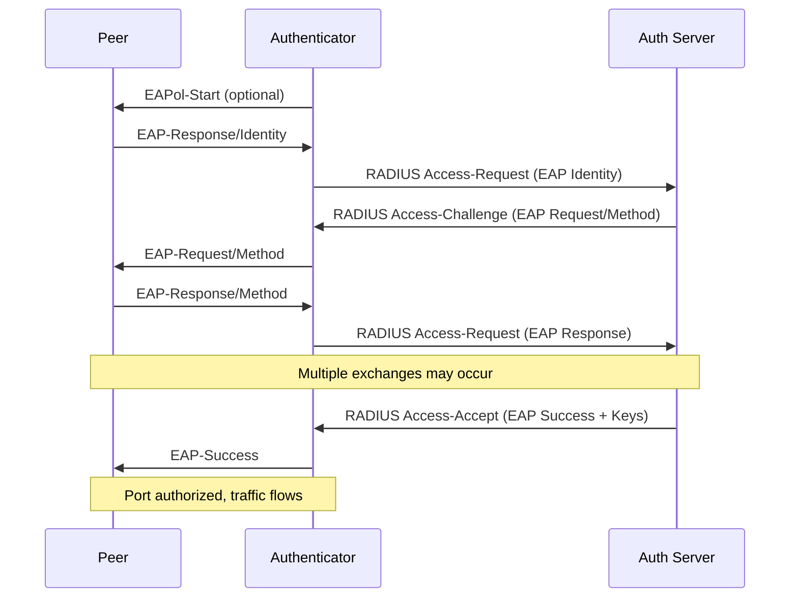

### EAP State Machine

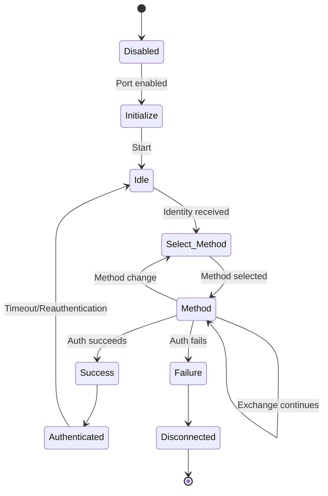

### Typical Exchange Pattern

1. **Identity Request**: Server asks peer to identify itself
2. **Identity Response**: Peer sends username/NAI (Network Access Identifier)
3. **Method Selection**: Server chooses EAP method based on policy
4. **Authentication Exchange**: Method-specific messages (varies by method)
5. **Result**: Server sends Success or Failure
6. **Key Distribution**: On success, MSK delivered to authenticator

---

## EAP Methods Comparison

### Overview of Common Methods

| Method | Security | Credentials | Mutual Auth | Tunnel | Complexity | Use Case |
|--------|----------|-------------|-------------|--------|------------|----------|
| **EAP-TLS** | Highest | Certificates (both) | Yes | Yes | High | High security, PKI infrastructure |
| **EAP-TTLS** | High | Server cert + various | Yes | Yes | Medium | Flexible, password or cert inner auth |
| **PEAP** | High | Server cert + password | Yes | Yes | Medium | Common in corporate WiFi |
| **EAP-MSCHAPv2** | Low | Password | No | No | Low | Used inside PEAP/TTLS only |
| **EAP-SIM** | Medium | SIM card | Yes | No | Medium | Cellular operator WiFi |
| **EAP-AKA** | Medium | USIM/AKA | Yes | No | Medium | 3G/4G cellular authentication |
| **EAP-PWD** | Medium | Password | Yes | No | Medium | Password without certificates |
| **EAP-FAST** | Medium | PAC + password | Yes | Yes | Medium | Cisco deployments |
| **EAP-MD5** | Very Low | Password | No | No | Very Low | Deprecated, insecure |

### Method Selection Guide

**When to use EAP-TLS:**
- Maximum security required
- PKI infrastructure available
- Device management supports certificate deployment
- Mutual authentication essential
- Examples: Government, healthcare, financial institutions

**When to use PEAP:**
- Certificate deployment challenging (only server needs cert)
- Active Directory integration desired
- Windows-heavy environment
- User password authentication acceptable
- Examples: Corporate WiFi, universities

**When to use EAP-TTLS:**
- More flexibility than PEAP needed
- Support for legacy inner methods required
- Non-Windows environments
- Mixed authentication methods
- Examples: Linux/Unix environments, ISPs

**When to use EAP-SIM/AKA:**
- Cellular operator providing WiFi
- SIM-based authentication required
- Mobile device environment
- Examples: Carrier WiFi offload, hotspots

---

## EAP-TLS Deep Dive

**EAP-TLS** (RFC 5216) is the most secure EAP method, using TLS for mutual authentication with certificates.

### Key Features

- **Mutual Authentication**: Both client and server prove identity with certificates
- **Strong Cryptography**: Leverages TLS 1.2/1.3 security
- **Key Derivation**: Generates strong session keys (MSK/EMSK)
- **No Password**: Certificate-based, resistant to dictionary attacks
- **Industry Standard**: Widely supported, well-tested

### EAP-TLS Authentication Flow

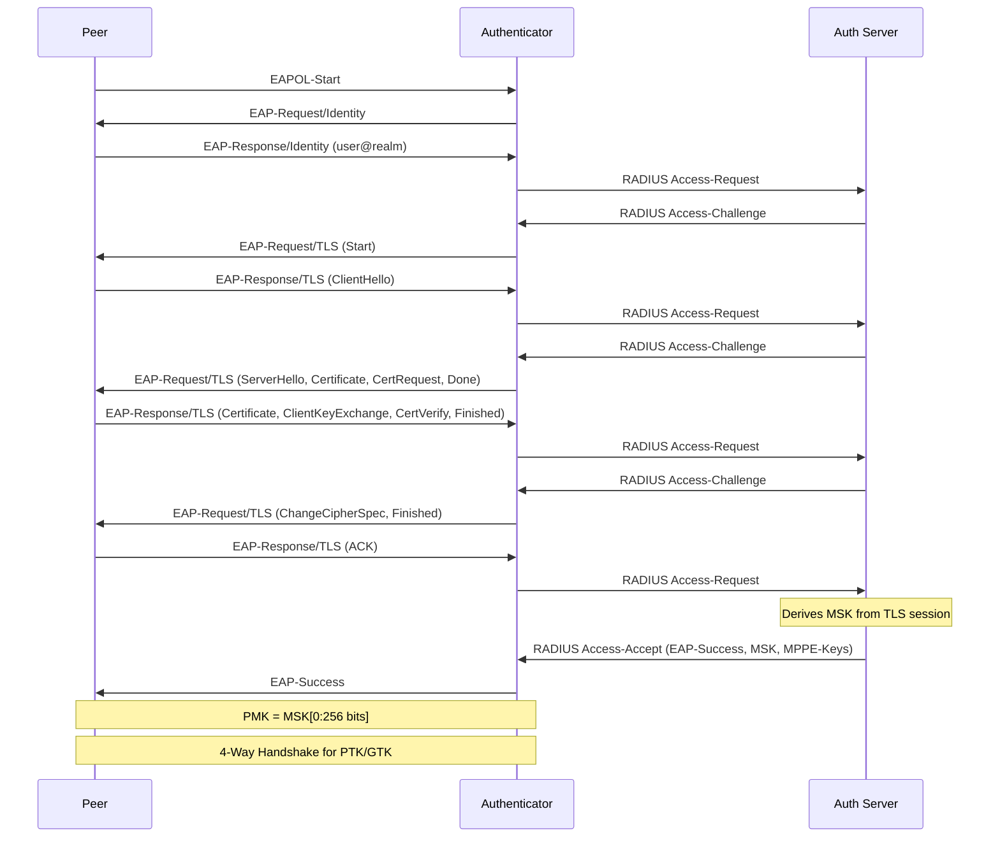

### Certificate Requirements

**Server Certificate:**
- Must be signed by trusted CA (peer must have CA certificate)
- Common Name (CN) or SAN should match server identity
- Extended Key Usage: Server Authentication (1.3.6.1.5.5.7.3.1)
- Valid date range (not expired)

**Client Certificate:**
- Must be signed by trusted CA (server must have CA certificate)
- Common Name (CN) typically contains username
- Extended Key Usage: Client Authentication (1.3.6.1.5.5.7.3.2)
- Private key must be accessible to supplicant

### Key Derivation

EAP-TLS derives keys from the TLS master secret:

```
TLS Master Secret (48 bytes)
        ↓
    PRF-256
        ↓
    ┌───────────────┐
    │  Key Block    │
    └───────────────┘
         ↓
    ┌────┴────┐
    ↓         ↓
   MSK      EMSK
(64 bytes) (64 bytes)
    ↓
  PMK (first 256 bits of MSK)
    ↓
4-Way Handshake
    ↓
  PTK, GTK
```

### Configuration Example (wpa_supplicant)

```bash
network={
    ssid="Enterprise-WiFi"
    key_mgmt=WPA-EAP
    eap=TLS
    identity="user@example.com"

    # Client certificate and key
    client_cert="/etc/certs/client.crt"
    private_key="/etc/certs/client.key"
    private_key_passwd="keypassword"

    # CA certificate (validates server)
    ca_cert="/etc/certs/ca.crt"

    # Optional: Verify server certificate CN
    domain_suffix_match="radius.example.com"

    # TLS version
    phase1="tls_disable_tlsv1_0=1 tls_disable_tlsv1_1=1"
}
```

### Configuration Example (hostapd/RADIUS)

**hostapd.conf:**
```bash
# Basic settings
interface=wlan0
ssid=Enterprise-WiFi
auth_algs=1
wpa=2
wpa_key_mgmt=WPA-EAP
rsn_pairwise=CCMP

# 802.1X settings
ieee8021x=1
eapol_version=2

# RADIUS server
auth_server_addr=192.168.1.10
auth_server_port=1812
auth_server_shared_secret=radiussecret
```

**FreeRADIUS eap.conf:**
```bash
eap {
    default_eap_type = tls

    tls-config tls-common {
        # Server certificate
        private_key_file = /etc/raddb/certs/server.key
        certificate_file = /etc/raddb/certs/server.crt
        ca_file = /etc/raddb/certs/ca.crt

        # Client certificate validation
        ca_path = /etc/raddb/certs/
        cipher_list = "HIGH"
        cipher_server_preference = no
        tls_min_version = "1.2"

        # Certificate verification
        check_cert_cn = %{User-Name}
    }

    tls {
        tls = tls-common
    }
}
```

---

## PEAP Deep Dive

**PEAP (Protected EAP)** creates a TLS tunnel to protect weaker authentication methods. Developed by Microsoft, Cisco, and RSA Security.

### Key Features

- **Two-Phase Authentication**: Outer TLS tunnel, inner method authentication
- **Server-Only Certificate**: Client doesn't need certificate
- **Protected Identity**: Username sent in encrypted tunnel (outer identity can be anonymous)
- **Common Inner Methods**: EAP-MSCHAPv2 (most common), EAP-GTC
- **Windows Integration**: Native support in Windows

### PEAP Architecture

```
┌─────────────────────────────────────────┐
│         TLS Tunnel (Phase 1)            │
│  ┌───────────────────────────────────┐  │
│  │   Inner EAP Method (Phase 2)      │  │
│  │                                   │  │
│  │   EAP-MSCHAPv2 / EAP-GTC /etc    │  │
│  └───────────────────────────────────┘  │
└─────────────────────────────────────────┘
         Server Certificate Required
         Client Certificate Optional
```

### PEAP Authentication Flow

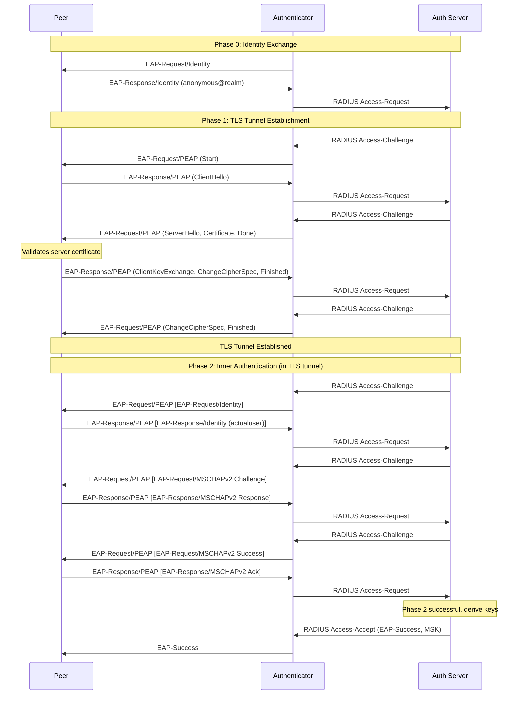

### PEAP Versions

**PEAPv0 (EAP-MSCHAPv2):**
- Most common implementation
- Inner method: EAP-MSCHAPv2
- Supported by Windows, most vendors

**PEAPv1 (EAP-GTC):**
- Less common
- Inner method: EAP-GTC (Generic Token Card)
- Used for OTP, token-based auth

### Configuration Example (wpa_supplicant)

```bash
network={
    ssid="Corporate-WiFi"
    key_mgmt=WPA-EAP
    eap=PEAP

    # Outer identity (can be anonymous)
    identity="anonymous@example.com"

    # Inner identity (actual username)
    password="userpassword"

    # Phase 2 (inner) authentication
    phase2="auth=MSCHAPV2"

    # CA certificate to validate server
    ca_cert="/etc/certs/ca.crt"

    # Optional: Verify server certificate
    domain_suffix_match="radius.example.com"

    # PEAP version (0 = PEAPv0, 1 = PEAPv1)
    phase1="peapver=0"

    # Anonymous identity for outer tunnel
    anonymous_identity="anonymous@example.com"
}
```

### Configuration Example (FreeRADIUS)

```bash
eap {
    default_eap_type = peap

    peap {
        tls = tls-common
        default_eap_type = mschapv2
        copy_request_to_tunnel = yes
        use_tunneled_reply = yes
        virtual_server = "inner-tunnel"
    }

    mschapv2 {
        # MSCHAPv2 settings
        with_ntdomain_hack = no
    }
}
```

**sites-enabled/inner-tunnel:**
```bash
server inner-tunnel {
    authorize {
        filter_username
        chap
        mschap
        eap {
            ok = return
        }
        files
        -sql
        -ldap
    }

    authenticate {
        Auth-Type EAP {
            eap
        }
        mschap
    }
}
```

### Key Derivation in PEAP

```
TLS Master Secret
        ↓
   TLS PRF (outer)
        ↓
    PEAP Keys
        ↓
  ┌─────┴─────┐
  ↓           ↓
Inner     Outer
Method    Keys
  ↓
MSCHAPv2
Response
  ↓
MSK (combined from TLS + MSCHAPv2)
```

---

## EAP-TTLS Deep Dive

**EAP-TTLS (Tunneled TLS)** - RFC 5281. Similar to PEAP but more flexible with inner authentication methods.

### Key Features

- **Flexible Inner Methods**: Supports both EAP and non-EAP methods
- **AVPs (Attribute-Value Pairs)**: Uses DIAMETER-style attributes
- **Server-Only Certificate**: Like PEAP, only server needs certificate
- **Protected Identity**: True identity sent in encrypted tunnel
- **Non-EAP Support**: Can tunnel PAP, CHAP, MS-CHAP, MS-CHAPv2

### PEAP vs EAP-TTLS

| Feature | PEAP | EAP-TTLS |
|---------|------|----------|
| **Inner Methods** | EAP only | EAP and non-EAP |
| **Protocol** | TLS + EAP | TLS + AVPs (DIAMETER) |
| **Common Inner** | EAP-MSCHAPv2, EAP-GTC | PAP, CHAP, MSCHAPv2, EAP-* |
| **Standardization** | Draft (Microsoft/Cisco) | RFC 5281 |
| **Windows Support** | Native | Requires client software |
| **Flexibility** | Lower | Higher |

### Supported Inner Methods

**Non-EAP Methods (Phase 2):**
- **PAP**: Clear-text password (protected by TLS tunnel)
- **CHAP**: Challenge-Handshake Authentication Protocol
- **MS-CHAP**: Microsoft CHAP
- **MS-CHAPv2**: Microsoft CHAP version 2
- **EAP-***: Any EAP method (EAP-MSCHAPv2, EAP-GTC, etc.)

### EAP-TTLS Authentication Flow

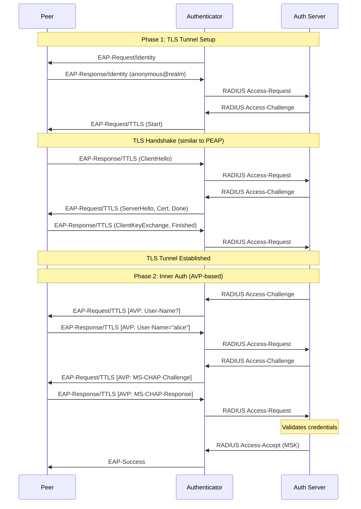

### AVP Structure

EAP-TTLS uses DIAMETER AVPs for inner authentication:

```
 0                   1                   2                   3
 0 1 2 3 4 5 6 7 8 9 0 1 2 3 4 5 6 7 8 9 0 1 2 3 4 5 6 7 8 9 0 1
+-+-+-+-+-+-+-+-+-+-+-+-+-+-+-+-+-+-+-+-+-+-+-+-+-+-+-+-+-+-+-+-+
|                           AVP Code                            |
+-+-+-+-+-+-+-+-+-+-+-+-+-+-+-+-+-+-+-+-+-+-+-+-+-+-+-+-+-+-+-+-+
|V M P r r r r r|                AVP Length                     |
+-+-+-+-+-+-+-+-+-+-+-+-+-+-+-+-+-+-+-+-+-+-+-+-+-+-+-+-+-+-+-+-+
|                        Vendor-ID (opt)                        |
+-+-+-+-+-+-+-+-+-+-+-+-+-+-+-+-+-+-+-+-+-+-+-+-+-+-+-+-+-+-+-+-+
|                           Data ...                            |
+-+-+-+-+-+-+-+-+-+-+-+-+-+-+-+-+-+-+-+-+-+-+-+-+-+-+-+-+-+-+-+-+
```

**Common AVPs:**
- `User-Name` (1): Username
- `User-Password` (2): Password (for PAP)
- `CHAP-Password` (3): CHAP response
- `MS-CHAP-Challenge` (11): Microsoft CHAP challenge
- `MS-CHAP2-Response` (25): MSCHAPv2 response

### Configuration Example (wpa_supplicant)

**EAP-TTLS with PAP:**
```bash
network={
    ssid="TTLS-Network"
    key_mgmt=WPA-EAP
    eap=TTLS

    # Outer identity (anonymous)
    anonymous_identity="anonymous@example.com"

    # Inner identity and password
    identity="alice@example.com"
    password="userpassword"

    # Phase 2: Use PAP (password in clear, but encrypted by TLS)
    phase2="auth=PAP"

    # CA certificate
    ca_cert="/etc/certs/ca.crt"
    domain_suffix_match="radius.example.com"
}
```

**EAP-TTLS with MSCHAPv2:**
```bash
network={
    ssid="TTLS-Network"
    key_mgmt=WPA-EAP
    eap=TTLS
    anonymous_identity="anonymous@example.com"
    identity="bob@example.com"
    password="bobpassword"

    # Phase 2: Use MSCHAPv2
    phase2="auth=MSCHAPV2"

    ca_cert="/etc/certs/ca.crt"
}
```

**EAP-TTLS with EAP-MSCHAPv2 (nested EAP):**
```bash
network={
    ssid="TTLS-Network"
    key_mgmt=WPA-EAP
    eap=TTLS
    anonymous_identity="anonymous@example.com"
    identity="carol@example.com"
    password="carolpassword"

    # Phase 2: Use EAP-MSCHAPv2 (EAP method inside TTLS)
    phase2="autheap=MSCHAPV2"

    ca_cert="/etc/certs/ca.crt"
}
```

### Configuration Example (FreeRADIUS)

```bash
eap {
    default_eap_type = ttls

    ttls {
        tls = tls-common
        default_eap_type = mschapv2
        copy_request_to_tunnel = yes
        use_tunneled_reply = yes
        virtual_server = "inner-tunnel"

        # Support non-EAP methods
        require_client_cert = no
    }
}
```

---

## EAPOL (EAP over LAN)

**EAPOL (EAP over LAN)** - IEEE 802.1X defines how EAP packets are encapsulated for LAN environments.

### EAPOL Frame Format

```
 Ethernet Frame
┌────────────────────────────────────────────────────────┐
│ Dest MAC │ Src MAC │ EtherType │ EAPOL Packet │  FCS  │
│  6 bytes │ 6 bytes │  0x888E   │   Variable   │4 bytes│
└────────────────────────────────────────────────────────┘
                           ↓
                    EAPOL Packet
         ┌──────────────────────────────────────┐
         │ Ver │ Type │ Length │ Packet Body    │
         │  1  │  1   │   2    │   Variable     │
         └──────────────────────────────────────┘
                                  ↓
                          (If Type = EAP-Packet)
                           EAP Packet Format
                   ┌─────────────────────────────┐
                   │ Code│ Id │Len │Type│ Data  │
                   └─────────────────────────────┘
```

### EAPOL Packet Structure

| Field | Size | Description |
|-------|------|-------------|
| **Protocol Version** | 1 byte | EAPOL version (1, 2, or 3) |
| **Packet Type** | 1 byte | Type of EAPOL packet |
| **Packet Body Length** | 2 bytes | Length of packet body (big-endian) |
| **Packet Body** | Variable | Content depends on Packet Type |

### EAPOL Packet Types

| Type | Name | Description |
|------|------|-------------|
| 0 | EAP-Packet | Carries EAP messages |
| 1 | EAPOL-Start | Supplicant initiates authentication |
| 2 | EAPOL-Logoff | Supplicant logging off |
| 3 | EAPOL-Key | Key exchange messages (WPA/WPA2 4-way handshake) |
| 4 | EAPOL-Encapsulated-ASF-Alert | Alert messages |
| 5 | EAPOL-MKA | MACsec Key Agreement |

### EAPOL Versions

- **EAPOL v1**: Original 802.1X-2001
- **EAPOL v2**: 802.1X-2004 (most common for WiFi)
- **EAPOL v3**: 802.1X-2010 (added features for MACsec)

### EAPOL Multicast Address

EAPOL frames are sent to a special multicast MAC address:

- **PAE Group Address**: `01:80:C2:00:00:03`
- Used when supplicant doesn't know authenticator's address
- Ensures EAPOL frames aren't forwarded by bridges

### EAPOL Exchange Example

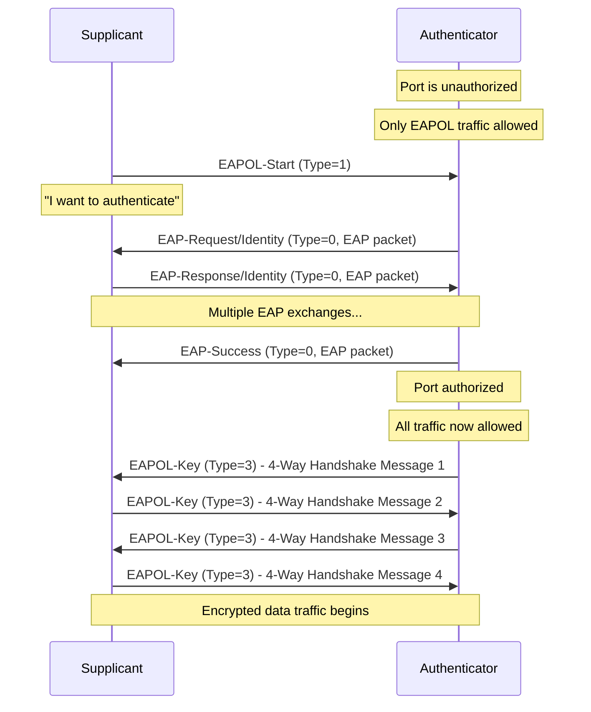

---

## EAP with 802.1X

**802.1X** provides port-based network access control using EAP authentication.

### 802.1X Architecture

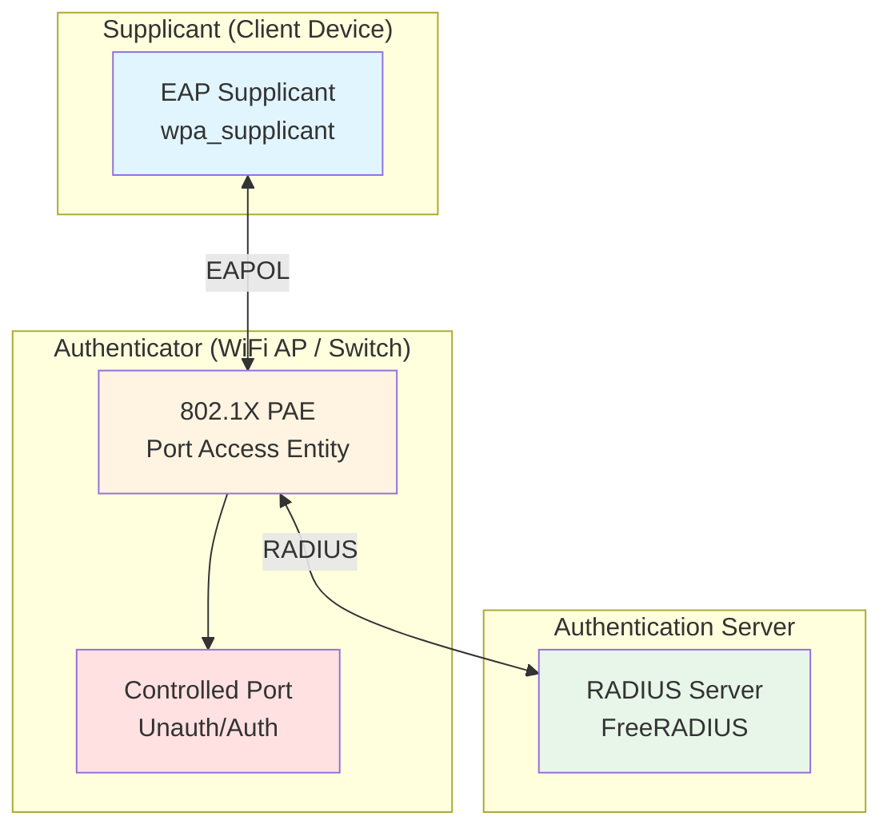

### Port States

**Uncontrolled Port:**
- Always open for EAPOL traffic
- Allows authentication messages
- Used for EAP exchange

**Controlled Port:**
- Initially blocked (unauthorized state)
- Opens after successful authentication (authorized state)
- Carries normal data traffic

### 802.1X with WiFi (WPA2-Enterprise)

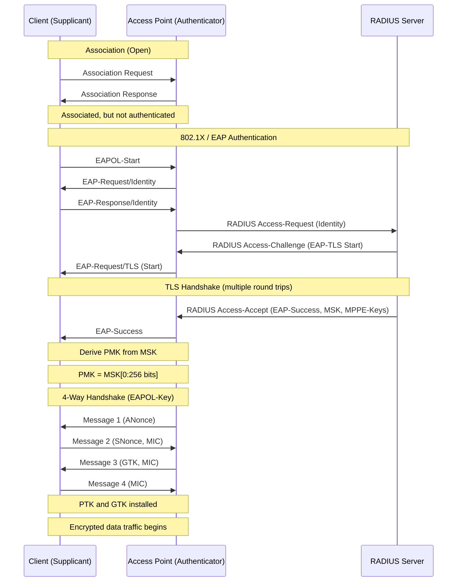

### Key Hierarchy with 802.1X

```
             EAP Authentication
                     ↓
        MSK (Master Session Key)
              64 bytes
                     ↓
        PMK = MSK[0:31] (first 256 bits)
     (Pairwise Master Key)
                     ↓
           4-Way Handshake
         (uses ANonce, SNonce)
                     ↓
        PTK (Pairwise Transient Key)
              384/512 bits
                     ↓
    ┌────────┬────────┬────────┬────────┐
    │  KCK   │  KEK   │  TK    │ (MIC)  │
    │(16B)   │(16B)   │(16B)   │        │
    └────────┴────────┴────────┴────────┘

    GTK (Group Temporal Key)
    ← Encrypted with KEK in Msg 3
```

**Key Definitions:**
- **MSK**: Master Session Key (from EAP method)
- **PMK**: Pairwise Master Key (derived from MSK)
- **PTK**: Pairwise Transient Key (per-session encryption key)
  - **KCK**: Key Confirmation Key (protects 4-way handshake)
  - **KEK**: Key Encryption Key (encrypts GTK)
  - **TK**: Temporal Key (encrypts unicast data)
- **GTK**: Group Temporal Key (encrypts multicast/broadcast)

### 802.1X State Machine (Simplified)

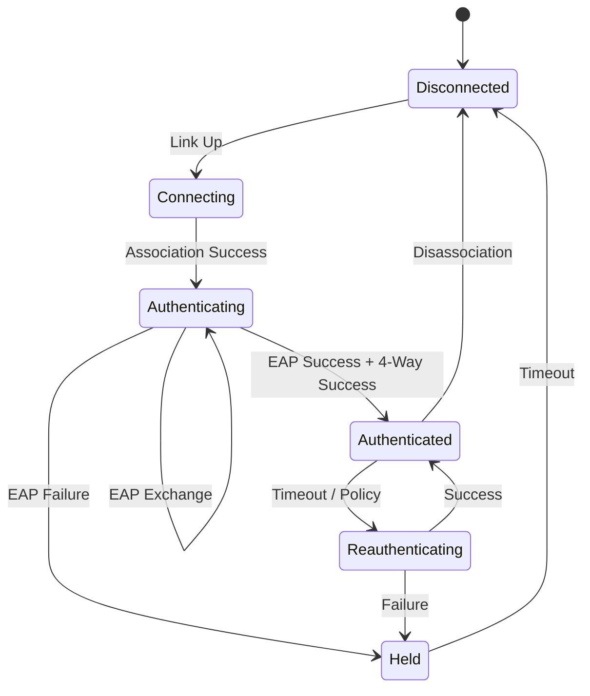

---

## EAP over RADIUS

RADIUS (Remote Authentication Dial-In User Service) is the transport protocol that carries EAP between authenticator and authentication server.

### RADIUS with EAP Attributes

**Key RADIUS Attributes for EAP:**

| Attribute | Type | Direction | Description |
|-----------|------|-----------|-------------|
| **EAP-Message** | 79 | Both | Carries EAP packets (can be fragmented) |
| **Message-Authenticator** | 80 | Both | HMAC-MD5 integrity check (required for EAP) |
| **State** | 24 | Server→NAS | Session state (opaque to NAS, returned in next request) |
| **MS-MPPE-Recv-Key** | 17 (Vendor) | Server→NAS | First 32 bytes of MSK |
| **MS-MPPE-Send-Key** | 16 (Vendor) | Server→NAS | Second 32 bytes of MSK |

### RADIUS Packet Flow with EAP

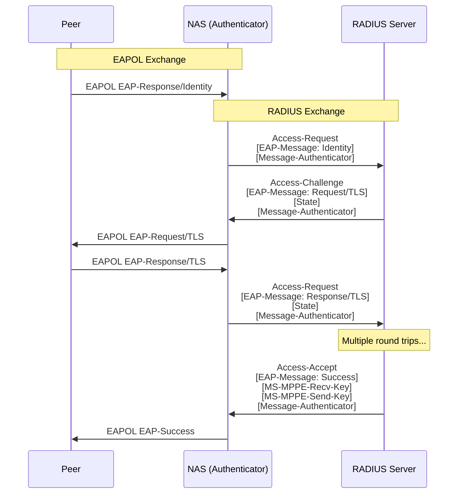

### RADIUS Packet Structure with EAP

**Access-Request:**
```
Code: 1 (Access-Request)
Identifier: 42
Length: 234
Authenticator: [16 bytes random]
Attributes:
  User-Name: "alice@example.com"
  NAS-IP-Address: 192.168.1.1
  NAS-Port: 0
  Called-Station-Id: "00-11-22-33-44-55:Corp-WiFi"
  Calling-Station-Id: "aa-bb-cc-dd-ee-ff"
  NAS-Port-Type: 19 (Wireless-802.11)
  EAP-Message: [EAP packet data]
  Message-Authenticator: [16 bytes HMAC-MD5]
  State: [server state from previous response]
```

**Access-Challenge:**
```
Code: 11 (Access-Challenge)
Identifier: 42 (matches request)
Length: 156
Authenticator: [16 bytes response]
Attributes:
  EAP-Message: [EAP packet data]
  State: [opaque session state]
  Message-Authenticator: [16 bytes HMAC-MD5]
```

**Access-Accept:**
```
Code: 2 (Access-Accept)
Identifier: 42
Length: 189
Authenticator: [16 bytes response]
Attributes:
  EAP-Message: [EAP-Success]
  MS-MPPE-Recv-Key: [encrypted, first 32 bytes of MSK]
  MS-MPPE-Send-Key: [encrypted, second 32 bytes of MSK]
  Message-Authenticator: [16 bytes HMAC-MD5]
  Session-Timeout: 3600
```

### EAP Fragmentation in RADIUS

EAP packets can be large (especially with certificates). RADIUS has a 4096-byte packet limit.

**Fragmentation Strategy:**
- Split EAP packet into multiple `EAP-Message` attributes
- Each attribute ≤ 253 bytes
- Reassembled at receiver
- Multiple `EAP-Message` attributes in single RADIUS packet

**Example:**
```
Access-Request:
  EAP-Message[1]: [253 bytes]
  EAP-Message[2]: [253 bytes]
  EAP-Message[3]: [253 bytes]
  EAP-Message[4]: [100 bytes]
  Message-Authenticator: [16 bytes]
```

### MSK Distribution

After successful EAP authentication, the RADIUS server sends the MSK to the NAS:

**Microsoft MPPE Keys (most common):**
```
MS-MPPE-Recv-Key = Salt + Encrypted(MSK[0:31])
MS-MPPE-Send-Key = Salt + Encrypted(MSK[32:63])

Encryption uses:
  Key = MD5(RADIUS-Secret + Request-Authenticator)
```

**RADIUS Tunnel-Password Attribute (alternative):**
```
Tag = 0
Salt = [2 bytes random]
Encrypted-Data = Encrypted(MSK[0:63])
```

---

## Key Derivation

EAP methods derive cryptographic keys used for subsequent encryption and integrity protection.

### Key Types

| Key | Size | Source | Purpose |
|-----|------|--------|---------|
| **MSK** (Master Session Key) | 512 bits (64 bytes) | EAP method | Distributed to authenticator, derives PMK |
| **EMSK** (Extended MSK) | 512 bits (64 bytes) | EAP method | Reserved for future use, not distributed |
| **PMK** (Pairwise Master Key) | 256 bits (32 bytes) | First 256 bits of MSK | Input to 4-way handshake |
| **PTK** (Pairwise Transient Key) | 384-512 bits | 4-way handshake | Per-session encryption keys |
| **GTK** (Group Temporal Key) | 128-256 bits | AP generated | Multicast/broadcast encryption |

### Key Derivation Hierarchy

```
                    EAP Method
                   (TLS, TTLS, PEAP, etc.)
                          ↓
         ┌────────────────┴────────────────┐
         ↓                                 ↓
    MSK (64 bytes)                    EMSK (64 bytes)
    Distributed to NAS                Not distributed
         ↓                             (Future use)
    PMK = MSK[0:31]
    (First 256 bits)
         ↓
    ──────────────────
    4-Way Handshake
    ──────────────────
    Inputs:
      - PMK
      - ANonce (AP random)
      - SNonce (STA random)
      - AA (AP MAC)
      - SA (STA MAC)
         ↓
    PTK = PRF-X(PMK, "Pairwise key expansion",
                Min(AA,SA) || Max(AA,SA) ||
                Min(ANonce,SNonce) || Max(ANonce,SNonce))
         ↓
    ┌─────────┬─────────┬─────────┬─────────┐
    │   KCK   │   KEK   │    TK   │ (MIC Key│
    │ 16 bytes│ 16 bytes│ 16 bytes│  if WPA)│
    │ Confirm │ Encrypt │ Data    │         │
    │ 4-Way   │  GTK    │ Encrypt │         │
    └─────────┴─────────┴─────────┴─────────┘
```

### EAP-TLS Key Derivation

```
TLS Master Secret (48 bytes)
        ↓
TLS PRF (Pseudo-Random Function)
        ↓
Key Material = TLS-PRF(master_secret,
                       "client EAP encryption",
                       client_random || server_random)
        ↓
    ┌───────┴────────┐
    ↓                ↓
MSK (64 bytes)   EMSK (64 bytes)
```

### PEAP/TTLS Key Derivation

PEAP and TTLS derive keys from both the TLS tunnel and inner method:

```
TLS Master Secret (from Phase 1)
        ↓
TLS PRF → Intermediate Keys
        ↓
Inner Method (Phase 2)
  (e.g., MSCHAPv2)
        ↓
    Response Hash
        ↓
Combined PRF (TLS keys + Inner keys)
        ↓
    ┌───────┴────────┐
    ↓                ↓
MSK (64 bytes)   EMSK (64 bytes)
```

### PMK Caching (Fast Roaming)

To speed up roaming, PMK can be cached:

**PMK-R0 (802.11r FT):**
```
PMK-R0 = KDF(MSK, "FT-R0", SSID || MDID || R0KH-ID || S0KH-ID)
```

**PMK-R1 (per-AP):**
```
PMK-R1 = KDF(PMK-R0, "FT-R1", R1KH-ID || S1KH-ID)
```

See [roaming.md](roaming.md) for 802.11r details.

### Key Lifetimes

| Key | Typical Lifetime | Refresh Method |
|-----|------------------|----------------|
| **MSK** | Until session ends | Full re-authentication |
| **PMK** | Hours to days | Re-authentication or cached |
| **PTK** | Session (until roam/disconnect) | 4-way handshake |
| **GTK** | Minutes to hours | Group key handshake (2-way) |

---

## Security Considerations

### EAP Method Security Comparison

| Method | MitM Protection | Dictionary Attack Resistance | Certificate Requirement | Vulnerabilities |
|--------|----------------|------------------------------|------------------------|-----------------|
| **EAP-TLS** | ✓✓✓ Strong | ✓✓✓ Immune | Both client & server | Cert management complexity |
| **PEAP** | ✓✓ Good | ✓✓ Good (tunneled) | Server only | Inner method weaknesses |
| **EAP-TTLS** | ✓✓ Good | ✓✓ Good (tunneled) | Server only | Inner method weaknesses |
| **EAP-MSCHAPv2** | ✗ None | ✗ Vulnerable | None | DES, dictionary attacks |
| **EAP-PWD** | ✓✓ Good | ✓✓ Good | None | Implementation bugs |
| **EAP-SIM/AKA** | ✓ Moderate | ✓✓ Good | None | SIM cloning risk |
| **EAP-FAST** | ✓ Moderate | ✓ Moderate | None (uses PAC) | PAC provisioning risk |
| **EAP-MD5** | ✗ None | ✗ Vulnerable | None | Deprecated, insecure |

### Common Vulnerabilities

**1. EAP-MSCHAPv2 (when used alone - not tunneled):**
- **DES encryption**: Uses deprecated DES algorithm
- **Dictionary attacks**: Password can be brute-forced
- **No server authentication**: Client doesn't verify server identity
- **Mitigation**: Only use inside PEAP/TTLS tunnel

**2. Certificate Validation Failures:**
- **Problem**: Client doesn't validate server certificate
- **Risk**: MitM attack with rogue AP and fake RADIUS
- **Mitigation**: Configure `ca_cert`, `domain_suffix_match`, `domain_match`

**3. Anonymous Identity Leakage:**
- **Problem**: Real identity sent in outer (unencrypted) identity
- **Risk**: Username disclosure before tunnel established
- **Mitigation**: Use `anonymous_identity` for outer, real identity for inner

**4. EAP Method Downgrade:**
- **Problem**: Attacker forces client to use weaker method
- **Risk**: Authentication with less secure method
- **Mitigation**: Configure specific EAP method(s), don't allow negotiation

**5. Rogue AP Attacks:**
- **Problem**: Fake AP with captive RADIUS server
- **Risk**: Credential theft, MitM
- **Mitigation**: Server certificate validation, certificate pinning

### Best Practices for Security

**Server Certificate Validation:**
```bash
# Minimum secure configuration
network={
    # ... other settings ...

    # Validate server certificate
    ca_cert="/etc/certs/ca.crt"

    # Verify server name (strongest protection)
    domain_suffix_match="radius.example.com"
    # OR
    domain_match="radius.example.com"

    # Optional: Pin specific certificate
    # ca_cert="/etc/certs/radius-server.crt"
}
```

**Anonymous Identity:**
```bash
# Protect real username
anonymous_identity="anonymous@example.com"
identity="alice@example.com"  # Sent in encrypted tunnel
```

**Disable Weak Methods:**
```bash
# Only allow strong methods
eap=TLS
# OR for tunneled:
eap=TTLS
phase2="autheap=MSCHAPV2"  # MSCHAPv2 inside tunnel is OK
```

**TLS Version:**
```bash
# Disable old TLS versions
phase1="tls_disable_tlsv1_0=1 tls_disable_tlsv1_1=1"
```

### Known Attacks and Mitigations

**1. MS-CHAPv2 Hash Cracking (Moxie Marlinspike, 2012):**
- **Attack**: DES keys derived from password can be cracked in ~23 hours
- **Affected**: EAP-MSCHAPv2 (unencrypted)
- **Mitigation**: Use MSCHAPv2 only inside PEAP/TTLS tunnel

**2. PEAP/PEAP (Double PEAP Attack):**
- **Attack**: Nested PEAP tunnels can bypass authentication
- **Affected**: Misconfigured PEAP
- **Mitigation**: Proper RADIUS server configuration, validate inner identity

**3. EAP-TLS Fragmentation Attack:**
- **Attack**: Memory exhaustion with fragmented packets
- **Affected**: Some implementations
- **Mitigation**: Update to patched versions, implement fragment limits

**4. Credential Forwarding (Evil Twin):**
- **Attack**: Rogue AP forwards credentials to legitimate network
- **Affected**: Methods without server authentication
- **Mitigation**: Mutual authentication (EAP-TLS, PEAP, TTLS with cert validation)

---

## Configuration Examples

### Complete wpa_supplicant Examples

**EAP-TLS (Maximum Security):**
```bash
# /etc/wpa_supplicant/wpa_supplicant.conf

ctrl_interface=/var/run/wpa_supplicant
ctrl_interface_group=wheel
update_config=1
country=US

network={
    ssid="Corporate-Secure"
    key_mgmt=WPA-EAP
    eap=TLS

    # Client identity (often from certificate CN)
    identity="alice@corp.example.com"

    # Client certificate and private key
    client_cert="/etc/certs/alice.crt"
    private_key="/etc/certs/alice.key"
    private_key_passwd="keypassword"

    # CA certificate (validate server)
    ca_cert="/etc/certs/corp-ca.crt"

    # Server certificate validation (CRITICAL for security)
    domain_suffix_match="radius.corp.example.com"

    # Optional: Check specific certificate fields
    # altsubject_match="DNS:radius.corp.example.com"

    # TLS settings
    phase1="tls_disable_tlsv1_0=1 tls_disable_tlsv1_1=1"

    # Optional: Specify cipher suites
    # openssl_ciphers="ECDHE-RSA-AES256-GCM-SHA384:ECDHE-RSA-AES128-GCM-SHA256"

    # Priority (higher = preferred)
    priority=10
}
```

**PEAP with EAP-MSCHAPv2 (Common Corporate):**
```bash
network={
    ssid="Corp-WiFi"
    key_mgmt=WPA-EAP
    eap=PEAP

    # Outer identity (anonymous for privacy)
    anonymous_identity="anonymous@corp.example.com"

    # Inner identity and password
    identity="alice@corp.example.com"
    password="SecurePassword123!"

    # Phase 2 (inner authentication)
    phase2="auth=MSCHAPV2"

    # PEAP version (0 is most common)
    phase1="peapver=0"

    # Server certificate validation (CRITICAL)
    ca_cert="/etc/certs/corp-ca.crt"
    domain_suffix_match="radius.corp.example.com"

    priority=5
}
```

**EAP-TTLS with PAP (Flexible):**
```bash
network={
    ssid="University-WiFi"
    key_mgmt=WPA-EAP
    eap=TTLS

    # Anonymous outer identity
    anonymous_identity="guest@uni.edu"

    # Real credentials (sent in encrypted tunnel)
    identity="student123@uni.edu"
    password="StudentPass456"

    # Phase 2: PAP (simple password, but encrypted in TLS tunnel)
    phase2="auth=PAP"

    # Server validation
    ca_cert="/etc/certs/uni-ca.crt"
    domain_match="radius.uni.edu"

    priority=5
}
```

**EAP-TTLS with EAP-MSCHAPv2 (Nested EAP):**
```bash
network={
    ssid="Enterprise-Network"
    key_mgmt=WPA-EAP
    eap=TTLS

    anonymous_identity="anon@example.com"
    identity="bob@example.com"
    password="BobPassword789"

    # Note: "autheap" (not "auth") for EAP inner method
    phase2="autheap=MSCHAPV2"

    ca_cert="/etc/certs/ca.crt"
    domain_suffix_match="radius.example.com"
}
```

### Complete hostapd Configuration

**hostapd.conf for WPA2-Enterprise:**
```bash
# Interface
interface=wlan0
driver=nl80211
bridge=br0

# SSID and basic settings
ssid=Corporate-WiFi
hw_mode=g
channel=6
country_code=US

# Security settings
auth_algs=1
wpa=2
wpa_key_mgmt=WPA-EAP
rsn_pairwise=CCMP
wpa_pairwise=CCMP

# 802.1X settings
ieee8021x=1
eapol_version=2
eapol_key_index_workaround=0

# RADIUS server configuration
auth_server_addr=192.168.1.100
auth_server_port=1812
auth_server_shared_secret=SuperSecretRADIUSPassword123

# Optional: Secondary RADIUS server (failover)
auth_server_addr=192.168.1.101
auth_server_port=1812
auth_server_shared_secret=SuperSecretRADIUSPassword123

# Optional: Accounting server
acct_server_addr=192.168.1.100
acct_server_port=1813
acct_server_shared_secret=SuperSecretRADIUSPassword123

# Optional: Dynamic VLAN assignment
dynamic_vlan=1
vlan_file=/etc/hostapd/hostapd.vlan

# PMK caching for fast roaming
rsn_preauth=1
rsn_preauth_interfaces=wlan0
pmk_r1_push=1
ft_over_ds=1
ft_psk_generate_local=1

# Logging
logger_syslog=-1
logger_syslog_level=2
logger_stdout=-1
logger_stdout_level=2
```

**hostapd.vlan (Dynamic VLAN):**
```bash
# Format: VLAN_ID VLAN_interface
1       vlan1
10      vlan10
20      vlan20
100     vlan100
*       vlan999  # Default VLAN for unknown users
```

### FreeRADIUS Configuration

**clients.conf:**
```bash
# Define NAS (Network Access Server) - your APs
client wifi-ap-1 {
    ipaddr = 192.168.1.50
    secret = SuperSecretRADIUSPassword123
    shortname = ap-building-a
    nas_type = other
}

client wifi-controllers {
    ipaddr = 192.168.1.0/24
    secret = ControllerSecret456
    shortname = wlc-network
}
```

**eap.conf:**
```bash
eap {
    # Default EAP type for outer authentication
    default_eap_type = peap

    # Timer settings
    timer_expire = 60
    ignore_unknown_eap_types = no

    # Common TLS configuration
    tls-config tls-common {
        # Server certificate and key
        private_key_file = /etc/raddb/certs/server.key
        certificate_file = /etc/raddb/certs/server.crt
        ca_file = /etc/raddb/certs/ca.crt

        # Certificate chain (if intermediate CAs)
        ca_path = /etc/raddb/certs/

        # Cipher configuration
        cipher_list = "HIGH:!aNULL:!eNULL:!EXPORT:!DES:!MD5:!PSK:!RC4"
        cipher_server_preference = yes

        # TLS version
        tls_min_version = "1.2"
        tls_max_version = "1.3"

        # Disable weak protocols
        disable_tlsv1 = yes
        disable_tlsv1_1 = yes

        # Certificate verification
        check_cert_cn = %{User-Name}
        check_cert_issuer = "/C=US/ST=CA/O=Example Corp/CN=Example CA"

        # DH parameters
        dh_file = /etc/raddb/certs/dh2048.pem

        # OCSP settings (optional)
        # ocsp {
        #     enable = yes
        #     override_cert_url = yes
        #     url = "http://ocsp.example.com"
        # }
    }

    # EAP-TLS configuration
    tls {
        tls = tls-common

        # Require client certificate
        require_client_cert = yes
    }

    # PEAP configuration
    peap {
        tls = tls-common
        default_eap_type = mschapv2
        copy_request_to_tunnel = yes
        use_tunneled_reply = yes
        virtual_server = "inner-tunnel"

        # PEAP version
        # peap_version = 0
    }

    # EAP-TTLS configuration
    ttls {
        tls = tls-common
        default_eap_type = mschapv2
        copy_request_to_tunnel = yes
        use_tunneled_reply = yes
        virtual_server = "inner-tunnel"

        # Support non-EAP inner methods
        require_client_cert = no
    }

    # MSCHAPv2 (for use inside PEAP/TTLS)
    mschapv2 {
        with_ntdomain_hack = no
    }
}
```

**users file (simple file-based auth):**
```bash
# EAP-TLS: Check certificate attributes
alice@corp.example.com   Cleartext-Password := "unused"
    Reply-Message = "Welcome Alice",
    Tunnel-Type = VLAN,
    Tunnel-Medium-Type = IEEE-802,
    Tunnel-Private-Group-ID = 10

# PEAP/MSCHAPv2: Password authentication
bob@corp.example.com     Cleartext-Password := "BobPassword123"
    Reply-Message = "Welcome Bob",
    Tunnel-Private-Group-ID = 20

# Default user (deny)
DEFAULT         Auth-Type := Reject
                Reply-Message = "Authentication failed"
```

**sites-enabled/default (outer server):**
```bash
server default {
    authorize {
        filter_username
        preprocess

        # EAP authorization
        eap {
            ok = return
        }

        # Check files, SQL, LDAP, etc.
        files
        -sql
        -ldap
    }

    authenticate {
        Auth-Type EAP {
            eap
        }
    }

    post-auth {
        # Reply attributes
        reply

        # Post-auth actions
        Post-Auth-Type REJECT {
            attr_filter.access_reject
        }
    }
}
```

**sites-enabled/inner-tunnel (for PEAP/TTLS phase 2):**
```bash
server inner-tunnel {
    authorize {
        filter_username

        # Inner EAP
        eap {
            ok = return
        }

        # Check credentials
        files
        -sql
        -ldap

        # MSCHAPv2
        mschap

        # PAP
        pap
    }

    authenticate {
        Auth-Type EAP {
            eap
        }

        Auth-Type MS-CHAP {
            mschap
        }

        Auth-Type PAP {
            pap
        }
    }

    post-auth {
        Post-Auth-Type REJECT {
            attr_filter.access_reject
        }
    }
}
```

### Certificate Generation (for testing)

**Generate CA certificate:**
```bash
# CA private key
openssl genrsa -out ca.key 4096

# CA certificate (self-signed)
openssl req -new -x509 -days 3650 -key ca.key -out ca.crt \
    -subj "/C=US/ST=California/L=San Francisco/O=Example Corp/CN=Example CA"
```

**Generate server certificate:**
```bash
# Server private key
openssl genrsa -out server.key 2048

# Server certificate signing request
openssl req -new -key server.key -out server.csr \
    -subj "/C=US/ST=CA/L=SF/O=Example Corp/CN=radius.example.com"

# Sign with CA
openssl x509 -req -days 365 -in server.csr -CA ca.crt -CAkey ca.key \
    -set_serial 01 -out server.crt \
    -extfile <(echo "extendedKeyUsage=serverAuth")
```

**Generate client certificate:**
```bash
# Client private key
openssl genrsa -out alice.key 2048

# Client CSR
openssl req -new -key alice.key -out alice.csr \
    -subj "/C=US/ST=CA/O=Example Corp/CN=alice@example.com"

# Sign with CA
openssl x509 -req -days 365 -in alice.csr -CA ca.crt -CAkey ca.key \
    -set_serial 02 -out alice.crt \
    -extfile <(echo "extendedKeyUsage=clientAuth")
```

---

## Troubleshooting

### Common Issues and Solutions

**1. EAP authentication failing immediately**

**Symptoms:**
```
CTRL-EVENT-EAP-FAILURE EAP authentication failed
```

**Possible causes:**
- Incorrect password
- Server not receiving requests
- RADIUS shared secret mismatch

**Debug:**
```bash
# Enable wpa_supplicant debug logging
wpa_supplicant -Dnl80211 -iwlan0 -c/etc/wpa_supplicant.conf -dd

# Check RADIUS server logs
tail -f /var/log/freeradius/radius.log

# Test RADIUS connectivity
radtest username password radius-server:1812 0 sharedsecret
```

**2. Certificate validation failures**

**Symptoms:**
```
SSL: SSL3 alert: write (local SSL3 detected an error):fatal:unknown CA
```

**Causes:**
- CA certificate not trusted
- Server certificate expired
- `domain_suffix_match` doesn't match server certificate CN/SAN

**Debug:**
```bash
# Check server certificate
openssl s_client -connect radius.example.com:1812 -showcerts

# Verify certificate chain
openssl verify -CAfile ca.crt server.crt

# Check certificate dates
openssl x509 -in server.crt -noout -dates

# Check certificate subject/SAN
openssl x509 -in server.crt -noout -text | grep -A1 "Subject Alternative Name"
```

**Fix:**
```bash
# Option 1: Use correct CA certificate
ca_cert="/path/to/correct/ca.crt"

# Option 2: Disable validation (INSECURE - testing only)
# ca_cert="/etc/ssl/certs/ca-certificates.crt"
# phase1="tls_disable_time_checks=1"
```

**3. Phase 2 (inner) authentication failing**

**Symptoms:**
```
CTRL-EVENT-EAP-SUCCESS (outer)
...
CTRL-EVENT-EAP-FAILURE (overall)
```

**Causes:**
- Incorrect inner username/password
- Phase 2 method mismatch
- RADIUS inner-tunnel misconfigured

**Debug:**
```bash
# Check phase 2 configuration
grep phase2 /etc/wpa_supplicant/wpa_supplicant.conf

# RADIUS server debug (shows phase 2)
radiusd -X
```

**Fix:**
```bash
# Verify phase 2 method matches server
phase2="auth=MSCHAPV2"  # For PEAP
# OR
phase2="autheap=MSCHAPV2"  # For TTLS with EAP inner

# Verify credentials
identity="correctuser@example.com"
password="correctpassword"
```

**4. Anonymous identity issues**

**Symptoms:**
- Real username visible in RADIUS logs before tunnel
- Authentication fails with anonymous identity

**Fix:**
```bash
# Use anonymous for outer, real for inner
anonymous_identity="anonymous@example.com"
identity="realuser@example.com"
```

**5. RADIUS server timeout**

**Symptoms:**
```
RADIUS No response from server
```

**Causes:**
- RADIUS server down
- Firewall blocking UDP 1812/1813
- Incorrect IP address

**Debug:**
```bash
# Test network connectivity
ping radius-server-ip

# Check firewall
sudo iptables -L -n | grep 1812
sudo ufw status

# Capture RADIUS traffic
sudo tcpdump -i any -n port 1812 or port 1813

# Test with radtest
echo "User-Name = test" | radclient radius-server:1812 auth sharedsecret
```

**6. 4-Way Handshake failure after EAP success**

**Symptoms:**
```
CTRL-EVENT-EAP-SUCCESS
...
WPA: 4-Way Handshake failed
```

**Causes:**
- MSK not delivered to NAS
- PMK derivation mismatch
- RADIUS Access-Accept missing MPPE keys

**Debug:**
```bash
# Check RADIUS Access-Accept includes MS-MPPE keys
radiusd -X  # Look for MS-MPPE-Send-Key and MS-MPPE-Recv-Key

# Verify in hostapd
hostapd_cli -i wlan0 all_sta  # Check for PMK
```

**Fix:**
```bash
# In FreeRADIUS, ensure eap module returns success
# In sites-enabled/default:
post-auth {
    # Ensure MPPE keys are included
    reply
}
```

### Debugging Commands

**wpa_supplicant:**
```bash
# Interactive control
wpa_cli -i wlan0

# Useful wpa_cli commands:
wpa_cli status                    # Connection status
wpa_cli reassociate               # Reconnect
wpa_cli reconfigure               # Reload config
wpa_cli log_level DEBUG           # Increase verbosity
wpa_cli bss <BSSID>               # AP information
wpa_cli list_networks             # Configured networks

# Debug logging to file
wpa_supplicant -Dnl80211 -iwlan0 -c/etc/wpa_supplicant.conf \
    -dd -f /tmp/wpa_debug.log

# Test EAP with eapol_test (useful for RADIUS testing)
eapol_test -c peap.conf -s radiussecret -a 192.168.1.100
```

**hostapd:**
```bash
# Interactive control
hostapd_cli -i wlan0

# Useful commands:
hostapd_cli status                # AP status
hostapd_cli all_sta               # All connected stations
hostapd_cli deauthenticate <MAC>  # Kick client (triggers reauth)
hostapd_cli help                  # All commands

# Debug mode
hostapd -dd /etc/hostapd/hostapd.conf
```

**FreeRADIUS:**
```bash
# Debug mode (extremely verbose)
radiusd -X

# Debug specific module
radiusd -Xxd eap

# Test authentication
radtest alice password 127.0.0.1:1812 0 testing123

# EAP test
eapol_test -c test.conf -s secret -a 127.0.0.1

# Check certificate
radtest -t eap-tls alice "" 127.0.0.1:1812 0 secret
```

**Network capture:**
```bash
# Capture EAPOL traffic
sudo tcpdump -i wlan0 -e ether proto 0x888e -w eapol.pcap

# Capture RADIUS traffic
sudo tcpdump -i eth0 port 1812 or port 1813 -w radius.pcap

# Wireshark display filters:
# eapol
# radius
# eap
# tls
```

**Certificate inspection:**
```bash
# View certificate details
openssl x509 -in cert.crt -text -noout

# Check expiration
openssl x509 -in cert.crt -noout -enddate

# Verify certificate chain
openssl verify -CAfile ca.crt -untrusted intermediate.crt server.crt

# Test TLS connection
openssl s_client -connect server:port -CAfile ca.crt -cert client.crt -key client.key
```

---

## Best Practices

### Deployment Recommendations

**1. Method Selection:**

| Environment | Recommended Method | Rationale |
|-------------|-------------------|-----------|
| **High Security** | EAP-TLS | Strongest, certificate-based mutual auth |
| **Corporate (Windows)** | PEAP-MSCHAPv2 | Native support, AD integration |
| **Mixed Environment** | EAP-TTLS-MSCHAPv2 | Flexible, good security |
| **Carrier WiFi** | EAP-SIM/AKA | SIM-based, seamless for mobile users |
| **Education** | PEAP or TTLS | Balance of security and usability |

**2. Certificate Management:**

- **Use internal CA** for Enterprise WiFi (don't use self-signed certs in production)
- **Set reasonable expiration**: 1-2 years for server certs, 1 year for client certs
- **Automate renewal**: Use certbot, ACME, or MDM for certificate distribution
- **Monitor expiration**: Alert before certificates expire
- **Use strong keys**: 2048-bit RSA minimum, 4096-bit preferred, or ECDSA P-256+
- **Implement CRL/OCSP**: For certificate revocation checking

**3. RADIUS Server:**

- **Deploy redundant servers**: At least 2 RADIUS servers for HA
- **Use separate inner-tunnel virtual server** for PEAP/TTLS
- **Enable logging**: Audit authentication attempts
- **Implement rate limiting**: Prevent brute force attacks
- **Backend integration**: Use LDAP/AD instead of flat files
- **Network segmentation**: RADIUS server on management VLAN

**4. Access Point Configuration:**

- **Use strong shared secret**: 20+ character random string for RADIUS
- **Enable 802.11w (PMF)**: Management frame protection
- **Disable WPA (use WPA2/WPA3 only)**
- **Enable RADIUS accounting**: Track user sessions
- **Configure fail-open policy**: Define behavior when RADIUS unreachable
- **Dynamic VLAN assignment**: Segment users by role/group

**5. Client Configuration:**

```bash
# Recommended wpa_supplicant settings
network={
    ssid="SecureNetwork"
    key_mgmt=WPA-EAP
    eap=PEAP

    # Use anonymous outer identity
    anonymous_identity="guest@example.com"
    identity="user@example.com"

    # Strong server validation (CRITICAL)
    ca_cert="/etc/certs/ca.crt"
    domain_suffix_match="radius.example.com"

    # Modern TLS only
    phase1="peapver=0 tls_disable_tlsv1_0=1 tls_disable_tlsv1_1=1"

    # Strong phase 2
    phase2="auth=MSCHAPV2"

    # Enable 802.11w
    ieee80211w=2  # Required
}
```

**6. Security Hardening:**

- **Validate server certificates**: Always configure `ca_cert` and `domain_suffix_match`
- **Use anonymous identity**: Protect username privacy
- **Disable weak methods**: No EAP-MD5, no bare MSCHAPv2
- **Enforce TLS 1.2+**: Disable TLS 1.0 and 1.1
- **Implement 802.1X timeouts**: Prevent hung sessions
- **Enable reauthentication**: Periodic re-authentication (e.g., every 8 hours)

**7. Monitoring and Maintenance:**

- **Log authentication events**: Success and failures
- **Alert on anomalies**: Unusual failure rates, new devices
- **Regular security audits**: Review configurations, certificates
- **Update regularly**: Patch RADIUS, hostapd, wpa_supplicant
- **Test failover**: Verify redundant RADIUS servers work

**8. User Experience:**

- **Pre-provision certificates**: Use MDM for automatic cert deployment
- **Provide clear instructions**: User guides for manual configuration
- **Support helpdesk**: Train staff on EAP troubleshooting
- **Test with all client types**: Windows, macOS, Linux, iOS, Android
- **Implement captive portal fallback**: For guest access

### Performance Optimization

**1. PMK Caching:**
```bash
# In hostapd.conf
rsn_preauth=1
okc=1  # Opportunistic Key Caching
```

**2. Fast Roaming (802.11r):**
- Enables PMK-R0/R1 key hierarchy
- Reduces roam time to ~50ms
- See [roaming.md](roaming.md)

**3. RADIUS Load Balancing:**
- Multiple RADIUS servers with load distribution
- Failover on timeout (not failure for better UX)

**4. Session Timeout:**
```bash
# In FreeRADIUS users file
Session-Timeout = 28800  # 8 hours
```

---

## References

### RFCs and Standards

- **RFC 3748**: Extensible Authentication Protocol (EAP)
- **RFC 5216**: EAP-TLS Authentication Protocol
- **RFC 5281**: EAP-TTLS (Tunneled Transport Layer Security)
- **RFC 5247**: EAP Key Management Framework
- **RFC 4186**: EAP-SIM (GSM Subscriber Identity)
- **RFC 4187**: EAP-AKA (UMTS Authentication and Key Agreement)
- **RFC 5931**: EAP-PWD (Password-Based Authentication)
- **RFC 4851**: EAP-FAST (Flexible Authentication via Secure Tunneling)
- **IEEE 802.1X-2020**: Port-Based Network Access Control
- **IEEE 802.11-2020**: WiFi standard (includes RSN/WPA2/WPA3)
- **Draft-josefsson-pppext-eap-tls-eap-13**: PEAP specification

### Related Documentation

- [security.md](security.md): WiFi security protocols (WEP, WPA, WPA2, WPA3)
- [roaming.md](roaming.md): Fast roaming (802.11r/k/v/w) with EAP integration
- [tools/hostapd.md](../tools/hostapd.md): hostapd configuration and examples
- [tools/wpa_supplicant.md](../tools/wpa_supplicant.md): wpa_supplicant usage
- [basics.md](basics.md): WiFi fundamentals

### Tools and Software

- **wpa_supplicant**: https://w1.fi/wpa_supplicant/
- **hostapd**: https://w1.fi/hostapd/
- **FreeRADIUS**: https://freeradius.org/
- **eapol_test**: Testing tool (part of wpa_supplicant)
- **radtest**: RADIUS testing tool
- **Wireshark**: Protocol analyzer with EAP/EAPOL/RADIUS support

### Further Reading

- Wi-Fi Alliance: WPA2/WPA3 specifications
- FreeRADIUS Wiki: https://wiki.freeradius.org/
- Microsoft EAP Documentation: https://docs.microsoft.com/en-us/windows-server/networking/technologies/extensible-authentication-protocol/network-access
- NIST SP 800-97: Establishing Wireless Robust Security Networks

---

**Last Updated**: 2025
**Maintainer**: Network Documentation Team
**Related Topics**: [WiFi Security](security.md) | [802.11r Roaming](roaming.md) | [hostapd](../tools/hostapd.md) | [wpa_supplicant](../tools/wpa_supplicant.md)
