# Roaming

## Overview

WiFi roaming is the process by which a client device (such as a smartphone or laptop) seamlessly transitions from one access point (AP) to another within the same network without losing connectivity. This is essential for maintaining uninterrupted service in environments with multiple APs, such as offices, campuses, and large homes.

### The Roaming Process

When a client device roams, several steps occur:

1. **Discovery**: The client scans for available APs and measures their signal strength (RSSI - Received Signal Strength Indicator).
2. **Decision**: Based on signal strength, network load, and other factors, the client decides to roam to a different AP.
3. **Authentication**: The client authenticates with the new AP.
4. **Reassociation**: The client reassociates with the new AP, completing the handoff.
5. **Key Exchange**: Security keys are exchanged to establish a secure connection.

### Legacy Roaming Challenges

Traditional roaming (without 802.11r/k/v/w) has several challenges:

- **High Latency**: Full 802.1X authentication can take 50-100ms or more, disrupting real-time applications like VoIP.
- **Poor Decision Making**: Clients lack information about neighboring APs and may make suboptimal roaming decisions.
- **Security Vulnerabilities**: Management frames are unprotected, allowing deauthentication attacks.
- **Inefficient Scanning**: Clients must actively scan all channels to discover APs, wasting time and battery.

The 802.11r, 802.11k, 802.11v, and 802.11w standards address these challenges by introducing fast transitions, radio resource management, network management, and security enhancements.

### Basic Roaming Flow Diagram

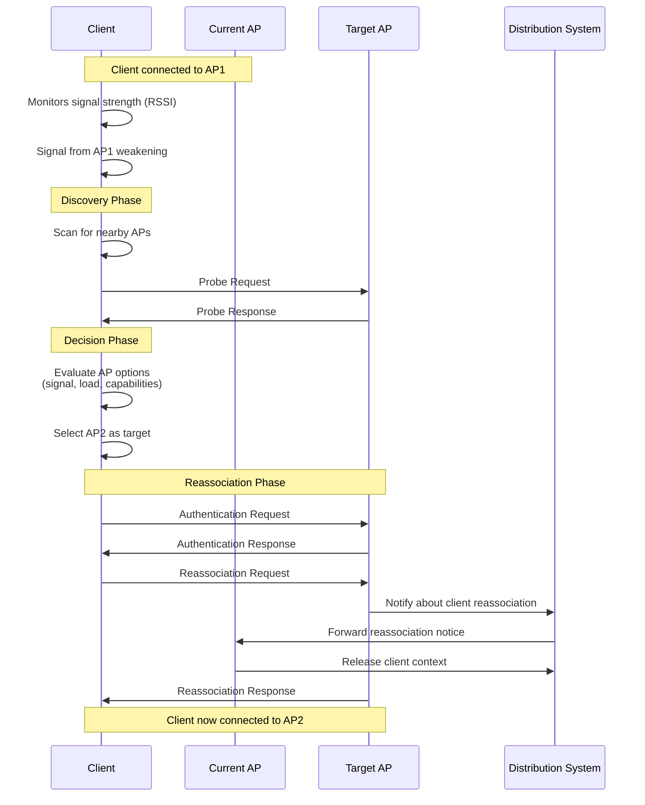

### Roaming Standards Comparison

| Standard | Purpose | Key Benefit | Typical Latency |
|----------|---------|-------------|-----------------|
| Legacy   | Basic roaming | Simple implementation | 50-100ms+ |
| 802.11r  | Fast BSS Transition | Reduced authentication time | <10ms |
| 802.11k  | Radio Resource Management | Better AP selection | N/A (decision aid) |
| 802.11v  | Network Management | Network-assisted roaming | Improved efficiency |
| 802.11w  | Protected Management Frames | Security against attacks | N/A (security) |

## 802.11r
- Also known as Fast BSS Transition (FT).
- Released: 2008.
- Purpose: Improves the speed of the handoff process between access points.
- Notes: Reduces the time required for re-authentication when a device moves from one AP to another.

### Technical Details of 802.11r

802.11r, also known as Fast BSS Transition (FT), is a standard that aims to improve the handoff process between access points (APs) in a wireless network. This is particularly important for applications that require seamless connectivity, such as VoIP (Voice over IP) and real-time video streaming. Here are some key technical details:

1. **Key Caching**:
   - 802.11r introduces the concept of key caching, which allows a client device to reuse the Pairwise Master Key (PMK) from a previous connection when roaming to a new AP. This reduces the time required for re-authentication.

2. **Fast Transition (FT) Protocol**:
   - The FT protocol defines two methods for fast transitions: over-the-air and over-the-DS (Distribution System).
     - **Over-the-Air**: The client communicates directly with the target AP to perform the handoff.
     - **Over-the-DS**: The client communicates with the target AP through the current AP, using the wired network (DS) as an intermediary.

3. **Reduced Latency**:
   - By minimizing the time required for re-authentication and key exchange, 802.11r significantly reduces the latency associated with roaming. This is crucial for maintaining the quality of real-time applications.

4. **FT Initial Mobility Domain Association**:
   - When a client first associates with an AP in an 802.11r-enabled network, it performs an FT Initial Mobility Domain Association. This process establishes the necessary security context and prepares the client for fast transitions within the mobility domain.

5. **Mobility Domain Information Element (MDIE)**:
   - The MDIE is included in the beacon frames and probe responses of 802.11r-enabled APs. It provides information about the mobility domain, allowing client devices to identify and connect to APs that support fast transitions.

6. **Fast BSS Transition Information Element (FTIE)**:
   - The FTIE is used during the authentication and reassociation processes to carry the necessary cryptographic information for fast transitions. It ensures that the security context is properly established and maintained during the handoff.

7. **Compatibility**:
   - 802.11r is designed to be backward compatible with non-802.11r devices. APs can support both 802.11r and non-802.11r clients simultaneously, ensuring a smooth transition for devices that do not support the standard.

8. **Key Hierarchy in 802.11r**:
   - The key hierarchy in 802.11r builds upon the existing 802.11i security framework:
     - **PMK (Pairwise Master Key)**: Derived from the initial 802.1X authentication, cached for reuse during fast transitions
     - **PMK-R0**: First-level derivation from PMK, includes the mobility domain identifier (MDID)
     - **PMK-R1**: Second-level derivation, specific to the target AP's R1 Key Holder
     - **PTK (Pairwise Transient Key)**: Final session key derived from PMK-R1 during reassociation
   - This hierarchical approach enables APs to derive session keys without contacting the authentication server

9. **Mobility Domain**:
   - A Mobility Domain (MD) is a group of APs that share the same security context and allow fast transitions
   - All APs in the same MD advertise the same Mobility Domain Identifier (MDID) in their beacons
   - Clients that associate with an AP in an MD can roam to any other AP in the same MD using fast transitions
   - The MD eliminates the need for full re-authentication when moving between APs

10. **R0 and R1 Key Holders**:
    - **R0 Key Holder (R0KH)**: Typically the RADIUS/authentication server or a centralized controller that holds PMK-R0
    - **R1 Key Holder (R1KH)**: Each AP in the mobility domain, holds PMK-R1 keys for clients
    - During FT, the target AP's R1KH requests the PMK-R1 from the R0KH or retrieves it from the current AP

By implementing these technical features, 802.11r enhances the efficiency and reliability of the roaming process, providing a better user experience in environments with multiple access points.

### 802.11r Key Hierarchy

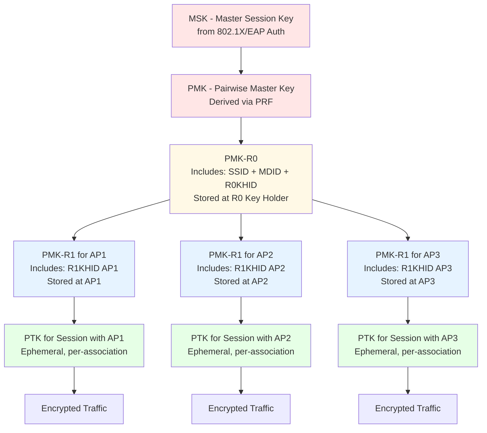

### 802.11r Fast BSS Transition Flow

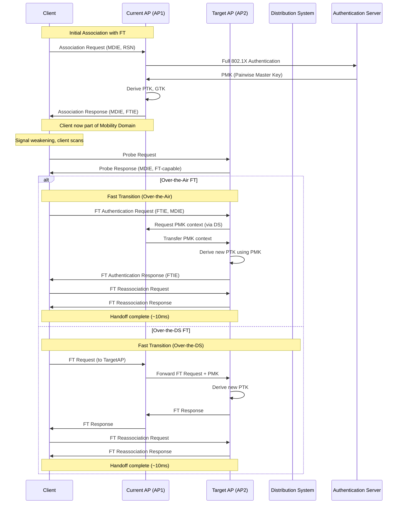

### Key Differences: Legacy vs 802.11r

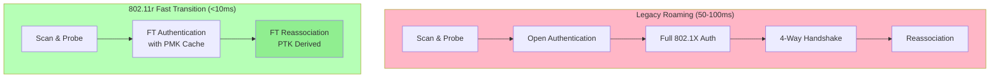


## 802.11k
- Also known as Radio Resource Management (RRM).
- Released: 2008.
- Purpose: Provides mechanisms for measuring and reporting the radio environment.
- Notes: Helps devices make better roaming decisions by providing information about neighboring APs.

### Technical Details of 802.11k

802.11k, also known as Radio Resource Management (RRM), is a standard that provides mechanisms for measuring and reporting the radio environment. This information helps client devices make better roaming decisions by providing data about neighboring access points (APs). Here are some key technical details:

1. **Neighbor Reports**:
   - 802.11k enables APs to provide neighbor reports to client devices. These reports contain information about nearby APs, including their signal strength, channel, and supported data rates. This helps clients identify the best AP to roam to.

2. **Beacon Reports**:
   - Client devices can request beacon reports from APs. These reports include details about the beacons received from neighboring APs, such as signal strength and channel utilization. This information assists clients in making informed roaming decisions.

3. **Channel Load Reports**:
   - APs can provide channel load reports, which indicate the level of traffic on a particular channel. This helps client devices avoid congested channels and select APs operating on less crowded frequencies.

4. **Noise Histogram Reports**:
   - Noise histogram reports provide information about the noise levels on different channels. By analyzing these reports, client devices can avoid channels with high levels of interference, improving overall network performance.

5. **Transmit Stream/Category Measurement Reports**:
   - These reports provide data on the performance of specific traffic streams or categories. This helps client devices assess the quality of service (QoS) provided by different APs and make better roaming decisions based on their specific needs.

6. **Location Tracking**:
   - 802.11k supports location tracking features, allowing APs to track the location of client devices within the network. This information can be used to optimize network performance and improve the accuracy of neighbor reports.

7. **Link Measurement Reports**:
   - Link measurement reports provide detailed information about the quality of the wireless link between the client device and the AP. This includes metrics such as signal-to-noise ratio (SNR) and packet error rate (PER), which help clients evaluate the performance of their current connection and potential target APs.

By implementing these technical features, 802.11k enhances the ability of client devices to make informed roaming decisions, leading to improved network performance and a better user experience in environments with multiple access points.

### 802.11k Neighbor Discovery and Reporting

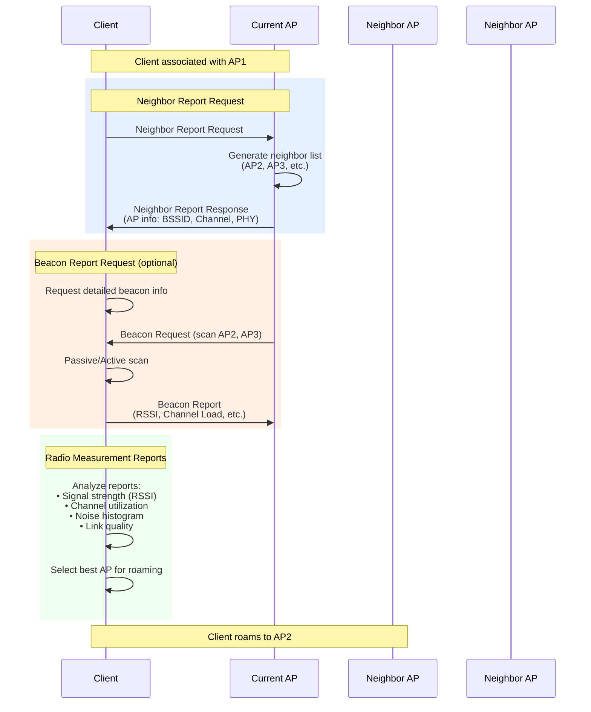

### 802.11k Report Types

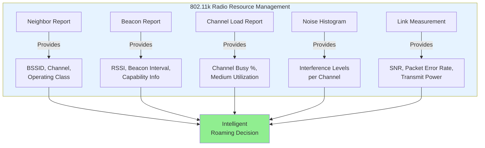


## 802.11v
- Also known as Wireless Network Management.
- Released: 2011.
- Purpose: Enhances network management by providing mechanisms for configuring client devices.
- Notes: Includes features like BSS Transition Management, which helps devices roam more efficiently.

### Technical Details of 802.11v

802.11v, also known as Wireless Network Management, is a standard that enhances network management by providing mechanisms for configuring client devices. This standard includes several features that improve the efficiency and performance of wireless networks. Here are some key technical details:

1. **BSS Transition Management**:
   - 802.11v provides BSS Transition Management, which helps client devices make better roaming decisions. APs can suggest the best APs for clients to roam to, based on factors like signal strength and load.

2. **Network Assisted Power Savings**:
   - This feature allows APs to provide information to client devices about the best times to enter power-saving modes. By coordinating power-saving activities, 802.11v helps extend battery life for client devices.

3. **Traffic Filtering Service (TFS)**:
   - TFS enables APs to filter traffic for client devices, reducing the amount of unnecessary data that clients need to process. This helps improve the efficiency of the network and reduces power consumption for client devices.

4. **Wireless Network Management (WNM) Sleep Mode**:
   - WNM Sleep Mode allows client devices to enter a low-power sleep state while remaining connected to the network. APs can buffer data for sleeping clients and deliver it when they wake up, improving power efficiency without sacrificing connectivity.

5. **Diagnostic and Reporting**:
   - 802.11v includes mechanisms for diagnostic and reporting, allowing APs and client devices to exchange information about network performance and issues. This helps network administrators identify and resolve problems more quickly.

6. **Location Services**:
   - The standard supports location services, enabling APs to provide location-based information to client devices. This can be used for applications like asset tracking and location-based services.

By implementing these technical features, 802.11v enhances the management and performance of wireless networks, leading to improved efficiency, better power management, and a more reliable user experience in environments with multiple access points.

### 802.11v BSS Transition Management

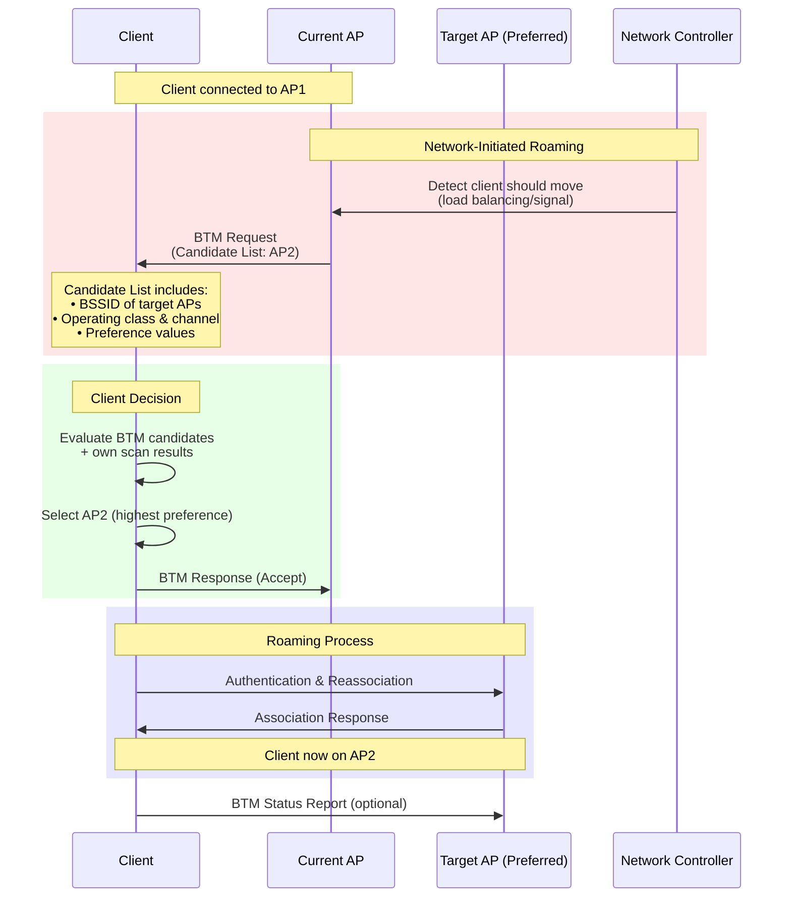

### 802.11v Features Overview

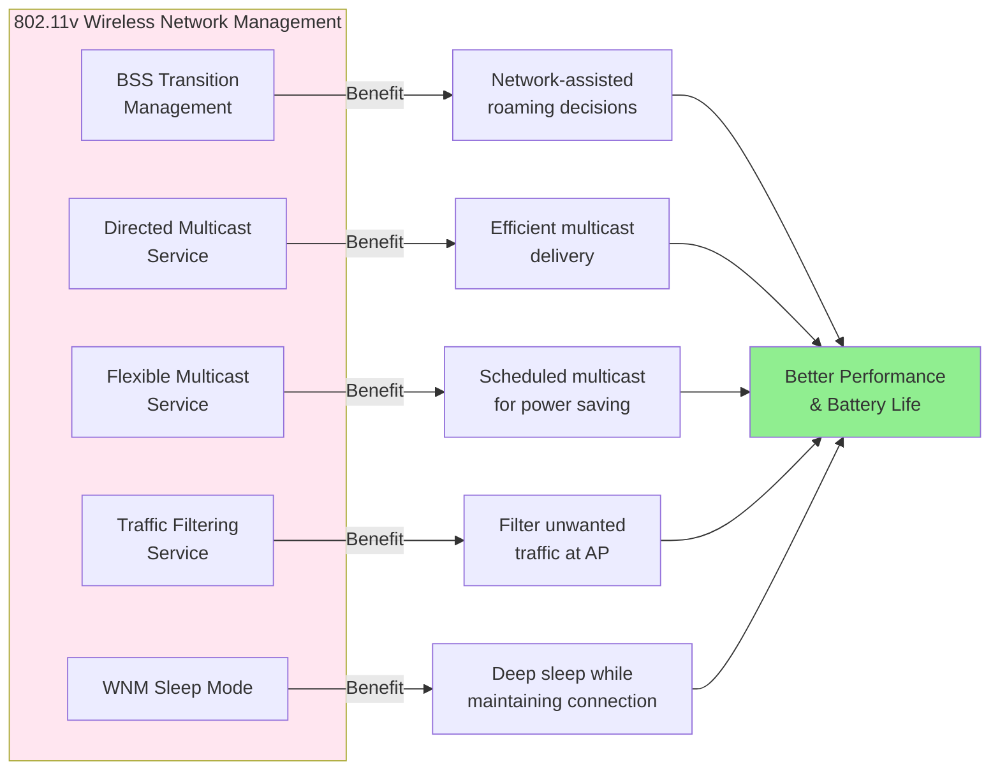

### Client-Initiated vs Network-Initiated Roaming

```mermaid
flowchart TB
    subgraph Client["Client-Initiated (Legacy)"]
        C1[Client monitors RSSI] --> C2[Signal weakens]
        C2 --> C3[Client scans all channels]
        C3 --> C4[Client selects AP]
        C4 --> C5[Client initiates roam]
    end

    subgraph Network["Network-Initiated (802.11v)"]
        N1[AP/Controller monitors<br/>client conditions] --> N2[AP detects poor signal<br/>or load imbalance]
        N2 --> N3[AP sends BTM Request<br/>with candidate list]
        N3 --> N4[Client evaluates<br/>suggestions]
        N4 --> N5[Client roams to<br/>recommended AP]
    end

    style Client fill:#FFE6E6
    style Network fill:#E6FFE6
```


## 802.11w
- Also known as Protected Management Frames (PMF).
- Released: 2009.
- Purpose: Enhances the security of management frames.
- Notes: Protects against certain types of attacks, such as deauthentication and disassociation attacks.

### Technical Details of 802.11w

802.11w, also known as Protected Management Frames (PMF), is a standard that enhances the security of management frames in wireless networks. This standard provides mechanisms to protect against certain types of attacks, such as deauthentication and disassociation attacks. Here are some key technical details:

1. **Management Frame Protection**:
   - 802.11w provides protection for management frames, which are used for network control and signaling. By securing these frames, the standard helps prevent attackers from disrupting network operations.

2. **Protected Management Frames (PMF)**:
   - PMF ensures that management frames are both encrypted and authenticated. This prevents unauthorized devices from injecting malicious management frames into the network.

3. **Robust Security Network (RSN) Associations**:
   - 802.11w requires the use of RSN associations, which provide a secure method for devices to join the network. This includes the use of cryptographic techniques to protect the integrity and confidentiality of management frames.

4. **Replay Protection**:
   - The standard includes mechanisms to protect against replay attacks, where an attacker captures and retransmits management frames to disrupt network operations. By using sequence numbers and timestamps, 802.11w ensures that management frames cannot be reused maliciously.

5. **Deauthentication and Disassociation Protection**:
   - 802.11w specifically addresses deauthentication and disassociation attacks, where an attacker forces a device to disconnect from the network. By securing these management frames, the standard helps maintain stable and reliable network connections.

6. **Cryptographic Protection Mechanisms**:
   - **IGTK (Integrity Group Temporal Key)**: Used to protect broadcast/multicast management frames
   - **BIP (Broadcast/Multicast Integrity Protocol)**: Default integrity algorithm, uses AES-128-CMAC
   - **MIC (Message Integrity Code)**: Appended to protected management frames to verify authenticity
   - **SA Query Mechanism**: Allows clients to verify the authenticity of disassociation/deauthentication frames

7. **Protected Frame Types**:
   - **Disassociation**: Protected to prevent forced disconnection attacks
   - **Deauthentication**: Protected to prevent session hijacking
   - **Robust Management Frames**: Action frames related to QoS, spectrum management, and fast BSS transition
   - **Unprotected Frames**: Beacon, Probe Request/Response, and Authentication frames remain unprotected for compatibility

8. **PMF Modes**:
   - **Optional (PMF=1)**: Client can connect with or without PMF support
   - **Required (PMF=2)**: Client must support PMF to connect (WPA3 requirement)
   - Mixed mode allows gradual migration from legacy to protected networks

By implementing these technical features, 802.11w enhances the security of wireless networks, protecting against various types of attacks and ensuring the integrity and reliability of network operations.

### 802.11w Protected Management Frames

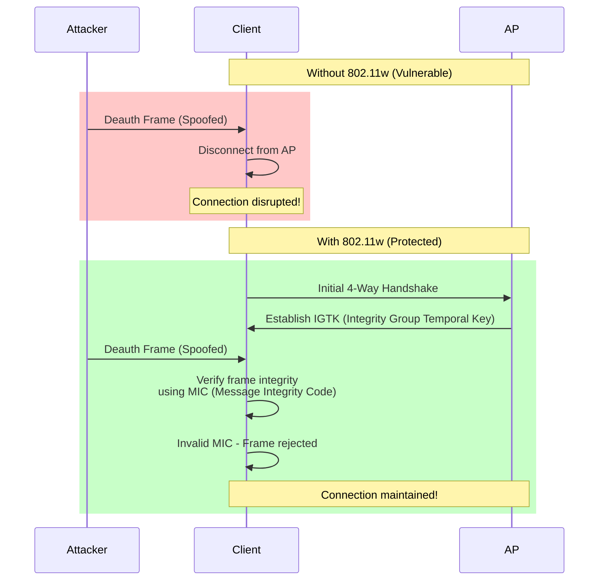


## Comprehensive Roaming Comparison

### Legacy vs Modern Roaming

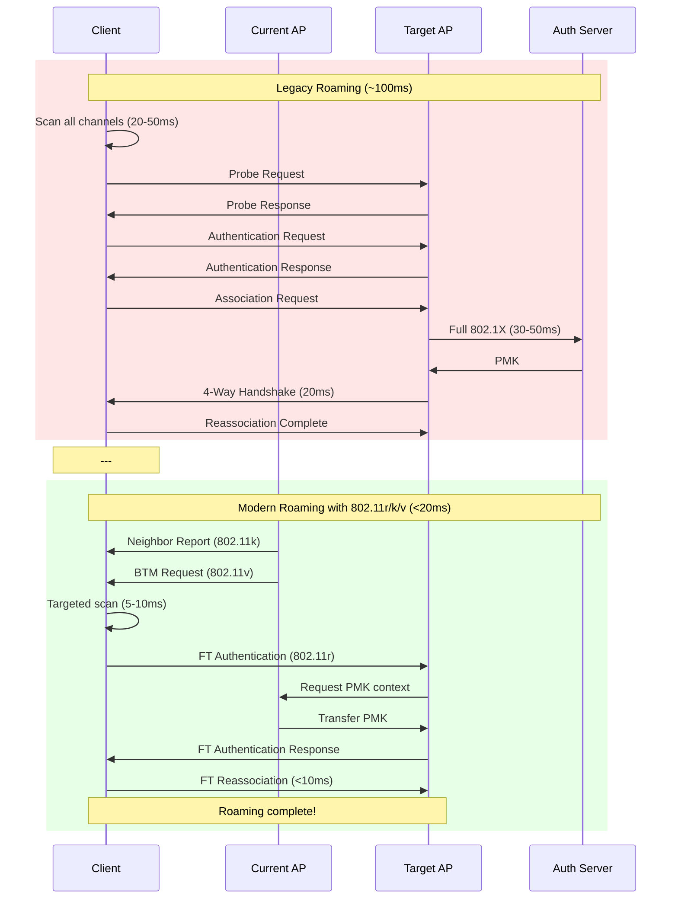

### How the Standards Work Together

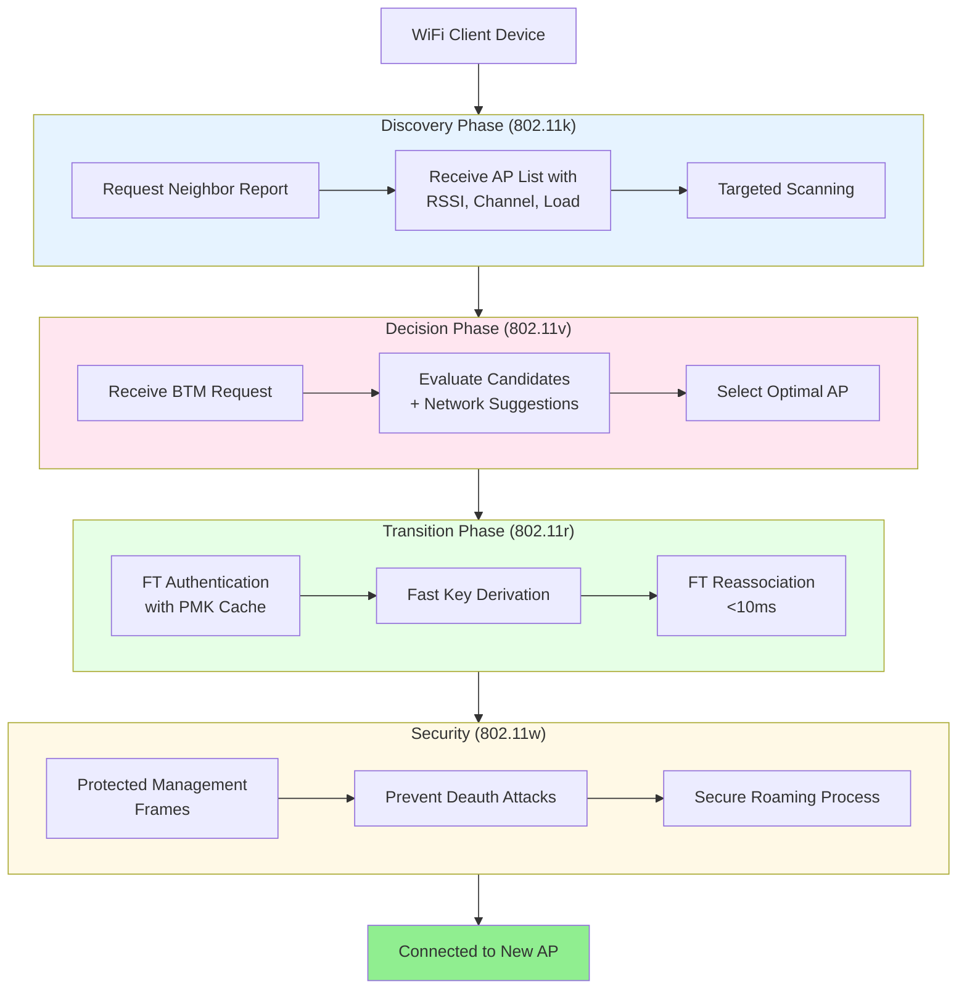

### Performance Comparison Table

| Roaming Aspect | Legacy | With 802.11r | With 802.11r/k/v | Full r/k/v/w |
|----------------|--------|--------------|------------------|--------------|
| **Latency** | 50-100ms | <10ms | <10ms | <10ms |
| **AP Discovery** | Full scan (all channels) | Full scan | Targeted scan | Targeted scan |
| **Decision Making** | Client-only | Client-only | Network-assisted | Network-assisted |
| **Authentication** | Full 802.1X | PMK caching | PMK caching | PMK caching |
| **Security** | Vulnerable to deauth | Vulnerable to deauth | Vulnerable to deauth | Protected |
| **VoIP Quality** | May experience dropouts | Seamless | Seamless | Seamless |
| **Battery Impact** | High (full scans) | Medium | Low (targeted) | Low (targeted) |
| **Best For** | Simple networks | Fast handoffs | Enterprise | Enterprise + Security |

### Real-World Roaming Timeline

```mermaid
gantt
    title Roaming Process Timeline Comparison
    dateFormat X
    axisFormat %Lms

    section Legacy
    Channel Scanning           :0, 50
    Authentication             :50, 30
    4-Way Handshake           :80, 20
    Total (100ms)             :0, 100

    section 802.11r Only
    Channel Scanning           :0, 40
    FT Authentication         :40, 5
    FT Reassociation          :45, 5
    Total (50ms)              :0, 50

    section 802.11r+k+v
    Targeted Scanning         :0, 10
    FT Authentication         :10, 5
    FT Reassociation          :15, 5
    Total (20ms)              :0, 20
```

## Implementation Considerations

### Enabling Fast Roaming

To achieve optimal roaming performance, consider the following:

1. **Network Requirements**:
   - All APs must support the same roaming standards (802.11r/k/v/w)
   - APs should be part of the same Mobility Domain (for 802.11r)
   - Backend infrastructure must support PMK caching and distribution

2. **Configuration Best Practices**:
   - Enable FT over-the-DS for better performance in dense deployments
   - Configure neighbor reports accurately with current AP information
   - Set appropriate BTM preference values to guide client decisions
   - Ensure PMF (802.11w) is enabled for security

3. **Client Support**:
   - Verify client devices support the required standards
   - Update client drivers and firmware for best compatibility
   - Test roaming behavior with target applications (VoIP, video conferencing)

4. **Tuning Parameters**:
   - RSSI thresholds for roaming triggers (typically -70 to -75 dBm)
   - Channel overlap and interference considerations
   - Load balancing thresholds for BTM requests
   - Roaming retry intervals and timeouts

### Common Deployment Scenarios

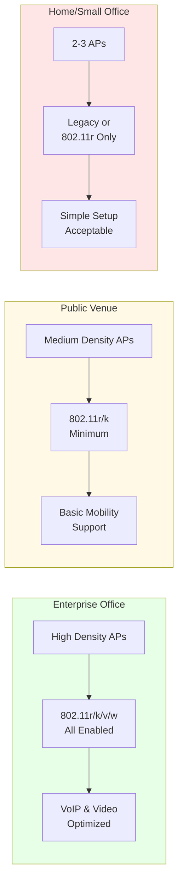

## Troubleshooting and Monitoring

### Common Roaming Issues

1. **Sticky Client Problem**:
   - **Symptom**: Client stays connected to distant AP despite closer APs being available
   - **Cause**: Client roaming algorithm too conservative, high RSSI disconnect threshold
   - **Solution**: Use 802.11v BTM to encourage roaming, adjust AP minimum RSSI settings

2. **Ping-Pong Roaming**:
   - **Symptom**: Client rapidly switches between two APs
   - **Cause**: APs have overlapping coverage with similar signal strength
   - **Solution**: Adjust AP transmit power, implement roaming hysteresis, use 802.11k/v

3. **Failed Fast Transitions**:
   - **Symptom**: Roaming takes longer than expected or fails completely
   - **Cause**: PMK not properly distributed, Mobility Domain misconfiguration
   - **Solution**: Verify all APs share same MDID, check R0KH/R1KH communication

4. **Authentication Timeouts**:
   - **Symptom**: Client disconnects during roaming attempt
   - **Cause**: Slow authentication server, network latency
   - **Solution**: Enable 802.11r PMK caching, optimize RADIUS server response time

### Monitoring Tools and Metrics

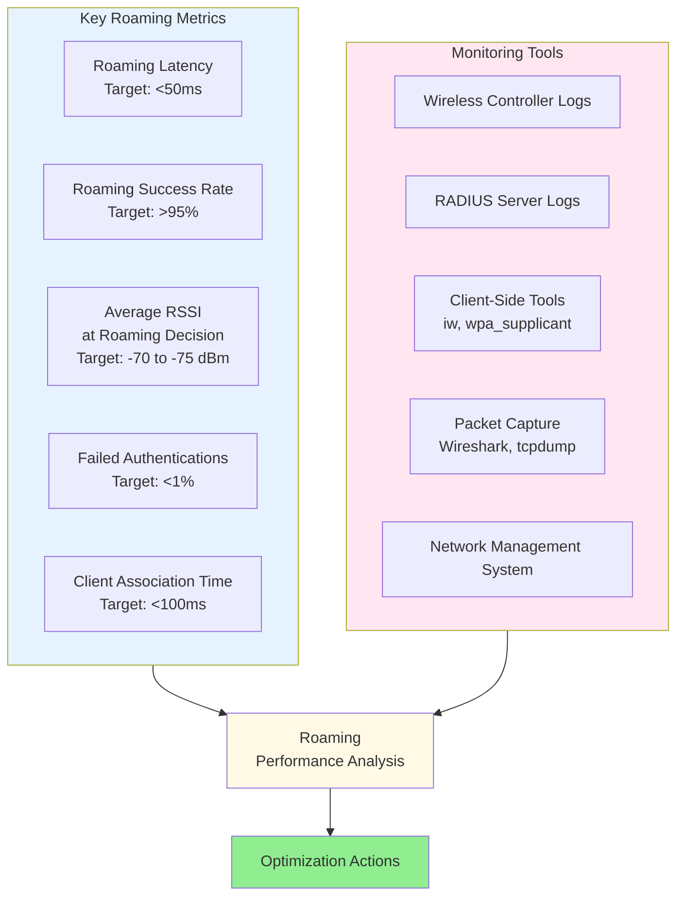

### Debugging Commands

**Linux Client (iw/wpa_supplicant)**:
```bash
# Check current connection and roaming capabilities
iw dev wlan0 link
iw dev wlan0 scan | grep -E "BSS|SSID|freq|signal|capability"

# Monitor roaming events in real-time
wpa_cli -i wlan0
> status
> bss_flush 0
> scan
> scan_results

# Check FT (802.11r) capabilities
iw dev wlan0 scan | grep -A 20 "your-ssid" | grep -E "FT|Mobility"

# Monitor neighbor reports (802.11k)
iw dev wlan0 station dump
```

**Access Point (hostapd)**:
```bash
# Enable debug logging for roaming events
hostapd -dd /etc/hostapd/hostapd.conf | grep -E "FT|BTM|neighbor"

# Check associated clients and their roaming status
hostapd_cli all_sta
hostapd_cli status

# Send BSS transition management request
hostapd_cli bss_tm_req <client-mac> neighbor=<target-bssid>,<op-class>,<channel>
```

**Wireshark Filters for Roaming Analysis**:
```
# 802.11r Fast BSS Transition frames
wlan.fc.type_subtype == 0x000b || wlan.fc.type_subtype == 0x000c

# Authentication and Reassociation
wlan.fc.type_subtype == 0x0000 || wlan.fc.type_subtype == 0x0001 ||
wlan.fc.type_subtype == 0x0002 || wlan.fc.type_subtype == 0x0003

# 802.11k Neighbor Reports
wlan.tag.number == 52

# 802.11v BSS Transition Management
wlan.fixed.action_code == 7 || wlan.fixed.action_code == 8

# 802.11w Protected Management Frames
wlan.fc.protected == 1 && (wlan.fc.type == 0)
```

### Performance Optimization Tips

1. **Channel Planning**:
   - Use non-overlapping channels (1, 6, 11 for 2.4 GHz)
   - Minimize co-channel interference in high-density deployments
   - Consider DFS channels in 5 GHz for additional capacity

2. **AP Placement and Power**:
   - Ensure 20-30% cell overlap for seamless roaming
   - Reduce AP transmit power in dense deployments to prevent sticky clients
   - Use site survey tools to validate coverage

3. **RSSI Thresholds**:
   - Set roaming trigger at -70 to -75 dBm for optimal performance
   - Configure minimum RSSI for association rejection at -80 to -85 dBm
   - Implement different thresholds for 2.4 GHz vs 5 GHz

4. **Fast Roaming Configuration**:
   - Enable FT over-the-DS for centralized architectures
   - Configure neighbor reports with accurate channel and BSSID information
   - Set appropriate BTM preference values to guide client decisions
   - Ensure PMK caching timeout (default 43200 seconds) is appropriate

### Sample wpa_supplicant Configuration

```conf
network={
    ssid="YourNetwork"
    psk="YourPassword"
    key_mgmt=WPA-PSK WPA-PSK-SHA256 FT-PSK
    ieee80211w=2                    # Require PMF (802.11w)

    # Fast roaming settings
    proactive_key_caching=1         # Enable opportunistic key caching
    ft_eap_pmksa_caching=1          # Enable PMK caching for FT

    # Roaming aggressiveness (0-3, 0 = disabled, 3 = most aggressive)
    bgscan="simple:30:-70:3600"     # Background scanning

    # Scan frequency configuration
    scan_freq=2412 2437 2462 5180 5200 5220 5240 5745 5765 5785 5805
}
```

### Sample hostapd Configuration

```conf
# Basic settings
interface=wlan0
driver=nl80211
ssid=YourNetwork
wpa=2
wpa_key_mgmt=WPA-PSK FT-PSK
wpa_pairwise=CCMP

# 802.11r Fast BSS Transition
mobility_domain=a1b2              # Same for all APs in the domain
ft_over_ds=1                       # Enable FT over Distribution System
ft_psk_generate_local=1            # Generate PMK-R0/R1 locally
nas_identifier=ap1.example.com     # Unique per AP
r0kh=02:00:00:00:03:00 ap1.example.com 000102030405060708090a0b0c0d0e0f
r1kh=02:00:00:00:03:00 00:00:00:00:03:00 000102030405060708090a0b0c0d0e0f

# 802.11k Radio Resource Management
rrm_neighbor_report=1
rrm_beacon_report=1

# 802.11v BSS Transition Management
bss_transition=1
wnm_sleep_mode=1
time_advertisement=2

# 802.11w Protected Management Frames
ieee80211w=2                       # Required (2) or Optional (1)
group_mgmt_cipher=AES-128-CMAC

# Roaming optimization
ap_max_inactivity=300
disassoc_low_ack=1
skip_inactivity_poll=0
```

## References and Further Reading

1. **IEEE Standards**:
   - IEEE 802.11r-2008: Fast BSS Transition
   - IEEE 802.11k-2008: Radio Resource Measurement
   - IEEE 802.11v-2011: Wireless Network Management
   - IEEE 802.11w-2009: Protected Management Frames

2. **RFCs and Documentation**:
   - RFC 5416: Control and Provisioning of Wireless Access Points (CAPWAP) Protocol
   - Wi-Fi Alliance: WPA3 Security Specification
   - hostapd documentation: https://w1.fi/hostapd/
   - wpa_supplicant documentation: https://w1.fi/wpa_supplicant/

3. **Best Practices**:
   - Cisco Enterprise Mobility Design Guide
   - Aruba Best Practices for High-Density WiFi Deployments
   - Ruckus SmartRoam Technology Overview
